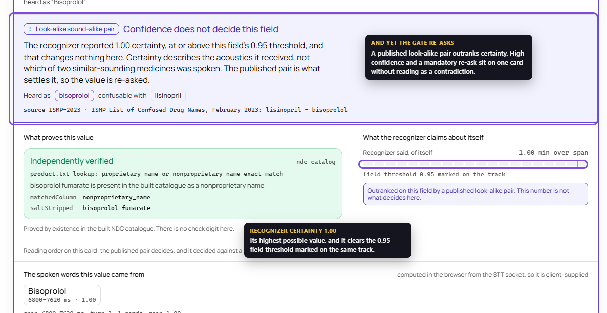
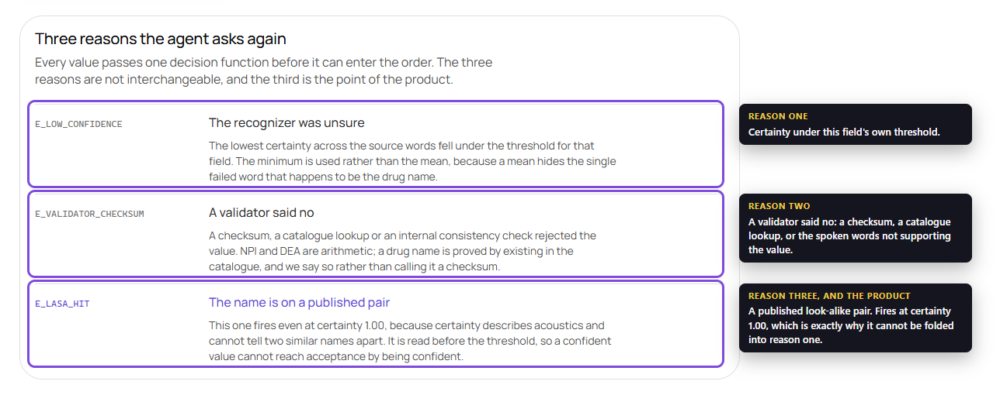
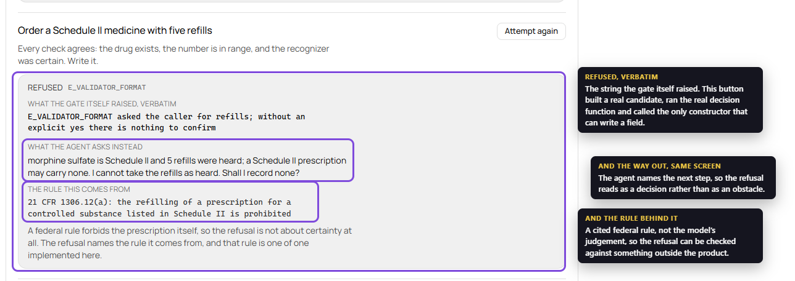
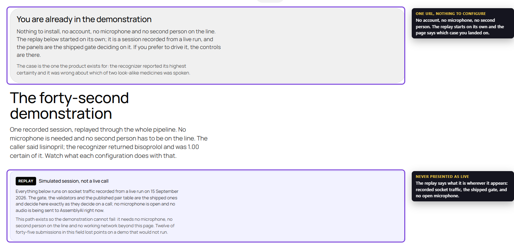
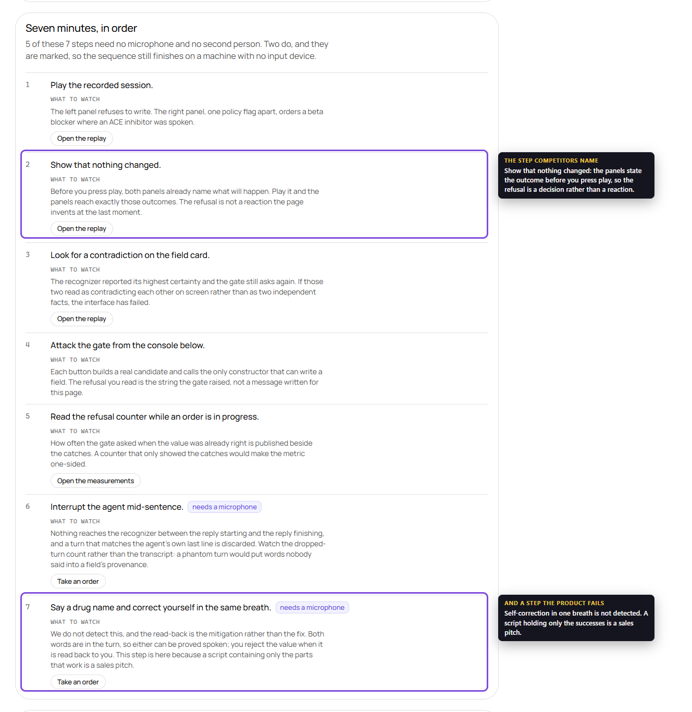

# Readback

A voice agent that takes prescription orders and proves it did not mishear.

**The recognizer proposes. A validator or a regulator's list decides. A refusal is a
result.**

Every field carries provenance: which spoken words produced the value, with
millisecond timecodes, the recognizer's confidence over those words, and the verdict
of an independent validator. A value cannot enter the order unless a validator passed
it or a human confirmed it aloud.

Built for the [AssemblyAI Voice Agent Hackathon](https://lablab.ai/ai-hackathons/assemblyai-voice-agent-hackathon).

## The problem

A recognition error in prescription intake does not look like an error. "Lisinopril"
becomes "Bisoprolol" — both drugs exist, both are plausible, and nothing signals a
fault. As AssemblyAI puts it: *a voice agent is a chain, and the LLM has no way to
know its input was wrong.*

Their numbers set the scale:

| Fact | Value |
|---|---|
| Entity Error Rate, Universal-3.5 Pro Realtime | **15.31%** at 6.99% WER |
| Errors on proper nouns, which drug names are | **16.92%** |
| Five-turn task success at 84.69% per-turn entity capture | **43.6%** |
| The same task with confirmation steps | **79.1%** |

The last two lines are the whole business case. A confirmation loop nearly doubles
the share of transactions that complete, and AssemblyAI presents it as a technique
rather than a feature — implementing and measuring it is the work.

## The hard claim

**High recognizer confidence does not protect against homophony.** The model can be
certain it heard Bisoprolol while the human said Lisinopril. Confidence proves
nothing there; a regulator-published look-alike sound-alike list does.

So a drug name inside a published ISMP or FDA LASA pair triggers a **mandatory
re-ask even at confidence 1.0**. Every other gate in this field fires on low
confidence or a failed validator. This one fires on a name, regardless of how sure
the recognizer is.

## What is measured, what is derived, and what is assumed

Every claim below carries one of six statuses. The scale exists because a reader
cannot otherwise tell our strongest evidence from our weakest, and the difference is
large. Nothing here is graded generously: the honest grade is the low one.

| Status | Meaning |
|---|---|
| **Measured** | A command in this repository produced the number; the command and the set size are published beside it |
| **Enforced** | A machine check fails when the property stops holding; the check is named and runs in `make verify` |
| **Verified by hand** | Checked by execution on specific inputs, which are named, without a general measurement |
| **Observed** | Seen in live traffic, possibly once; the vendor does not document it and we do not generalise |
| **Cited** | A third party's number or rule, linked, not re-measured by us |
| **Assumption, not result** | Reasoned but unmeasured. Believing it is a choice, and it is labelled so nobody makes that choice unknowingly |

Applied to the claims this project actually makes:

| Claim | Status | Where |
|---|---|---|
| `ConfirmedValue` is unconstructible outside the gate | **Enforced** | `make gate-invariant`; a second type assertion, an `as unknown as`, or an angle-bracket cast fails the build |
| Each gate branch has a test that fails by name when the branch breaks | **Enforced** | `make gate-mutation`, 11 of 11 mutations killed |
| A LASA hit re-asks at confidence 1.0 | **Enforced** | LASA is read before the threshold in `decide()`; a mutation reversing the order fails a named test |
| The key never reaches the browser | **Enforced** | `make secrets` fails if `ASSEMBLYAI_API_KEY` appears outside `app/api/` |
| Entity Error Rate on our corpus | **Measured** | `eval/REPORT.md`, with the command and the set size, Wilson intervals throughout |
| Which of the three mechanisms pays for which re-ask | **Measured** | Coverage matrix over every recorded utterance, `scripts/measure/coverage-matrix.ts` |
| False-ask rate | **Measured** | Published beside the catches, because hiding the cost side makes the metric one-sided |
| Rare drug names are harder than common ones | **Assumption, not result** | Pre-registered in `eval/heldout-preregistration.md`, opened once, **not demonstrated**: the Wilson intervals overlap |
| DEA and NPI are equally provable by arithmetic | **Measured, and 4.8% false of DEA** | 30 600 exhaustive mutations: NPI catches every single-digit substitution, DEA catches 95.2%. The policy stands; the sentence claiming equivalence did not |
| Our LASA table covers the published ISMP list | **Assumption, not result** | 20 curated pairs ship; coverage is partial and unquantified, because the source moved off a stable URL |
| Provenance proves what was said | **False, and stated as false** | Provenance is computed in the browser; the gate proves a value traces to words the session reported, not that they were spoken |
| Socket close codes mean what we log | **Observed** | The vendor documents no close codes at all, verified 17 September; every entry names whose observation it is |
| A confirmation loop nearly doubles task completion | **Cited** | AssemblyAI's own published numbers, linked above, not re-measured by us |
| Read-back is required by ICAO and the Joint Commission | **Cited** | Both quoted verbatim with the clause number |
| Checksum behaviour on specific identifiers | **Verified by hand** | `AB1234563` passes, `BX1234567` fails, `1234567893` passes, `1234567890` fails |
| The market size in money | **Assumption, not result** | We have not estimated it and do not publish a figure we cannot source |
| A proposed value is supported by what was spoken | **Enforced** | The server reconciles the value against the words of its turn; a mismatch is a validator failure, not a fourth reason |
| A value confirmed for one field cannot be written under another | **Enforced** | Found by attack the same day: the policy applied was the wrong field's while the write keyed off the candidate's |
| A word the recognizer never scored cannot pass as a scored one | **Enforced** | Found by attack: `NaN < threshold` is false, so an unscored word was accepted outright on a field without mandatory read-back |

Two entries in that table are failures of our own hypotheses, and one says a claim we
previously made was wrong. They are in the table for the same reason the rest are:
a scale that only ever grades its author highly is decoration.

## Sixty seconds, in order, with no microphone

The demonstration does not require a working microphone, a second person, or a
successful recognition. Every step below runs from a recorded session, so it produces
the same result on a laptop in a quiet room and on a phone in a corridor.

**1. Open `/demo`.** Two panels, one recorded file. A human said *Lisinopril*; the
recognizer returned *Bisoprolol* at confidence **1.0** — not a low score, not a
hedge, the highest value the API can report.

**2. Read the left panel, where the pair check is on.** The order is **not written**.
The agent names both drugs from the ISMP look-alike list and asks which one was
meant. Note what did *not* cause this: the confidence is perfect and the validator
passed, because Bisoprolol is a real drug at a real strength. The only thing that
stopped it was membership in a published pair.

**3. Read the right panel, where the same file runs with the pair check disabled.**
Same audio, same recognizer, same confidence. **The wrong drug is ordered.** This is
the whole product in one side-by-side: the difference between the panels is one
policy flag, not a better model.

**4. Now try to make the gate contradict itself.** The left panel shows high
confidence *and* a mandatory re-ask at the same time. If that reads as a
contradiction on screen, the interface has failed — confidence is presented as the
recognizer's own certainty beside an independent verdict, never as a quality score.
There is a check in `make verify` that refuses wording which turns it into one.

**5. Open `/metrics`.** Every figure carries the command that produced it and the
size of the set it came from, and the cost side is published beside the catches: how
often the gate asked when the value was already right. A one-sided metric would have
been the easier thing to show.

**6. Open `/how-it-works` and try to break it yourself.** Three reasons to re-ask,
enforced in code rather than in a prompt, and the one constructor that can write a
value — and beside them an attack console with **seven attempts to get a value past
the gate**, each one you run rather than read about:

- *Lower the confidence threshold to zero.* If the gate were only a threshold,
  accepting everything would let the value through. It does not: the pair check is
  read **before** the threshold, so a published look-alike name is still asked about
  at any confidence, including 1.00. This is the quickest way to falsify our central
  claim, so it is the first button.
- *Claim the caller confirmed it, without a read-back.* The payload says
  `caller_confirmed`. That is a string in a request, not a confirmation.
- *Write a value its validator rejected.* The recognizer was certain and the field is
  filled in.
- *Write a value with no source words.* The value is correct — does it matter which
  words produced it?
- *Reuse an accepted decision from another field.* One field passed, so borrow its
  approval.
- *Order a Schedule II medicine with five refills.* Every individual check agrees:
  the drug exists, the number is in range, the recognizer was certain. The order is
  still federally void, and the data to know that was already present.
- *Order a medicine whose name is one vowel away from a real one.*

Each attack states what it assumes and what actually happens. We would rather hand a
reviewer the tools to disprove the claim than ask them to take it on the strength of
a paragraph.

**7. If you do have a microphone, interrupt the agent mid-sentence.** Nothing is sent
to the recognizer between `reply.started` and `reply.done`, and a turn arriving during
playback that matches the agent's own last line is discarded. A phantom turn would put
words the human never said into a field's provenance, which is worse than a stutter.

**8. Then say a drug name and, in the same breath, correct yourself** — "Lisinopril,
no wait, Losartan". **We do not detect this, and it is documented rather than hidden**
([docs/limitations.md](docs/limitations.md)). Both words are in the turn, so the matcher can
prove either was spoken. The read-back is the mitigation: the value is spoken back and
you can reject it.

Step 8 is in this list on purpose. A demo script that only contains the parts that
work is a sales pitch; the failure is one command away from being found, so it is
better pointed at than discovered.

### The four screens that carry the argument



*The whole product in one card.* The recognizer reported **1.00** certainty — its
highest possible value — and the field threshold of 0.95 is cleared on the same track.
The value is still re-asked, because `bisoprolol` is named on a published look-alike
pair with `lisinopril`. High confidence and a mandatory re-ask sit together without
reading as a contradiction, which is the design requirement rather than an accident.
Note the line the card carries about its own evidence: provenance is computed in the
browser from the STT socket, so it is client-supplied.



*Three reasons, never folded into one.* `E_LOW_CONFIDENCE`, `E_VALIDATOR_CHECKSUM`
and `E_LASA_HIT`, each carrying the reasoning behind it. Two details worth reading off
this screen: confidence is the **minimum** across the source words rather than the
mean, because a mean hides the single failed word that turns out to be the drug name;
and the pair check is **read before** the threshold, so a confident value cannot reach
acceptance by being confident. That ordering is what makes the third reason
structurally different from the first rather than a stricter version of it.



*A refusal that can be checked against something outside the product.* Every
individual check agreed — the drug exists, the refill count is in range, the
recognizer was certain — and the order is still refused, because
**21 CFR 1306.12(a)** forbids refilling a Schedule II prescription. The screen carries
the verbatim string the gate raised, the sentence the agent says next, and the rule it
comes from. Refusal and recovery on one screen; the citation is what makes it
auditable rather than a judgement call.



*One URL, nothing to configure.* `/start` lands a judge inside the replay with it
already running — no account, no microphone, no second person on the line. The panel
above it says which case they are looking at, and the replay carries a standing
**"Simulated session, not a live call"** label stating that the gate, the validators and
the pair table are the shipped ones while no microphone is open. Twelve of forty-five
submissions in this field lost points on a demo that would not run; this path exists so
this one cannot.



*The script is on the page, not only in this file.* Seven steps, each with an action
and what to watch, including "show that nothing changed" and "interrupt the agent
mid-sentence". The two steps that need a microphone are marked, so a judge without one
knows which five still work.

**What each artefact in this project actually is, stated once so it does not have to
be guessed at.** The four images above are unedited screenshots of the running
application. Every recognizer confidence and word timing in `eval/REPORT.md` and in
the recorded-session demo comes from real AssemblyAI socket traffic against
synthesised speech (a desktop text-to-speech voice, named per item in the eval
artefacts as `"voice": "Microsoft David Desktop"` or similar) — synthetic audio, real
recognition. No step of the sixty-second walkthrough above is staged with invented
numbers. The submission video, once recorded, carries the same labelling in its own
description: which parts are a live screen recording, which play back a recorded
session rather than a live microphone, and whether any cut removes dead air or a
retake rather than changing what the product did. A cut for pacing is disclosed as a
cut for pacing; nothing in the video is permitted to imply a capability the running
application does not have.

## Why it is called Readback

The name is the procedure, not a metaphor.

**Aviation, ICAO Annex 11 §3.7.3:** *a procedure whereby the receiving station
repeats a received message or an appropriate part thereof back to the transmitting
station so as to obtain confirmation of correct reception.*

**Clinical practice, Joint Commission National Patient Safety Goals, since 2003:**
*for verbal or telephone orders or for telephonic reporting of critical test results,
verify the complete order or test result by having the person receiving the order or
test result read-back the complete order or test result.*

Medicine borrowed the readback/hearback pair straight from aviation. We automate a
step regulation already requires and practice routinely skips, which
[ISMP documents](https://www.ismp.org/sites/default/files/attachments/2018-03/20170518.pdf).

## Three reasons the agent re-asks

Not interchangeable, and enforced in code rather than in a prompt:

1. **Confidence below the field threshold** — the minimum over the source words.
2. **Validator failure** — DEA mod-10, NPI Luhn with the `80840` prefix, NDC format
   plus existence in the catalogue, or an internally inconsistent
   drug × strength × form × route combination.
3. **LASA pair membership** — fires regardless of confidence.

Three, and the count is load-bearing. A fourth top-level reason would mean the gate
had acquired a policy, and a policy can be argued with; these three are conditions.

**A value the speech does not support is the second reason, not a fourth.** The agent
supplies the value, so it can propose a name nobody said while quoting a phrase that
really does trace to a recorded turn. The server reconciles the proposed value against
the words of that turn and, on a mismatch, produces a validator verdict named
`spoken_support` — deliberately not borrowing a checksum's name, because naming
another validator would claim a proof that never ran. Tolerances are the ones a
recognizer really produces: spoken units, spelled-out digits, salt suffixes in either
direction, and the vowel drift that turns `vinorelbine` into `venorelbine`. A test
asserts over all 20 curated pairs, in both directions, that no look-alike counterpart
is ever accepted as evidence for its partner.

`ConfirmedValue` cannot be constructed outside the gate: it is a branded type whose
brand is module-private, and the order accepts nothing else. There is no code path by
which "the model decided it was fine" writes a value — not a `force` flag, not a
convenience constructor, not an object literal. The check that enforces this was
itself bypassable until we attacked it, which is the section below.

### The same idea, said better by other teams in this field

Quoted rather than paraphrased, because each states something this project also
claims more sharply than we have stated it ourselves. **Status: Cited** — linked to
the team, not re-measured by us.

- *"No citation, no score."* — Brand Studio. The same rule this project applies to
  every figure in `eval/REPORT.md`, in four words.
- *"The recogniser is never biased toward the phrases the rules match, so a
  mishearing cannot invent a disclosure."* — Saakshi. Exactly the reasoning behind
  `make keyterms-purity`, which refuses a LASA-checked name in `keyterms_prompt` for
  the same reason: biasing the recognizer toward what the rules check would make the
  rules confirm themselves.
- *"A threshold is a review heuristic, not a calibrated probability of truth."* —
  EvidenTurn. States precisely why this report labels every threshold in
  `src/domain/policy.ts` as a chosen default rather than a measured optimum.
- *"The final urgency score is decided by deterministic local code — not the LLM."*
  — a competing submission's framing of the same structural guarantee `ConfirmedValue`
  gives this project: a value the model proposes and code alone can confirm.
- *"Exact audited figures, not a model's guess."* — another submission, on why a
  number needs a command behind it, which is the rule this report enforces on itself.
- *"It works because it stops relying on the prompt holding."* — a competing
  submission, on the same reason `ConfirmedValue` has no constructor a prompt could
  reach: a rule enforced in the type system does not depend on the model reading it
  correctly on a given turn.
- *"The decision is made by deterministic code, not by the model."* — a third
  submission independently converging on the same structural argument.
- *"One intervention in 36 advisor turns."* — Saakshi, in the same shape as this
  project's false-ask rate: an intervention count against a turn count, published
  beside the catches rather than instead of them.

## What is proved by arithmetic and what is not

Stated plainly, because the distinction matters and is easy to overclaim:

- **DEA and NPI are arithmetic, and they are not equally strong.** A checksum
  rejects a mistyped digit independently of what the recognizer heard, so both fields
  skip mandatory read-back: reading nine digits aloud lengthens the call without
  adding proof. Verified by hand: `AB1234563` passes and `BX1234567` is rejected;
  `1234567893` passes and `1234567890` is rejected. Then verified exhaustively, which
  corrected us: `make audit-checksums` mutates 200 valid identifiers of each kind in
  every single-digit substitution and every adjacent transposition — 30 600 mutations,
  not a sample. **NPI catches 100% of substitutions, DEA catches 95.2%**, because the
  DEA scheme weights alternating digits by 1 and 2 and sums mod 10, so a substitution
  changing a weight-2 digit by five is invisible to it. The policy stands; the earlier
  sentence claiming the two checks were equivalent did not.
- **NDC has no check digit.** A drug name, strength, form and route are proved by
  existence in the built catalogue and by the combination being internally
  consistent. Calling that a checksum would be a lie.
- **A field with no validator must be read back.** `patientName` has neither, so it
  is confirmed by voice or not at all. A test enforces this implication across the
  whole policy table.

## Why it's built on AssemblyAI

The product's claim only has teeth if the input to the gate is the recognizer's own
evidence, not a paraphrase of it. Three properties of AssemblyAI's API make that
possible rather than aspirational:

- **Word-level timings and per-word confidence, not a turn-level score.** The gate's
  policy takes the **minimum** confidence across the words that produced a value, not
  the mean, because a mean hides the single failed word that turns out to be the drug
  name. That policy needs `words[]` with millisecond `start`/`end` and a confidence
  per word — a turn-level number alone could not support it. `E_LOW_CONFIDENCE` names
  this choice, and it is what makes provenance genuine down to the word rather than
  the sentence.
- **Server-side HTTP tools remove a race this architecture would otherwise have to
  manage itself.** `commitOrder` and `proposeField` are declared with `http.url` and
  AssemblyAI calls them directly — there is no `tool.call`/`tool.result` exchange in
  the browser to order against `reply.done`, and no client-side queue to flush on
  interruption. That is what makes a stateless serverless route sufficient: the
  function lives for the milliseconds of one call, not the minutes of a session. The
  full argument, including the race it removes, is in
  [docs/assemblyai-api.md](docs/assemblyai-api.md).
- **`keyterms_prompt` biases the recognizer toward exactly the strings it is given,
  which is a control surface the product depends on staying pointed away from the
  thing it verifies.** Domain terms — clinic name, prescriber name, dosage forms,
  units, route words — go in; drug names inside a published LASA pair never do,
  enforced by `make keyterms-purity`. A vendor feature that could not bias the
  recognizer toward specific strings would not create this risk, and a vendor that did
  not expose the bias as a first-class, testable configuration field would not let us
  guard against it mechanically.

Two further properties matter for the build rather than the claim: single-use,
short-lived tokens minted server-side mean `ASSEMBLYAI_API_KEY` never has to reach the
browser (`make secrets` enforces the absence), and entity-aware turn detection on the
agent socket — active by default, and switched off entirely if `min_silence` or
`max_silence` is ever set, per the vendor's own documented behaviour — is what lets a
prescriber dictate a nine-digit NPI in groups without a short endpoint truncating it
mid-number. Both are documented at length in
[docs/assemblyai-api.md](docs/assemblyai-api.md).

## Stack

One Next.js application on Vercel. No Docker, no always-on process, no database
server.

The browser holds both AssemblyAI sockets directly using short-lived tokens; our
routes mint those tokens, serve the agent's server-side HTTP tools, and store
finished sessions in Vercel Blob. AssemblyAI's docs state no proxy is required, and
the same shape is the documented Vercel pattern: mint on the server, hand the browser
a token.

```
browser ──► wss://streaming.assemblyai.com/v3/ws    word timings, confidence
        ──► wss://agents.assemblyai.com/v1/ws       conversation, turn detection
        ──► /api/tokens/*                           short-lived tokens
AssemblyAI ─► /api/tools/*                          server-side tool calls
```

## Running

```bash
npm ci
cp .env.example .env.local
make data
make agent
make dev
make verify
```

`make data` builds the NDC catalogue and the LASA table into `data/`. `make agent`
creates the stored agent once and prints the id to put in `.env.local`. `make dev`
serves on `http://localhost:3000`. `make verify` runs the linters, the type checker,
the tests and every ratchet.

`ASSEMBLYAI_API_KEY` is required for `make agent` and for any live session; the tests
and the recorded-session demo run without it.

**The stored agent is defined in one file, `src/agent/`, and `make agent` is the only
intended way it reaches AssemblyAI.** `buildAgentDefinition()` produces the whole
`POST /v1/agents` body — prompt, tools, `input`/`output` configuration — from source
under version control, so the definition can be read, reviewed and diffed like any
other code.

**What this does not yet close: an edit made directly in AssemblyAI's own agent
dashboard is invisible to this repository.** The vendor's own API supports reading an
agent back (`GET /v1/agents/{id}`), so a script that fetches the live definition and
diffs it against `buildAgentDefinition()`'s output is possible and does not exist yet.
`make doctor` checks that the stored agent and its tool webhooks are *reachable*; it
does not check that the stored agent's *content* still matches the source that built
it. Until that diff exists, a playground edit to the prompt or the tool schema would
not be caught by anything in `make verify`, and this paragraph is the disclosure of
that gap rather than a claim that it is closed.

### Checking our numbers without a key

```bash
make honest
```

Prints every figure in this repository that is derivable offline, each above the
command that produced it and the size of the set it came from: the entity error rate
on the control corpus, which mechanism catches which recorded error and what each
costs in false asks, the gate run against itself with the pair check on and off,
exhaustive checksum coverage, our own skeleton detector pointed at our own catalogue,
the confidence calibration curve, the rarity stratification, latency against its
budget, the recorded audio path replayed end to end, an honest count of every paid run
including the discarded ones, reproducibility, the keyterms ablation, and what the
paid API has actually cost. Thirteen blocks, no network call, no key —
`scripts/report/honest.ts` names the count itself at the end of its own output, so this
sentence is checked against that rather than typed independently.

It deliberately does not fill in anything that needs a live socket. Those rows read
as not measured in `eval/REPORT.md` and they read that way here too.

Server-side tools need a publicly reachable HTTPS host, so they are debugged on a
preview deployment rather than localhost.

### Which path reaches the API and which reaches a fixture

Stated as a table, because "tests must not burn credits" is a rule that is easy to
claim and easy to violate by accident.

| Command | Opens a paid socket | What it runs against |
|---|---|---|
| `make test` | **no** | Socket traffic in `eval/fixtures/`, **synthesised** by `make fixtures` against the documented message shapes, not captured from a live run |
| `make verify` | **no** | Every step is local; `VERIFY_STEPS` in the `Makefile` is the list |
| `make honest` | **no** | Recorded corpora and the real validator and gate |
| `make e2e` | **no** | Playwright with a fake microphone against a preview deployment |
| `make doctor` | **no** | Ordinary HTTPS: the stored agent exists and every tool URL is reachable. Opens no socket, so it costs nothing, and it **exits non-zero** rather than printing a summary |
| `make spend` | **no** | Reads the recorded run ledger. With no run recorded it publishes **no figure at all** and says why, because a zero would be a number nobody measured |
| `make measure` | **no** | Its live path is **not implemented**: it prints the gate's own decision latency from fixtures and then states which rows stay unmeasured. It refuses to fabricate the socket figures rather than opening a socket |
| `make eval` | **yes** | The sealed held-out set, 60 sessions at 24-second spacing |

The paid targets **refuse to run without a key rather than reporting a number they
did not measure** — the error message says exactly that. A target that silently
skipped would produce an absent figure indistinguishable from a measured zero, which
is the defect class this project has been bitten by three times.

In the other direction, the test suite never reads a real key: the only occurrences
in `tests/` are `vi.stubEnv` with a placeholder and with an empty string, both in
`tests/api/token-routes.test.ts`, which exercises the routes' own handling of a
missing key. No test can reach AssemblyAI even if the environment holds a valid
credential.

## Engineering rules

Enforced mechanically, not by convention. `make verify` runs all of it.

| Rule | Check |
|---|---|
| No file over 250 lines | `make file-length` (ratchet over a baseline) |
| No directory over 20 sources / 30 tests | `make package-size` |
| No import cycles, test imports included | `make import-cycles` |
| The gate imports nothing but domain, validators, lasa, catalog | `make import-cycles` |
| No directory named utils, common, helpers | `make package-subject` |
| English only in code | `make ascii` |
| No raw hex outside the token files | `make tokens` |
| Body text reaches 4.5:1 against its surface | `make contrast` |
| The API key never leaves `app/api/` | `make secrets` |
| No LASA-checked drug name in keyterms | `make keyterms-purity` |
| The held-out set is unchanged since sealing, **and a populated set nobody sealed also fails** | `make heldout-seal` |
| A design token referenced but never defined | `make token-refs` |
| A stylesheet separated from the component it styles | `make colocation` |
| A class declared in a module and read by nobody | `make css-dead` |
| A client tree importing **values** from `@/catalog`, `@/sessions`, `@/tools`, `@/agent`; type-only imports pass | `make server-only` |
| Wording that renders confidence as a quality score | `make confidence-language` |
| `ConfirmedValue` is built only inside the gate | `make gate-invariant` |
| Every gate branch dies to its own test | `make gate-mutation` |

The table above names the ones whose purpose is not obvious from the check name; it is
not the full list. `VERIFY_STEPS` in the `Makefile` is the full list, and no count
appears here on purpose: a number transcribed into prose drifts from the list that runs
the moment either one changes without the other. Read it there, or run `make help`.

`make gate-mutation` breaks one gate branch at a time and requires the matching test
to fail **by name**, then restores the file byte for byte. A mutation that survives
is a defect in the test, not proof of the code. The check fails when the gate file is
absent — absence must never read as success.

### Continuous integration

Three workflows rather than one, split by what each protects and by how fast it answers:

| Workflow | What fails it | Runs |
|---|---|---|
| **code quality** | lint, types, the file and package ratchets, import cycles, the English-only rule, and the interface rules a screenshot cannot prove | about 10 minutes, two jobs in parallel |
| **test suite** | the suite itself, then the offline evidence: the recorded pipeline, the latency budget, keyterm purity, the held-out seal, and every figure `make honest` reproduces | about 20 minutes |
| **safety invariants** | the gate invariant, all eleven mutations, and the check that no secret reaches the built client bundle | about 25 minutes |

Every step inside a job carries `if: ${{ !cancelled() }}`, so a failing lint does not
hide the state of the nine checks behind it. One red run should say everything that is
wrong, not the first thing.

Two of the jobs assert something about the run rather than the code: the gate file must
be byte-identical after mutation testing, and no positive control may leave a planted
file behind. Both have happened, so both are checked.

There are no comments in this repository. Not line, not block, not JSDoc, not `#` in
configuration. Explanations live in [docs/](docs/), where they can be read
in full rather than in fragments beside code.

## How the guarantee is engineered, and how we tried to break it

A guarantee nobody attacked is a claim. So each of ours was attacked deliberately,
and two of them fell.

**The invariant was bypassable, and all three checks were green while it was.**
`ConfirmedValue` is a branded type whose brand is a non-exported
`declare const ... unique symbol`, so exactly one type assertion in the repository
builds one, inside `gate/confirm.ts`. `make gate-invariant` enforces that count.
TypeScript, however, has **two** assertion syntaxes, and the check scanned only for
`as ConfirmedValue`. A file using the older `<ConfirmedValue>raw` forged a value and
wrote it into an `Order` while `biome check`, `npx tsc` and `make gate-invariant`
passed **simultaneously**. Worse, the `as unknown as` route — which forges any
branded type at all — was closed only incidentally, by a lint rule rather than by the
invariant, and would have reopened at the first `biome-ignore`. All three forms fail
by name now, and the exploits are kept as tests instead of being deleted.

**The contrast with a secret is worth naming, because it is easy to mistake one for
the other.** A competing submission's human-gate tool, OpsPilot, generates
`secrets.token_urlsafe(10)` and **returns it in the tool result that goes back to the
model** — so the human-approval code sits inside the context of the very agent it is
meant to restrain. That is a defensible design for its purpose, and it works because
the token is a secret: knowing it is what grants the action, and a secret can be
copied, guessed with enough attempts, or leaked by a careless log line, because
knowledge of a value is exactly the kind of thing a string can carry. `ConfirmedValue`
is not a secret and cannot be treated as one. Nothing about knowing the shape of a
`ConfirmedValue`, or even holding a real one from another field, lets code construct a
new one — the brand symbol that makes the type is module-private, so the only
expression in the entire repository capable of producing the assertion lives inside
`gate/confirm.ts`, and copying the string `"lisinopril"` into a hundred contexts does
not copy the authority to write it. The difference is the one between a password and
a lock with no keyhole: OpsPilot's human gate can be defeated by learning the right
string; ours cannot be defeated by learning anything, because there is no code path
that accepts a string as proof.

**The secrets check excluded a directory name, not a directory.**
`make secrets` asserts that `ASSEMBLYAI_API_KEY` never appears outside `app/api/`.
It used `grep --exclude-dir=api`, which excludes *any* directory called `api` at
*any* depth — so `src/features/api/leak.ts` reading the key passed cleanly. The same
file now fails by name, and the key's absence is verified against the **built
bundle** rather than the source tree: after `next build` the key appears in exactly
`.next/server/app/api/tokens/{stt,agent}/route.js` and nowhere under `.next/static`.

**Absence must never read as success, and we had to learn this more than once.**
The first version of `make gate-mutation` passed when the gate file was missing. That
class of defect then reappeared in two unrelated places: `make secrets` would have
gone green if the variable were simply renamed away, and `make tokens` suppressed its
own output for every file because of a shell subtlety — under `set -o pipefail`, the
`||` in `grep | sed || true` binds to `sed`, so a non-matching `grep` killed the
pipeline and `|| true` swallowed the failure. It reported success while checking
nothing, and a raw hex literal lived in a component for an unknown period. Every
ratchet now has a positive control: a test that plants a violation and requires the
check to fail. `tests/scripts/ratchet-positive-control.test.ts`.

**Each gate branch is required to die to its own test.**
`make gate-mutation` breaks one branch at a time, runs the suite, and requires the
matching test to fail **by name** — then restores the file byte for byte. A mutation
that survives is a defect in the test, not evidence about the code. Eleven of eleven
are killed. The script itself was hardened after it reported a count it derived from
itself, which is a number that cannot disagree with reality.

**What remains broken on purpose, stated at full strength.** Provenance is computed
in the browser. Anyone with DevTools can post arbitrary words with arbitrary
confidences to the turns route, and the gate will accept a value tracing to them,
because the gate proves a value traces to words *the session reported* — not that
they were spoken. Against a malicious client the evidentiary chain is worth nothing.
It is built to stop a recognizer from quietly mishearing a drug name, not to stop a
caller who wants to deceive themselves, and closing it properly would mean routing
audio through our own host — the always-on process this architecture deliberately
removed.

The full engineering account, with the commands and the set sizes, is in
[eval/REPORT.md](eval/REPORT.md).

## Honest limits

Stated here rather than left to be discovered. The complete account, with nothing
softened, is in [docs/limitations.md](docs/limitations.md).

- **A caller who corrects themselves inside one utterance is not detected.** If someone
  says "Lisinopril, no wait, Losartan", the turn contains both words, so the matcher can
  prove either one was spoken. Nothing in the system knows the first was withdrawn: if
  the agent proposes the retracted value, it acquires full provenance and a timecode.
  Four tests in `tests/realtime/self-correction.test.ts` pin this behaviour rather than
  leave it to be found. The mitigation today is the read-back itself — the value is
  spoken back and the caller can reject it — and the fix belongs in candidate
  construction, not in the gate, which keeps exactly three reasons to re-ask.

- **Provenance is computed in the browser, so the gate proves provenance, not truth.**
  With the browser holding the STT socket directly, `words[]` never passes through our
  server, so provenance is client-supplied data: the client posts it to
  `POST /api/sessions/{id}/turns`, which is deliberately unauthenticated because a
  browser cannot hold the shared tool secret without publishing it. Stated at full strength: anyone with DevTools can post
  arbitrary words with arbitrary timings and arbitrary confidences, and the gate will
  accept a value carrying that provenance, because the gate verifies that a value
  traces to words the session reported — not that those words were ever spoken.
  Forging your own transcript is lying to yourself, and the gate is not built to stop
  a caller who wants to deceive themselves; it is built to stop a recognizer from
  quietly mishearing a drug name. In the malicious-client threat model the evidentiary
  chain is worth nothing, and we say so rather than letting it be found.
  What the route does enforce is resource isolation, since bounds are the only defence
  available without a secret: a validated session id (`[A-Za-z0-9._-]`, never `..`, at
  most 128 characters, so a session id can neither address another tenant's blob nor
  escape the `sessions/` prefix), at most 200 words per turn, 400 turns per session,
  64 concurrent sessions evicted least-recently-used, and word timings bounded by the
  three-hour socket cap. Making provenance itself trustworthy would mean routing audio
  through our own host, which is the always-on process the architecture deliberately
  removed. Turn-level numbers from `GET /v1/sessions/{id}` are server-side and honest;
  word-level timings are not available there, so word-to-gate latency is a browser
  measurement and is labelled as one.
- **The evaluation corpus is synthesised.** No open English corpus of human speech
  reading drug names exists. Entity Error Rate here measures the recognizer against
  synthetic speech, not human speech, and the report says so.
- **The LASA table holds 20 pairs, hand-curated, and that is the real number.** The
  ISMP list moved to ECRI and is no longer published at a stable public URL, so the
  automated extraction this project was designed around cannot run. `make data` says so
  in the built file itself: `data/lasa-pairs.json` records its provenance as
  `curated table in src/lasa/pairs.ts (20 pairs)`. An earlier draft of this file
  claimed about 240 pairs survive matching; that was the design target, never a
  measurement, and 20 is what ships. Coverage of the published list is therefore
  **partial and unquantified**, and the gate's guarantee is about the pairs it holds,
  not about every pair ISMP names.
- **Thresholds are initial values, not measured optima.** They are tuned on a
  development set and reported against a held-out set that is sealed before
  development starts.
- Every figure in `eval/REPORT.md` carries the command that produced it and the size
  of the set it came from. Numbers without a method are not published.
- **Voice audio goes to a third-party vendor, and consent to that is implied by using
  the app rather than asked for explicitly.** Both sockets connect to AssemblyAI's
  global endpoints with no data-residency selection in this codebase; their retention
  policy governs what happens to that audio, and we have not verified its terms
  closely enough to summarise them here rather than link to them.

**This is a technology demonstration, not a medical device.** All data is synthetic:
no real patients, no real prescriptions, no clinical use. **If this were a real
emergency, call 911, or 988 for a mental health crisis** — this application does not
triage symptoms or reach emergency services.

## What we claimed and then withdrew

Claims in this repository that turned out to be wrong, corrected in place rather than
quietly deleted. The diffs are in the history; the reasoning is here. The list is kept
complete rather than representative, because a section of this kind is only worth
reading if its author had no say in what goes in it.

**We accused a competitor of sloppiness, and the misreading was ours.** An earlier
draft of our own working rules cited RevenueFlow as claiming "8 tests in the README and
177 elsewhere", and used it as the justification for our own rule that numbers without a
method are forbidden. Their README's Tests section is a table of **eight verification
topics**, not a count of tests, and their repository holds sixteen test files. We had
spent weeks citing another team's supposed carelessness while misreading their
document. The rule stands on its own reasoning; the example did not, and the
correction is written where the accusation used to be rather than quietly deleted.

**We overstated our own LASA coverage by a factor of twelve.** A design target of
"about 240 surviving pairs" was written down before the ISMP list moved to ECRI and
off a stable public URL. It was never measured, and it survived in our text as though
it had been. The real number is **20 hand-curated pairs**, `data/lasa-pairs.json`
records that provenance in the built artefact itself, and nothing is allowed to quote
a remembered count — `LASA_PAIRS.length` or nothing.

**We said a missing `Bearer` prefix would break token minting.** Measured on
16 September 2026, all four combinations of host and prefix return a real token,
verified by token length and payload keys, while a wrong key returns 404 and a missing
header returns 422 — so those successes are genuine authentication rather than a
permissive endpoint. The code still sends the documented shape per host, because that
is what the vendor documents and it costs nothing, but the asymmetry is no longer a
cause to suspect when a token call fails.

**We predicted rare drug names would be measurably harder, and the held-out set said
no.** The prediction, the decision rule and the falsification condition were written
to `eval/heldout-preregistration.md` before the audio existed. The rule required
non-overlapping Wilson intervals between the rare and common strata. They overlap
heavily, and the rare and mid strata are identical. The hypothesis is published as
**not supported**, because dropping a pre-registered hypothesis that failed is the
practice that makes benchmarks untrustworthy, and because a sealed set can only be
opened once.

Two further corrections were about our own checks rather than our claims, and they
belong here for the same reason. `make tokens` silently passed a raw hex literal for
an unknown period: under `set -o pipefail`, the `||` in `grep | sed || true` binds to
`sed`, so a non-matching `grep` killed the pipeline and `|| true` swallowed the
failure — output suppressed for every file, exit code 0. It is a Node script now.
And `make gate-mutation` could not fail its own count: the mutations file lacked a
trailing newline, `while read` drops the last line of such a file, and the summary
line printed the total against itself rather than against how many mutations the file
declares. A silently skipped mutation would have read as a pass. The script now
derives an expected count from the file and refuses to agree with itself.

### Two more holes, found the same way, on the same day

Both were in code we had already reviewed, and both were found by attacking our own
write path rather than by reading it.

**A value confirmed for one field was accepted under another field's policy.** The
read-back route took a field name and a candidate id and trusted them independently.
Confirming a `patient_name` candidate while naming `prescriber_npi` returned
`written_to_order: true`: the policy applied was the identifier's — laxer thresholds,
no mandatory read-back, different criticality — while the write keyed off the
candidate's own field. So the value landed under `patient_name` and the audit record
said `prescriber_npi`. **Both names are on the closed list, so the enum could not see
it**; only comparing the two could. The route now refuses the mismatch and reports the
candidate's field in both the refusal and the success payload, so the record cannot
disagree with the write.

**A word the recognizer never scored was accepted as a scored one.** `makeProvenance`
computed `minConfidence` with `Math.min` and did not revalidate confidence. `WordSpan`
is structurally typed, so a caller could bypass the throwing factory and hand in a
word with no confidence at all — `minConfidence` became `NaN`. And `NaN < threshold`
is **false**, so the low-confidence branch was skipped entirely; on a field with
`readBackAlways: false` the value was **accepted outright**, reason code
`A_VALIDATOR_PASSED_HIGH_CONF`. An unscored word read as a confident one. The guard
now sits in `makeProvenance` and in the store, refusing the turn whole and naming the
word, because a browser sending one unscored word among fifty is otherwise impossible
to locate. A test constructs the `NaN` provenance directly and asserts what the gate
*would* have returned, so the reason the guard sits upstream is recorded rather than
remembered.

Note what these two have in common with the earlier failures: in each case the
mechanism was correct and the **agreement between two pieces of data was never
checked**. A field name against its candidate. A confidence value against the
possibility of its own absence. That is the defect class this project keeps finding in
itself, and naming it is more useful than listing the instances.

### Fixes that did not work the first time

**The mutation checker reported a count it derived from itself.** `make gate-mutation`
printed `11/11` where both numbers came from the same variable, so a mutation silently
skipped would still have read as a pass — and one was being skipped, because the
mutations file lacked a trailing newline and `while read` drops the last line of such
a file. It also had to be hardened four further ways before it was trustworthy on
Windows: explicit `newline=""` on read and write, because the platform was translating
to CRLF and the byte-for-byte restore was not; ANSI stripping before matching a test
name, because colour codes made the name never match; a lock recording its own pid so
an interrupted run could clear it; and a pre-flight check that every mutation's
original text is actually present, so a mutation that no longer applies fails loudly
instead of passing quietly.

**A test of ours contained literal Cyrillic** and was caught by `make ascii` — which
is the check working, reported here because a ratchet that only ever catches other
people is not evidence of anything.

**Three separate gate mutations were left in the working tree** by interrupted runs
and had to be restored by editing the text back, because `git stash`, `checkout`,
`restore` and `reset` are forbidden in this repository: another agent may be working
in the tree and its edits would disappear silently. On one occasion the restore was
done with `git checkout-index`, which is the same category of mistake, and it is
recorded here rather than omitted.

## Who pays for this, and the number we refuse to invent

Placed here rather than left to the slides, because it is the criterion where this
project is thinnest and pretending otherwise would contradict everything above.

**The budget exists before the product does.** Read-back is not our idea and not an
optional feature: ICAO Annex 11 §3.7.3 requires it of flight crews, and Joint
Commission NPSG has required it of verbal orders and critical test results since
2003. We automate a step regulation already mandates and practice routinely skips.
A regulatory requirement is a committed budget line, not a buyer to be convinced.

**Who signs.** Primary: pharmacy chains and prescription delivery services taking
orders by voice — the purchase is made by whoever owns regulatory risk, not by a
technology buying committee. Secondary: telehealth and insurer call centres, where
voice intake already exists and proof of intake does not.

**What is sold.** A seat, which is an intake line. A verified field, which scales with
use and compares directly against the cost of one dispensing error. And the compliance
record itself — provenance for every field, with source words, millisecond timecodes
and an independent validator's verdict, which is already an audit artefact rather than
a report generated after the fact.

**The unit of the market is an intake position**, not an abstract volume: every
pharmacy and every delivery service taking prescriptions by voice has a finite number
of them, and each one falls under the read-back requirement. The serviceable slice is
whoever is already deploying voice agents into intake — this hackathon is itself
evidence that the demand exists, with several dozen teams building medical voice
intake right now and, on our reading of 69 submissions, none checking homophony.

**And here is the number we do not publish.** We have no figure of the form "a
$X billion market", because we have not measured one. The project rule forbids a
number without a method and a set size, and it applies to us most strictly where a
large number would flatter us most. Everything we did measure is in
[eval/REPORT.md](eval/REPORT.md) with the command above each line. Mixing the two
kinds of number in one document would devalue the second kind, which is the only kind
we have.

That is an honest weakness rather than a rhetorical one: a reviewer scoring business
value will find less here than in a submission willing to estimate. We would rather
be marked down for the omission than supply a figure we cannot defend.

## For a reviewer: the four criteria and where each one is answered

The hackathon publishes four judging criteria with no weights, quoted here verbatim.
The table points at the artefact rather than asking anyone to go looking.

| Criterion, as published | Where this project answers it |
|---|---|
| **Application of Technology** — *"How effectively the chosen model(s) are integrated into the solution."* | Both AssemblyAI sockets are held directly by the browser on short-lived tokens, with no proxy: `src/realtime/`. Word-level timings and per-word confidence are the input to the gate, not decoration — `src/gate/decide.ts`. `keyterms_prompt` is spent deliberately and is forbidden from containing the drug names the rules check, because biasing the recognizer toward them would make the observation depend on the verification: a test fails if a forbidden term enters the list. Turn detection is treated as character, with per-field patience rather than one global setting. Model: `universal-3-5-pro`, named explicitly because `universal-3-pro` was retired on 2 September 2026 |
| **Presentation** — *"The clarity and effectiveness of the project presentation."* | The forty-second demonstration: one recorded file where the human said Lisinopril and the recognizer confidently returns Bisoprolol. The agent refuses to write the order, names both alternatives from the ISMP list, and asks. Beside it, the same file with the gate disabled, ordering the wrong drug. A judge arriving alone without a microphone gets the same pipeline end to end from a recorded session — `src/features/judge-demo/` |
| **Business Value** — *"The impact and practical value, considering how well it fits into business areas."* | AssemblyAI's own published numbers set the scale: 15.31% Entity Error Rate, 16.92% on proper nouns, and five-turn task success rising from 43.6% to 79.1% once confirmation steps exist. Read-back is already mandatory under Joint Commission NPSG and ICAO Annex 11 §3.7.3, so the compliance requirement precedes the product. **This is our weakest criterion and we say so**: we publish no TAM figure, because we have not measured one and will not source a number we cannot defend |
| **Originality** — *"The uniqueness and creativity of the solution, highlighting approaches and ability to demonstrate behaviors."* | The claim no other submission in this field makes: **confidence is not evidence against homophony.** A drug name in a published LASA pair re-asks at confidence 1.0. Every other gate observed in 69 submissions fires on low confidence or a failed validator. And the guarantee is structural rather than promised — `ConfirmedValue` has no constructor outside the gate, so "the model decided it was fine" is not a code path that exists |

Two things worth saying about this table rather than leaving them implied. The
supporting evidence for each row is a command, not a paragraph — `make verify` runs
every check named here, and `eval/REPORT.md` carries each number with the command
that produced it and the size of the set it came from. And the Business Value row is
graded honestly: it is the row where we are thinnest, and inflating it would
contradict the only thing this project is actually about.

## Documentation

[docs/](docs/) is flat and English. The index is [docs/README.md](docs/README.md).

- [docs/limitations.md](docs/limitations.md) — everything this project cannot prove, at full strength
- [docs/findings.md](docs/findings.md) — every defect found after the checks were already green, and what keeps each one fixed
- [docs/evidence.md](docs/evidence.md) — each claim, what measured it, at what n, and what that n is not enough for
- [docs/case.md](docs/case.md) — why this problem and this domain
- [docs/spec.md](docs/spec.md) — data model, gate branches, tool schemas, metric formulas
- [docs/assemblyai-api.md](docs/assemblyai-api.md) — the AssemblyAI protocol as observed
- [docs/cost-guardrails.md](docs/cost-guardrails.md) — which commands bill, and what a forgotten socket costs
- [eval/REPORT.md](eval/REPORT.md) — every measurement, with the command that produced it and the size of its set

## Licence

[MIT](LICENSE).
