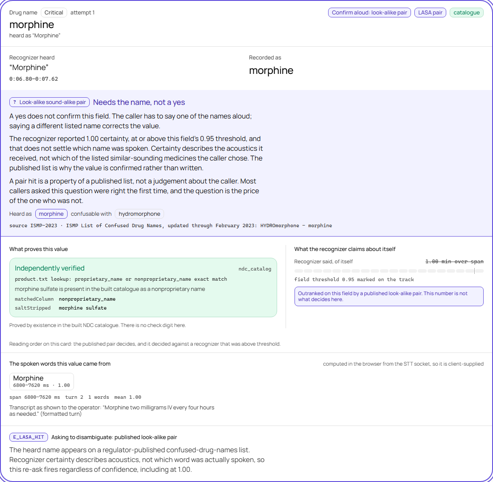
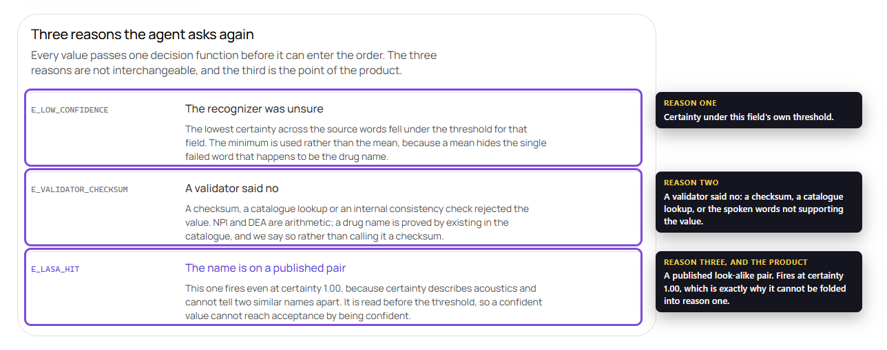
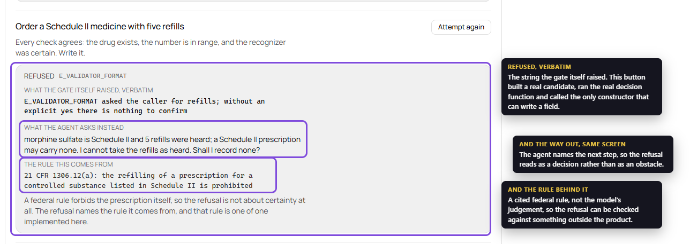
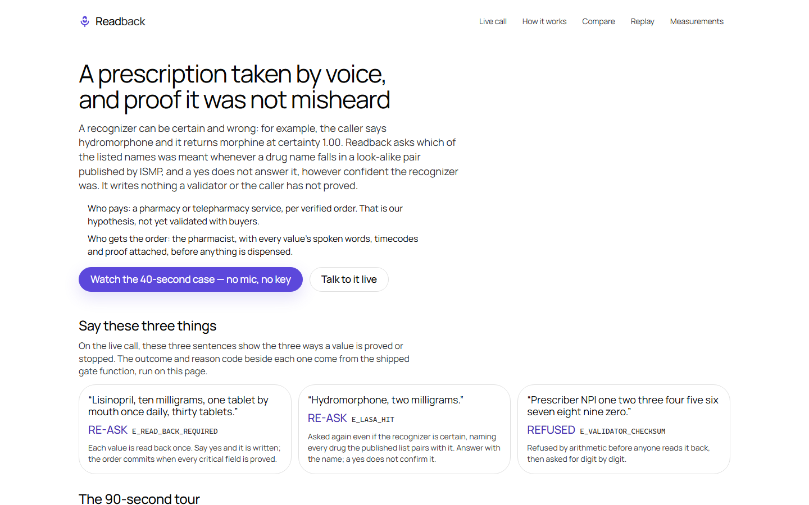
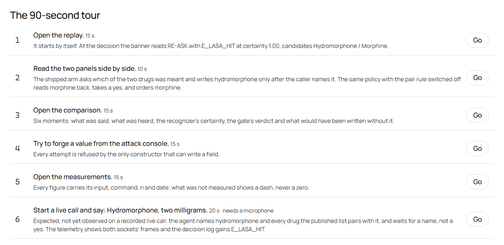

# Readback

A voice agent that takes prescription orders and proves it did not mishear.

**The recognizer proposes. A validator or a regulator's list decides. A refusal is a
result.**

Every field carries provenance: which spoken words produced the value, with
millisecond timecodes, the recognizer's confidence over those words, and the verdict
of an independent validator. A value cannot enter the order unless a validator passed
it or a human confirmed it aloud.

Built for the [AssemblyAI Voice Agent Hackathon](https://lablab.ai/ai-hackathons/assemblyai-voice-agent-hackathon).

## If you are judging this

**No clone, no key, no microphone.** Open the deployed application's root and press
*Watch the 40-second case*, or go straight to `/?judge=1`, which opens the replay first.

| Route | What it is |
|---|---|
| `/` | The first screen: the case in one line, the replay, the three things to say, and the tour below |
| `/live` | The live intake. Needs a microphone, and spends AssemblyAI credit; when the daily budget is spent it says so and offers the replay |
| `/compare` | Six moments side by side: said, heard, certainty, the gate's verdict, and what would have been written without it |
| `/how-it-works` | The three reasons to re-ask, the one constructor, and an attack console to try to get a value past the gate |
| `/metrics` | Every figure with its input, command, n and date; a dash where nothing was measured |
| `/order/[id]` | A committed order's receipt, re-checked in your browser: hash, NPI, DEA and the pair rule, VALID or TAMPERED |
| `/demo` | The replay with the pair rule on and off in two panels; both read the drug back |

### The tour, ninety seconds

Also on `/`, with a link per step. Only the last step needs a microphone.

| Seconds | Do this | Expect this |
|---|---|---|
| 15 | Open the replay (`/?judge=1`) | It starts by itself. At the decision the banner reads RE-ASK with `E_LASA_HIT` at certainty 1.00, candidates hydromorphone and morphine |
| 10 | Read the two panels side by side | The pair-rule arm refuses the caller's "yes" and writes hydromorphone only when the caller says the name. The same candidate with the pair rule switched off is read back plainly, the "yes" is accepted, and morphine is ordered |
| 15 | Open `/compare` | Six moments: said, heard, certainty, verdict, and what would have been written without the gate |
| 15 | Try to forge a value on `/how-it-works` | Every attempt is refused by the only constructor that can write a field |
| 15 | Open `/metrics` | Every figure carries its input, command, n and date; what was not measured shows a dash, never a zero |
| 20 | Start a live call on `/live` and say "Hydromorphone, two milligrams" | Expected, not yet observed on a recorded live call: the agent names hydromorphone and every drug the ISMP list pairs with it, spelling the start of each, and asks which; a "yes" is not accepted, only a name. The decision log gains `E_LASA_HIT` |

**What the replay is.** The replay is built from **synthesised socket traffic**: messages
generated in the documented shapes by `scripts/build/fixtures.ts`, not recorded from a
live call. The gate, the validators and the pair table it runs through are the shipped
ones. The recognizer figures in `eval/REPORT.md` (Entity Error Rate, calibration, the
coverage matrix, socket latency, the stress set) are different: those come from real
AssemblyAI sockets, over synthesised speech. The A/B table uses assigned confidences and the
gate's own decision time runs on the synthesised fixtures, and both say so. A recorded live session, when we have one,
replaces the synthesised replay and is labelled with its date.

## The problem

A recognition error in prescription intake does not look like an error. AssemblyAI's
own example: *"A patient states an allergy to Lisinopril. The transcript reads
Bisoprolol."* Both drugs exist, both are plausible, and nothing signals a fault. ISMP's
survey of verbal orders records the same thing happening between people: *HYDROmorphone*
heard as *morphine*. And, in AssemblyAI's words, *"A conversation isn't one transcription.
It's a chain of them."* ([The Voice Agent Accuracy Problem Nobody Benchmarks](https://www.assemblyai.com/blog/voice-agent-accuracy-problem-benchmarks),
8 September 2026.)

Their numbers set the scale:

| Fact | Value | Source |
|---|---|---|
| Entity Error Rate, Universal-3.5 Pro Realtime | **15.31%** at 6.99% WER | [Universal-3.5 Pro Realtime](https://www.assemblyai.com/blog/universal-3-5-pro-realtime), 23 June 2026 |
| Entity errors in the benchmark's *names* category | **16.92%** | the same page |
| A five-turn conversation at 84.69% per-turn entity capture comes through clean | **43.6%** | the accuracy-problem article above |
| The same, if the agent reads back every entity and the caller catches errors 70% of the time | **79.1%** | the same article; a model, not a measurement |

The last row is a projection, and its weak point is the caller: it assumes a person who
hears the wrong value read back catches it seven times in ten. A caller who hears
"morphine, correct?" and says "yes" out of habit is exactly how that assumption fails,
and it is the case this product is built around.

## The hard claim

**High recognizer confidence does not protect against homophony.** The model can be
certain it heard morphine while the human said hydromorphone. Confidence proves
nothing there; a regulator-published look-alike sound-alike list does.

So a drug name on the published ISMP List of Confused Drug Names triggers a **mandatory
re-ask even at confidence 1.0**, and the re-ask is contrastive: the agent names the drug it
heard and every drug the list pairs with it, and only a spoken name answers it. A "yes" is
not counted, and naming a partner corrects the value. The gates we found in the 132 submissions listed on the hackathon page on 24 September
2026, which we read, fire on low confidence, a failed validator, or a value missing from a known set.
This one fires on a name that is valid and present in the catalogue, regardless of how
sure the recognizer is.

## What is measured, what is derived, and what is assumed

Every claim below carries one of six statuses. The scale exists because a reader
cannot otherwise tell our strongest evidence from our weakest, and the difference is
large. Nothing here is graded generously: the honest grade is the low one.

| Status | Meaning |
|---|---|
| **Measured** | A command in this repository produced the number; the command and the set size are published beside it |
| **Enforced** | A machine check fails when the property stops holding; the check is named and runs in `make verify` |
| **Verified by hand** | Checked by execution on specific inputs, which are named, without a general measurement |
| **Observed** | Seen in live traffic, possibly once; the vendor does not document it and we do not generalise |
| **Cited** | A third party's number or rule, linked, not re-measured by us |
| **Assumption, not result** | Reasoned but unmeasured. Believing it is a choice, and it is labelled so nobody makes that choice unknowingly |

Applied to the claims this project actually makes:

| Claim | Status | Where |
|---|---|---|
| `ConfirmedValue` is unconstructible outside the gate | **Enforced** | `make gate-invariant`; a second type assertion, an `as unknown as`, or an angle-bracket cast fails the build |
| Each gate branch has a test that fails by name when the branch breaks | **Enforced** | `make gate-mutation`, 12 of 12 mutations killed |
| A LASA hit re-asks at confidence 1.0 | **Enforced** | LASA is read before the threshold in `decide()`; a mutation reversing the order fails a named test |
| The key never reaches the browser | **Enforced** | `make secrets` fails if `ASSEMBLYAI_API_KEY` appears outside `app/api/` |
| Entity Error Rate on our corpus | **Measured** | `eval/REPORT.md`, with the command and the set size, Wilson intervals throughout |
| Which of the three mechanisms pays for which re-ask | **Measured** | Coverage matrix over the 80 utterances of `eval/control` and `eval/native16`, `scripts/measure/coverage-matrix.ts` |
| What the shipped gate asks about correct values | **Measured** | Every drug name is read back by policy, so 59 of 59 correct drug names are asked about: 25 by the standing read-back, 13 by the threshold, 21 by a contrastive question. The pair rule changes which question is asked, not whether one is: `npx tsx scripts/measure/coverage-matrix.ts` |
| What the pair rule adds over a plain read-back | **Measured** | Without the pair rule a reflex yes writes 20 of 20 pair mishearings; with it, 0. The same candidates and the same read-back, one flag apart: `npx tsx scripts/measure/ab-gate.ts` |
| Rare drug names are harder than common ones | **Assumption, not result** | Pre-registered in `eval/heldout-preregistration.md`, opened once, **not demonstrated**: the Wilson intervals overlap |
| DEA and NPI are equally provable by arithmetic | **Measured, and 4.8% false of DEA** | 32 080 exhaustive mutations: NPI catches every single-digit substitution, DEA catches 95.2%. The policy stands; the sentence claiming equivalence did not |
| The pair rule covers the published ISMP list | **Measured** | The 2023 list, parsed from the ISMP PDF with the page and row of every pair kept, carries 514 pairs over 754 names; 502 of 3730 catalogue drugs carry a listed name, so every dictation of them gets a contrastive question: `npx tsx scripts/measure/ismp-coverage.ts`. The 20 curated pairs are the evaluation core and the demo |
| The recognizer confidently turns a listed name into its published partner | **Measured, not observed** | 0 of 186 degraded utterances (telephone band, noise at 10 and 5 dB, speed-up; 188 recorded, two sessions that closed on a transport error excluded rather than scored as mishearings), and no error at all at or above the 0.95 threshold: `npx tsx scripts/measure/analyse-stress.ts`. TTS voices only; the rule rests on the published list, not on this corpus |
| Provenance proves what was said | **False, and stated as false** | Provenance is computed in the browser; the gate proves a value traces to words the session reported, not that they were spoken |
| Socket close codes mean what we log | **Observed** | The vendor documents no close codes at all, verified 17 September; every entry names whose observation it is |
| A confirmation loop nearly doubles task completion | **Cited, and a projection** | AssemblyAI's own model (43.6% to 79.1%), linked in the table above; it assumes callers catch 70% of read-back errors, and we have not measured it |
| Read-back is required by ICAO and the Joint Commission | **Cited** | Both quoted verbatim with the clause number |
| Checksum behaviour on specific identifiers | **Verified by hand** | `AB1234563` passes, `BX1234567` fails, `1234567893` passes, `1234567890` fails |
| The market size in money | **Assumption, not result** | We have not estimated it and do not publish a figure we cannot source |
| A proposed value is supported by what was spoken | **Enforced** | The server reconciles the value against the words of its turn; a mismatch is a validator failure, not a fourth reason |
| A value confirmed for one field cannot be written under another | **Enforced** | Found by attack the same day: the policy applied was the wrong field's while the write keyed off the candidate's |
| A word the recognizer never scored cannot pass as a scored one | **Enforced** | Found by attack: `NaN < threshold` is false, so an unscored word was accepted outright on a field without mandatory read-back |
| A spoken "yes" confirms only when bound to the words that were read back | **Enforced** in tests, not yet seen live | The model's `caller_answer` is a hint. A confirmation needs the agent's read-back turn, played to the end and naming the value, then a caller turn that is wholly affirmative. "Yeah, no", "yes but", a different value, "mhm" or "thank you" never confirm. For a drug on the ISMP list a "yes" never confirms at all: the read-back must name every listed partner (`E_READBACK_NOT_CONTRASTIVE` otherwise), the caller must say the name (`E_LASA_NAMED_ANSWER_REQUIRED` for a yes), and naming a partner corrects the value (`E_CALLER_NAMED_LASA_PARTNER`): `tests/sessions/confirmation-evidence.test.ts`, `tests/sessions/contrastive-read-back.test.ts`, `tests/api/confirmation-flow.test.ts`, `tests/api/contrastive-read-back.test.ts` |
| Every curated pair is a row of the 2023 ISMP list | **Verified by hand**, then pinned | Checked 25 September against the list itself; `tests/lasa/pairs-sourced.test.ts` re-checks it whenever the list text is present |

Two entries in that table are failures of our own hypotheses, and one says a claim we
previously made was wrong. They are in the table for the same reason the rest are:
a scale that only ever grades its author highly is decoration.

## Sixty seconds, in order, with no microphone

The demonstration does not require a working microphone, a second person, or a
successful recognition. Every step below runs from a synthesised session, so it
produces the same result on a laptop in a quiet room and on a phone in a corridor.

**1. Open `/demo`.** Two panels, one synthesised session. The staged caller says
*hydromorphone*; the recognizer is made to return *morphine* at confidence **1.0** — not a
low score, not a hedge, the highest value the API can report.

**2. Read the left panel, where the pair rule is on.** The agent names both drugs from
the ISMP list, spelling the start of each, and asks which one was meant. A "yes" is
refused (`E_LASA_NAMED_ANSWER_REQUIRED`) and writes nothing; the caller says
"hydromorphone", which corrects the recognizer, and that is what is ordered. Note what did
*not* cause this: the confidence is perfect and the validator passed, because morphine is
a real drug at a real strength. The only thing that stopped it was membership in a
published pair.

**3. Read the right panel, where the same file runs with the pair rule off.** Same
input, same recognizer output, same confidence, and the drug is still read back, as policy
requires: "morphine, correct?". The caller says "yes" by reflex and **the wrong drug is
ordered**. Both panels read the drug back; the difference between them is one policy flag,
`lasaChecked`, not a better model and not the presence of a read-back.

**4. Now try to make the gate contradict itself.** The left panel shows high
confidence *and* a mandatory re-ask at the same time. If that reads as a
contradiction on screen, the interface has failed — confidence is presented as the
recognizer's own certainty beside an independent verdict, never as a quality score.
There is a check in `make verify` that refuses wording which turns it into one.

**5. Open `/metrics`.** Every figure carries the command that produced it and the
size of the set it came from, and the cost side is published beside the catches: how
often the gate asked when the value was already right. A one-sided metric would have
been the easier thing to show.

**6. Open `/how-it-works` and try to break it yourself.** Three reasons to re-ask,
enforced in code rather than in a prompt, and the one constructor that can write a
value — and beside them an attack console with **seven attempts to get a value past
the gate**, each one you run rather than read about:

- *Lower the confidence threshold to zero.* If the gate were only a threshold,
  accepting everything would let the value through. It does not: the pair check is
  read **before** the threshold, so a published look-alike name is still asked about
  at any confidence, including 1.00. This is the quickest way to falsify our central
  claim, so it is the first button.
- *Claim the caller confirmed it, without a read-back.* The payload says
  `caller_confirmed`. That is a string in a request, not a confirmation.
- *Write a value its validator rejected.* The recognizer was certain and the field is
  filled in.
- *Write a value with no source words.* The value is correct — does it matter which
  words produced it?
- *Reuse an accepted decision from another field.* One field passed, so borrow its
  approval.
- *Order a Schedule II medicine with five refills.* Every individual check agrees:
  the drug exists, the number is in range, the recognizer was certain. The order is
  still federally void, and the data to know that was already present.
- *Order a medicine whose name is one vowel away from a real one.*

Each attack states what it assumes and what actually happens. We would rather hand a
reviewer the tools to disprove the claim than ask them to take it on the strength of
a paragraph.

**7. If you do have a microphone, interrupt the agent mid-sentence.** Nothing is sent
to the recognizer between `reply.started` and `reply.done`, and a turn arriving during
playback that matches the agent's own last line is discarded. A phantom turn would put
words the human never said into a field's provenance, which is worse than a stutter.

**8. Then say a drug name and, in the same breath, correct yourself** — "Lisinopril,
no wait, Losartan". The server refuses the value you took back: `propose_field` answers
`E_VALIDATOR_COMBO` with `support_code: E_RETRACTED_VALUE`, the second reason to re-ask and
not a fourth, and losartan goes on to its own checks. It knows six markers: "no wait",
"sorry", "I mean", "actually", "scratch that" and "not X, Y". A correction phrased any other
way is not detected, and then the read-back is the mitigation
([docs/limitations.md](docs/limitations.md)).

Step 8 used to point at a gap and now points at its fix, with the boundary of the fix
beside it. A demo script that only contains the parts that work is a sales pitch.

### The five screens that carry the argument



*The whole product in one card, from the synthesised replay.* The recognizer heard
**morphine** at certainty **1.00**, above the field's 0.95 threshold, and the value is still
not accepted: morphine is on the 2023 ISMP list with hydromorphone, so the card asks for the
name, not a yes. High certainty and a mandatory re-ask sit together without reading as a
contradiction; the certainty meter is marked as outranked by the published pair.



*Three reasons, never folded into one.* `E_LOW_CONFIDENCE`, `E_VALIDATOR_CHECKSUM`
and `E_LASA_HIT`, each carrying the reasoning behind it. Two details worth reading off
this screen: confidence is the **minimum** across the source words rather than the
mean, because a mean hides the single failed word that turns out to be the drug name;
and the pair check is **read before** the threshold, so a confident value cannot reach
acceptance by being confident. That ordering is what makes the third reason
structurally different from the first rather than a stricter version of it.



*A refusal that can be checked against something outside the product.* Every
individual check agreed — the drug exists, the refill count is in range, the
recognizer was certain — and the order is still refused, because
**21 CFR 1306.12(a)** forbids refilling a Schedule II prescription. The screen carries
the verbatim string the gate raised, the sentence the agent says next, and the rule it
comes from. Refusal and recovery on one screen; the citation is what makes it
auditable rather than a judgement call.



*One URL, nothing to configure.* The root is the judge's first screen: the case in one line,
**Watch the 40-second case** with no microphone and no key, **Talk to it live**, and three
things to say, each with the outcome and reason code to expect.



*The script is on the page, not only in this file.* Six timed steps with a link each; only
the last needs a microphone.

**What each artefact in this project actually is, stated once so it does not have to
be guessed at.** The five images here are unedited screenshots of the running
application, retaken on 25 September after the demo pair changed. Three earlier screenshots
showed the withdrawn lisinopril-bisoprolol citation and a label calling the replay a live
recording; both claims were wrong, and those images were replaced rather than captioned over. The recognizer confidences and word timings in the live
sections of `eval/REPORT.md` come from real AssemblyAI socket traffic against
synthesised speech (a desktop text-to-speech voice, named per item in the eval
artefacts as `"voice": "Microsoft David Desktop"` or similar) — synthetic audio, real
recognition. The A/B table there uses assigned confidences and the gate's own decision time
runs on the synthesised fixtures, and both say so. The replay behind the walkthrough is the
other exception, and it is labelled as one: its
socket messages are synthesised in the documented shapes, so it demonstrates the gate's
decisions, not the recognizer's behaviour. The submission video, once recorded, carries the same labelling in its own
description: which parts are a live screen recording, which play back a synthesised
session rather than a live microphone, and whether any cut removes dead air or a
retake rather than changing what the product did. A cut for pacing is disclosed as a
cut for pacing; nothing in the video is permitted to imply a capability the running
application does not have.

## Why it is called Readback

The name is the procedure, not a metaphor.

**Aviation, ICAO Annex 11 §3.7.3.1:** *the flight crew shall read back to the air
traffic controller safety-related parts of ATC clearances and instructions which are
transmitted by voice*, and, in §3.7.3.1.2, the controller *shall take immediate action to
correct any discrepancies revealed by the read-back.*

**Clinical practice, Joint Commission, a National Patient Safety Goal from 2003**
(NPSG.02.01.01 in the 2009 wording): *for verbal or telephone orders or for telephone
reporting of critical test results, the individual giving the order or test result
verifies the complete order or test result by having the person receiving the
information record and "read back" the complete order or test result.* ISMP's 2017
survey places the requirement in the standards at PC.02.01.03 EP 20. Where it sits in
the 2026 manual, after the goals were restructured, we have not verified.

Medicine borrowed the readback/hearback pair straight from aviation. We automate a
step regulation already requires and practice routinely skips, which
[ISMP documents](https://www.ismp.org/sites/default/files/attachments/2018-03/20170518.pdf).

## Three reasons the agent re-asks

Not interchangeable, and enforced in code rather than in a prompt:

1. **Confidence below the field threshold** — the minimum over the source words.
2. **Validator failure** — DEA mod-10, NPI Luhn with the `80840` prefix, existence in
   the catalogue, or an internally inconsistent
   drug × strength × form × route combination.
3. **LASA pair membership** — fires regardless of confidence.

Three, and the count is load-bearing. A fourth top-level reason would mean the gate
had acquired a policy, and a policy can be argued with; these three are conditions.

**A value the speech does not support is the second reason, not a fourth.** The agent
supplies the value, so it can propose a name nobody said while quoting a phrase that
really does trace to a recorded turn. The server reconciles the proposed value against
the words of that turn and, on a mismatch, produces a validator verdict named
`spoken_support` — deliberately not borrowing a checksum's name, because naming
another validator would claim a proof that never ran. Tolerances are the ones a
recognizer really produces: spoken units, spelled-out digits, salt suffixes in either
direction, and the vowel drift that turns `vinorelbine` into `venorelbine`. A test
asserts over all 20 curated pairs, in both directions, that no look-alike counterpart
is ever accepted as evidence for its partner.

`ConfirmedValue` cannot be constructed outside the gate: it is a branded type whose
brand is module-private, and the order accepts nothing else. There is no code path by
which "the model decided it was fine" writes a value — not a `force` flag, not a
convenience constructor, not an object literal. The check that enforces this was
itself bypassable until we attacked it, which is the section below.

## What is proved by arithmetic and what is not

Stated plainly, because the distinction matters and is easy to overclaim:

- **DEA and NPI are arithmetic, and they are not equally strong.** A checksum
  rejects a mistyped digit independently of what the recognizer heard, so both fields
  skip mandatory read-back: reading nine digits aloud lengthens the call without
  adding proof. Verified by hand: `AB1234563` passes and `BX1234567` is rejected;
  `1234567893` passes and `1234567890` is rejected. Then verified exhaustively, which
  corrected us: `make audit-checksums` mutates 200 valid identifiers of each kind in
  every single-digit substitution and every adjacent transposition — 32 080 mutations,
  not a sample. **NPI catches 100% of substitutions, DEA catches 95.2%**, because the
  DEA scheme weights alternating digits by 1 and 2 and sums mod 10, so a substitution
  changing a weight-2 digit by five is invisible to it. The policy stands; the earlier
  sentence claiming the two checks were equivalent did not.
- **NDC has no check digit.** A drug name, strength, form and route are proved by
  existence in the built catalogue and by the combination being internally
  consistent. Calling that a checksum would be a lie.
- **A field with no validator must be read back.** `patientName` has neither, so it
  is confirmed by voice or not at all. A test enforces this implication across the
  whole policy table.

## Why it's built on AssemblyAI

The product's claim only has teeth if the input to the gate is the recognizer's own
evidence, not a paraphrase of it. Three properties of AssemblyAI's API make that
possible rather than aspirational:

- **Word-level timings and per-word confidence, not a turn-level score.** The gate's
  policy takes the **minimum** confidence across the words that produced a value, not
  the mean, because a mean hides the single failed word that turns out to be the drug
  name. That policy needs `words[]` with millisecond `start`/`end` and a confidence
  per word — a turn-level number alone could not support it. `E_LOW_CONFIDENCE` names
  this choice, and it is what makes provenance genuine down to the word rather than
  the sentence.
- **Server-side HTTP tools remove a race this architecture would otherwise have to
  manage itself.** `commitOrder` and `proposeField` are declared with `http.url` and
  AssemblyAI calls them directly — there is no `tool.call`/`tool.result` exchange in
  the browser to order against `reply.done`, and no client-side queue to flush on
  interruption. That is what makes a stateless serverless route sufficient: the
  function lives for the milliseconds of one call, not the minutes of a session. The
  full argument, including the race it removes, is in
  [docs/assemblyai-api.md](docs/assemblyai-api.md).
- **`keyterms_prompt` biases the recognizer toward exactly the strings it is given,
  which is a control surface the product depends on staying pointed away from the
  thing it verifies.** Domain terms — clinic name, prescriber name, dosage forms,
  units, route words — go in; drug names inside a published LASA pair never do,
  enforced by `make keyterms-purity`. A vendor feature that could not bias the
  recognizer toward specific strings would not create this risk, and a vendor that did
  not expose the bias as a first-class, testable configuration field would not let us
  guard against it mechanically.

Two further properties matter for the build rather than the claim: single-use,
short-lived tokens minted server-side mean `ASSEMBLYAI_API_KEY` never has to reach the
browser (`make secrets` enforces the absence), and entity-aware turn detection on the
agent socket — active by default, and switched off entirely if `min_silence` or
`max_silence` is ever set, per the vendor's own documented behaviour — is what lets a
prescriber dictate a nine-digit NPI in groups without a short endpoint truncating it
mid-number. Both are documented at length in
[docs/assemblyai-api.md](docs/assemblyai-api.md).

## Stack

One Next.js application on Vercel. No Docker, no always-on process, no database
server.

The browser holds both AssemblyAI sockets directly using short-lived tokens; our
routes mint those tokens, serve the agent's server-side HTTP tools, and store
finished sessions in Vercel Blob; the shared daily budget and the session registry live in
Upstash Redis from the Vercel Marketplace, a third-party resource. AssemblyAI's docs state no proxy is required, and
the same shape is the documented Vercel pattern: mint on the server, hand the browser
a token.

```
browser ──► wss://streaming.assemblyai.com/v3/ws    word timings, confidence
        ──► wss://agents.assemblyai.com/v1/ws       conversation, turn detection
        ──► /api/tokens/*                           short-lived tokens
AssemblyAI ─► /api/tools/*                          server-side tool calls
```

## Running

```bash
npm ci
cp .env.example .env.local
make data
make agent
make dev
make verify
```

`make data` builds the NDC catalogue and the LASA table into `data/`. `make agent`
creates the reference agent that `make doctor` checks against the source and prints the id
to put in `.env.local`; live sessions create their own. `make dev`
serves on `http://localhost:3000`. `make verify` runs the linters, the type checker,
the tests and every ratchet.

`ASSEMBLYAI_API_KEY` is required for `make agent` and for any live session; the tests
and the synthesised replay run without it.

**The agent is defined in one place, `src/agent/`, and every live session creates its
own.** `buildAgentDefinition()` produces the whole `POST /v1/agents` body — prompt, tools,
`input`/`output` configuration — from source under version control, so the definition can
be read, reviewed and diffed like any other code. The agent token route POSTs that
definition with the session id for every live session, and finalize deletes the agent
again. `make agent` keeps a reference agent for `make doctor`, which checks that its
tool webhooks are reachable and that its content matches the source
(`scripts/report/agent-drift.ts`).

### Checking our numbers without a key

```bash
make honest
```

Prints every figure in this repository that is derivable offline, each above the
command that produced it and the size of the set it came from: the entity error rate
on the control corpus, which mechanism catches which recorded error and which question
each asks of a correct value, the shipped gate run against itself with and without the
pair rule, exhaustive checksum coverage, our own skeleton detector pointed at our own
catalogue, the controlled-substance census, the confidence calibration curve, the rarity
stratification, latency against its budget, how much of the published ISMP list the pair
rule covers and what it costs, whether degraded audio turns a name into its published
partner, the synthesised fixture path replayed end to end, the human-voice set, an honest
count of every paid run including the discarded ones, and what the paid API has actually
cost. Fifteen blocks, no network call, no key —
`scripts/report/honest.ts` names the count itself at the end of its own output, so this
sentence is checked against that rather than typed independently.

It deliberately does not fill in anything that needs a live socket. Those rows read
as not measured in `eval/REPORT.md` and they read that way here too.

Server-side tools need a publicly reachable HTTPS host, so they are debugged on a
preview deployment or through a tunnel.

### Which path reaches the API and which reaches a fixture

Stated as a table, because "tests must not burn credits" is a rule that is easy to
claim and easy to violate by accident.

| Command | Opens a paid socket | What it runs against |
|---|---|---|
| `make test` | **no** | Socket traffic in `eval/fixtures/`, **synthesised** by `make fixtures` against the documented message shapes, not captured from a live run |
| `make verify` | **no** | Every step is local; `VERIFY_STEPS` in the `Makefile` is the list |
| `make honest` | **no** | Recorded corpora and the real validator and gate |
| `make e2e` | **no** | Playwright with a fake microphone against a preview deployment |
| `make doctor` | **no** | Ordinary HTTPS: the reference agent exists and matches the source, and every tool URL is reachable. Opens no socket, so it costs nothing, and it **exits non-zero** rather than printing a summary |
| `make spend` | **no** | Reads the recorded run ledger. With no run recorded it publishes **no figure at all** and says why, because a zero would be a number nobody measured |
| `make measure` | **no** | Its live path is **not implemented**: it prints the gate's own decision latency from fixtures and then states which rows stay unmeasured. It refuses to fabricate the socket figures rather than opening a socket |
| `make eval` | **yes** | The development set, 40 sessions at 24-second spacing |
| `make eval-heldout` | **yes** | The sealed held-out set, opened once against a pre-registered rule |
| `make eval-live` | **yes** | The human voice set from `docs/voice-set.md`; refuses to open a socket without `--confirm-paid`, which the target passes |

The paid targets **refuse to run without a key rather than reporting a number they
did not measure** — the error message says exactly that. A target that silently
skipped would produce an absent figure indistinguishable from a measured zero, which
is the defect class this project has been bitten by three times.

In the other direction, the test suite never reads a real key: `tests/setup.ts` deletes
`ASSEMBLYAI_API_KEY` and the other paid credentials before any test module loads and
replaces `fetch` and `WebSocket` with refusing stubs; every test that needs the variable
sets a placeholder with `vi.stubEnv`. No test can reach AssemblyAI even if the environment
holds a valid credential.

## Engineering rules

Enforced mechanically, not by convention. `make verify` runs all of it.

| Rule | Check |
|---|---|
| No file over 250 lines | `make file-length` (ratchet over a baseline) |
| No directory over 20 sources / 30 tests | `make package-size` |
| No import cycles, test imports included | `make import-cycles` |
| The gate imports nothing but domain, validators, lasa, catalog | `make import-cycles` |
| No directory named utils, common, helpers | `make package-subject` |
| English only in code | `make ascii` |
| No raw hex outside the token files | `make tokens` |
| Body text reaches 4.5:1 against its surface | `make contrast` |
| The API key never leaves `app/api/` | `make secrets` |
| No LASA-checked drug name in keyterms | `make keyterms-purity` |
| The held-out set is unchanged since sealing, **and a populated set nobody sealed also fails** | `make heldout-seal` |
| A design token referenced but never defined | `make token-refs` |
| A stylesheet separated from the component it styles | `make colocation` |
| A class declared in a module and read by nobody | `make css-dead` |
| A client tree importing **values** from `@/catalog`, `@/sessions`, `@/tools`, `@/agent`; type-only imports pass | `make server-only` |
| Wording that renders confidence as a quality score | `make confidence-language` |
| `ConfirmedValue` is built only inside the gate | `make gate-invariant` |
| Every gate branch dies to its own test | `make gate-mutation` |

The table above names the ones whose purpose is not obvious from the check name; it is
not the full list. `VERIFY_STEPS` in the `Makefile` is the full list, and no count
appears here on purpose: a number transcribed into prose drifts from the list that runs
the moment either one changes without the other. Read it there, or run `make help`.

`make gate-mutation` breaks one gate branch at a time and requires the matching test
to fail **by name**, then restores the file byte for byte. A mutation that survives
is a defect in the test, not proof of the code. The check fails when the gate file is
absent — absence must never read as success.

### Continuous integration

Three workflows rather than one, split by what each protects and by how fast it answers:

| Workflow | What fails it | Runs |
|---|---|---|
| **code quality** | lint, types, the file and package ratchets, import cycles, the English-only rule, and the interface rules a screenshot cannot prove | about 10 minutes, two jobs in parallel |
| **test suite** | the suite itself, then the offline evidence: the recorded pipeline, the latency budget, keyterm purity, the held-out seal, and every figure `make honest` reproduces | about 20 minutes |
| **safety invariants** | the gate invariant, all twelve mutations, and the check that no secret reaches the built client bundle | a few minutes; each mutation reruns the gate tests, not the whole suite |

Every step inside a job carries `if: ${{ !cancelled() }}`, so a failing lint does not
hide the state of the nine checks behind it. One red run should say everything that is
wrong, not the first thing.

Two of the jobs assert something about the run rather than the code: the gate file must
be byte-identical after mutation testing, and no positive control may leave a planted
file behind. Both have happened, so both are checked.

There are no comments in this repository. Not line, not block, not JSDoc, not `#` in
configuration. Explanations live in [docs/](docs/), where they can be read
in full rather than in fragments beside code.

## How the guarantee is engineered, and how we tried to break it

A guarantee nobody attacked is a claim. So each of ours was attacked deliberately,
and two of them fell.

**The invariant was bypassable, and all three checks were green while it was.**
`ConfirmedValue` is a branded type whose brand is a non-exported
`declare const ... unique symbol`, so exactly one type assertion in the repository
builds one, inside `gate/confirm.ts`. `make gate-invariant` enforces that count.
TypeScript, however, has **two** assertion syntaxes, and the check scanned only for
`as ConfirmedValue`. A file using the older `<ConfirmedValue>raw` forged a value and
wrote it into an `Order` while `biome check`, `npx tsc` and `make gate-invariant`
passed **simultaneously**. Worse, the `as unknown as` route — which forges any
branded type at all — was closed only incidentally, by a lint rule rather than by the
invariant, and would have reopened at the first `biome-ignore`. All three forms fail
by name now, and the exploits are kept as tests instead of being deleted.

**The contrast with a secret is worth naming, because it is easy to mistake one for
the other.** A human-gate design seen elsewhere in this field generates
`secrets.token_urlsafe(10)` and **returns it in the tool result that goes back to the
model** — so the human-approval code sits inside the context of the very agent it is
meant to restrain. That is a defensible design for its purpose, and it works because
the token is a secret: knowing it is what grants the action, and a secret can be
copied, guessed with enough attempts, or leaked by a careless log line, because
knowledge of a value is exactly the kind of thing a string can carry. `ConfirmedValue`
is not a secret and cannot be treated as one. Nothing about knowing the shape of a
`ConfirmedValue`, or even holding a real one from another field, lets code construct a
new one — the brand symbol that makes the type is module-private, so the only
expression in the entire repository capable of producing the assertion lives inside
`gate/confirm.ts`, and copying the string `"lisinopril"` into a hundred contexts does
not copy the authority to write it. The difference is the one between a password and
a lock with no keyhole: a token-based human gate can be defeated by learning the right
string; ours cannot be defeated by learning anything, because there is no code path
that accepts a string as proof.

**The secrets check excluded a directory name, not a directory.**
`make secrets` asserts that `ASSEMBLYAI_API_KEY` never appears outside `app/api/`.
It used `grep --exclude-dir=api`, which excludes *any* directory called `api` at
*any* depth — so `src/features/api/leak.ts` reading the key passed cleanly. The same
file now fails by name, and the key's absence is verified against the **built
bundle** rather than the source tree: after `next build` the key appears only under
`.next/server/app/api/` (the two token routes and the finalize route, which deletes the
per-session agent) and nowhere under `.next/static`.

**Absence must never read as success, and we had to learn this more than once.**
The first version of `make gate-mutation` passed when the gate file was missing. That
class of defect then reappeared in two unrelated places: `make secrets` would have
gone green if the variable were simply renamed away, and `make tokens` suppressed its
own output for every file because of a shell subtlety — under `set -o pipefail`, the
`||` in `grep | sed || true` binds to `sed`, so a non-matching `grep` killed the
pipeline and `|| true` swallowed the failure. It reported success while checking
nothing, and a raw hex literal lived in a component for an unknown period. Every
ratchet now has a positive control: a test that plants a violation and requires the
check to fail. `tests/scripts/ratchet-positive-control.test.ts`.

**Each gate branch is required to die to its own test.**
`make gate-mutation` breaks one branch at a time, runs the suite, and requires the
matching test to fail **by name** — then restores the file byte for byte. A mutation
that survives is a defect in the test, not evidence about the code. Twelve of twelve
are killed. The script itself was hardened after it reported a count it derived from
itself, which is a number that cannot disagree with reality.

**What remains broken on purpose, stated at full strength.** Provenance is computed
in the browser. Anyone with DevTools can post arbitrary words with arbitrary
confidences to the turns route, and the gate will accept a value tracing to them,
because the gate proves a value traces to words *the session reported* — not that
they were spoken. Against a malicious client the evidentiary chain is worth nothing.
It is built to stop a recognizer from quietly mishearing a drug name, not to stop a
caller who wants to deceive themselves, and closing it properly would mean routing
audio through our own host — the always-on process this architecture deliberately
removed.

The full engineering account, with the commands and the set sizes, is in
[eval/REPORT.md](eval/REPORT.md).

## Security model

- **The key never leaves the server.** The browser holds two short-lived, single-use
  tokens; the routes clamp `expires_in_seconds` and `max_session_duration_seconds`
  (`tests/api/tokens/token-routes.test.ts`), and `make secrets` fails if the key appears
  outside `app/api/`. After a build, `make check-bundle` searches the client bundle for
  secrets and server modules.
- **Spend has a ceiling that is shared, not per instance.** A daily budget of
  `READBACK_DAILY_BUDGET_SECONDS` (7 200 by default, a policy we chose, not a
  measurement) is debited atomically in Redis when a token is minted and refunded when
  the vendor fails; one client may spend at most half of it, so a single visitor cannot
  end live calls for everyone. Two addresses still can: this is a ceiling, not a rate
  limit (`tests/api/tokens/budget-health.test.ts`, `tests/sessions/budget-client-share.test.ts`).
  The per-instance rate brake says in its own 429 body that it enforces no global cap.
- **The tools trust only AssemblyAI and only for one session.** Every tool call carries a
  shared secret in a write-only header, compared in constant time, and a `?sid=` that
  must name a session the token route registered; an unknown id is refused and creates
  nothing. Tool URLs are built from the configured deployment URL, never from a request's
  own `Host` in production (`tests/agent/tool-base-url.test.ts`).
- **Storage fails closed.** Without the Redis and Blob variables, production refuses to
  start rather than keeping orders in the memory of one function
  (`tests/sessions/store-fail-closed.test.ts`, `tests/tools/shared-store.test.ts`).
- **Headers.** Production responses carry a content security policy limited to our own
  origin and the two AssemblyAI hosts, `frame-ancestors 'none'`, and a permissions policy
  that allows the microphone to this origin only (`next.config.ts`).
- **What is not protected** is in the next section: provenance is posted by the browser,
  so the gate proves a value traces to reported words, not that they were spoken.

## Honest limits

Stated here rather than left to be discovered. The complete account, with nothing
softened, is in [docs/limitations.md](docs/limitations.md).

- **A caller who corrects themselves inside one utterance is detected only through six
  markers.** If someone says "Lisinopril, no wait, Losartan", the server refuses
  lisinopril as a value the caller took back: `spoken_support` fails with
  `E_RETRACTED_VALUE`, which is the second reason to re-ask, not a fourth. The markers are
  "no wait", "sorry", "I mean", "actually", "scratch that" and "not X, Y";
  `tests/confirmation/self-correction.test.ts` pins each of them and the phrases that must not
  fire ("lisinopril, not losartan", "sorry about that"). A correction without a marker,
  or one spread across two turns, is not detected, and the read-back is the mitigation.
  Four tests in `tests/confirmation/retracted-span.test.ts` pin the provenance side: the
  matcher still finds a span for the retracted word, because it was said, and the
  refusal is spoken support's.

- **We have not caught the recognizer making the mistake the product is built around.**
  Every listed name in our TTS corpora, re-recognized live through a telephone band, white
  noise and a speed-up, 188 utterances, 186 of them scored (two sessions closed on a
  transport error, 1006 and 1008, and are excluded rather than counted as mishearings): none
  came back as its published partner, and none of the 18 errors reached the 0.95 threshold. Some did become other real drugs (azacitidine as
  azithromycin, silodosin as thalidomide), which is the shape of the error, one step short.
  The replay that shows hydromorphone heard as morphine at 1.00 is staged and labelled so. The
  pair rule rests on the published list and on people mishearing these names, not on our corpus.

- **No live call is recorded yet, and the first attempts found four real defects.** Six
  scripted calls (`make live-smoke`: a real browser, both real sockets, a synthesised caller)
  failed on 25 September before any field was proposed, and each failure was a defect every
  passing test had missed: a vendor schema that differs from its documentation, a session
  message the vendor refuses, per-route memory in development, and a capture that could hang
  with both sockets billing. All four are fixed and tested
  ([docs/findings.md](docs/findings.md)). The calls themselves cannot run on the machine they
  were written on, whose automated browsers never start an audio worklet, so they run in CI
  against a deployed URL (`.github/workflows/live-smoke.yml`). Until that run is recorded, the
  live path is proved by tests, not by a call.

- **A published list only catches the pairs it publishes.** Lisinopril misheard as
  bisoprolol is AssemblyAI's own example of the failure this product exists for, and it
  is on no list we have found, the full 2023 ISMP list included. Our gate would not
  re-ask it on the pair rule: it would pass on confidence and a valid catalogue entry, and
  only the plain read-back, which a reflex "yes" passes, would stand between it and the
  order. The pair rule is exactly as good as the list behind it.

- **Provenance is computed in the browser, so the gate proves provenance, not truth.**
  With the browser holding the STT socket directly, `words[]` never passes through our
  server, so provenance is client-supplied data: the client posts it to
  `POST /api/sessions/{id}/turns`, which is deliberately unauthenticated because a
  browser cannot hold the shared tool secret without publishing it. Stated at full strength: anyone with DevTools can post
  arbitrary words with arbitrary timings and arbitrary confidences, and the gate will
  accept a value carrying that provenance, because the gate verifies that a value
  traces to words the session reported — not that those words were ever spoken.
  Forging your own transcript is lying to yourself, and the gate is not built to stop
  a caller who wants to deceive themselves; it is built to stop a recognizer from
  quietly mishearing a drug name. In the malicious-client threat model the evidentiary
  chain is worth nothing, and we say so rather than letting it be found.
  What the route does enforce is resource isolation, since bounds are the only defence
  available without a secret: a validated session id (`[A-Za-z0-9._-]`, never `..`, at
  most 128 characters, so a session id can neither address another tenant's blob nor
  escape the `sessions/` prefix), at most 200 words per turn, 400 turns per session,
  64 concurrent sessions evicted least-recently-used, and word timings bounded by the
  three-hour socket cap. Making provenance itself trustworthy would mean routing audio
  through our own host, which is the always-on process the architecture deliberately
  removed. Turn-level numbers from `GET /v1/sessions/{id}` are server-side and honest;
  word-level timings are not available there, so word-to-gate latency would be a browser
  measurement, and it is not measured yet.
- **A second channel now witnesses the words, after the call.** The agent socket recognizes
  the caller on AssemblyAI's side. At finalize the server fetches that transcript with its own
  key and marks every confirmed field `witnessed`, `not_witnessed` or `unavailable` in the
  receipt, which `/order/[id]` shows. A browser that forges its turns cannot forge the vendor's
  record. Two boundaries, stated: the timeline appears only seconds after the session ends,
  so the witness cannot block a commit during the call; and it proves the vendor heard the
  words, not that a person said them (`src/sessions/witness.ts`, `tests/sessions/finalize-witness.test.ts`).
- **The evaluation corpus is synthesised.** We found no open English corpus of human
  speech reading drug names. Entity Error Rate here measures the recognizer against
  synthetic speech, not human speech, and the report says so.
- **The pair rule is as good as the 2023 ISMP list, and no better.** `data/lasa-pairs.json`
  is parsed from the ISMP PDF, whose URL and sha256 it records, and its full tier carries
  514 pairs over 754 names with the page and row of each; the curated table holds 20 pairs,
  each checked by hand against its row, for the demo and the evaluation. A pair the list
  does not publish is not re-asked on the pair rule, and a pair we derived ourselves is
  never added. The list is from 2023; a newer edition means rebuilding with `make data`.
  The price is measured beside the catches: `npx tsx scripts/measure/ismp-coverage.ts`
  prints the share of catalogue drugs on the list and the share of correct values it puts
  to a contrastive question.
- **Thresholds are initial values, not measured optima.** They are chosen defaults,
  reasoned from the cost of an error per field before any audio existed. They were not
  tuned on any set; the held-out set was sealed on 16 September and opened once.
- Every figure in `eval/REPORT.md` carries the command that produced it and the size
  of the set it came from. Numbers without a method are not published.
- **Voice audio goes to a third-party vendor, and consent to that is implied by using
  the app rather than asked for explicitly.** Both sockets connect to AssemblyAI's
  global endpoints with no data-residency selection in this codebase; their retention
  policy governs what happens to that audio, and we have not verified its terms
  closely enough to summarise them here rather than link to them.

**This is a technology demonstration, not a medical device.** All data is synthetic:
no real patients, no real prescriptions, no clinical use. **If this were a real
emergency, call 911, or 988 for a mental health crisis** — this application does not
triage symptoms or reach emergency services.

## What we claimed and then withdrew

Claims in this repository that turned out to be wrong, corrected in place rather than
quietly deleted. The diffs are in the history; the reasoning is here. The list is kept
complete rather than representative, because a section of this kind is only worth
reading if its author had no say in what goes in it.

**We accused a competitor of sloppiness, and the misreading was ours.** An earlier
draft of our own working rules cited another submission as claiming "8 tests in the README and
177 elsewhere", and used it as the justification for our own rule that numbers without a
method are forbidden. Their README's Tests section is a table of **eight verification
topics**, not a count of tests, and their repository holds sixteen test files. We had
spent weeks citing another team's supposed carelessness while misreading their
document. The rule stands on its own reasoning; the example did not, and the
correction is written where the accusation used to be rather than quietly deleted.

**We got our own LASA coverage wrong twice, in opposite directions.** A design target of
"about 240 surviving pairs" was written down before any parse ran, and survived in our
text as though it had been measured. We then wrote that the ISMP list had moved to ECRI
and off a stable public URL, so that 20 hand-curated pairs were all that could ship; that
was wrong too, because the 2023 PDF is on ismp.org. The product rule now reads the parsed
list, and the curated tier keeps its 20 hand-curated pairs for the demo and the
evaluation. Neither count is quoted from memory: `ismpPairCount()` and `LASA_PAIRS.length`,
or nothing.

**Our demo pair was not on the list we said it came from.** For weeks the whole product
was demonstrated on lisinopril and bisoprolol, and `src/lasa/pairs.ts` cited a row
"ISMP List of Confused Drug Names, February 2023: lisinopril - bisoprolol". Checked on
25 September 2026 against the list itself, from ismp.org and from ECRI: **neither name
appears anywhere in it.** Two more curated pairs cited rows that do not exist either,
azathioprine with azithromycin and cefazolin with cefotaxime, and five more could not be
confirmed as a single row of the list's layout. The lisinopril pair is
AssemblyAI's own example of a mishearing, and somewhere between that example and our
table it acquired a regulator's name it never had. All eight are replaced with pairs
whose rows we found on one line of the list, the demo now uses hydromorphone and morphine, which the
list does carry, and a test keeps the old pair out. The lesson is the product's own:
a citation is a claim, and it needs the same check as a number.

**We said a missing `Bearer` prefix would break token minting.** Measured on
16 September 2026, all four combinations of host and prefix return a real token,
verified by token length and payload keys, while a wrong key returns 404 and a missing
header returns 422 — so those successes are genuine authentication rather than a
permissive endpoint. The code still sends the documented shape per host, because that
is what the vendor documents and it costs nothing, but the asymmetry is no longer a
cause to suspect when a token call fails.

**We predicted rare drug names would be measurably harder, and the held-out set said
no.** The prediction, the decision rule and the falsification condition were written
to `eval/heldout-preregistration.md` before the audio existed. The rule required
non-overlapping Wilson intervals between the rare and common strata. They overlap
heavily, and the rare and mid strata are identical. The hypothesis is published as
**not supported**, because dropping a pre-registered hypothesis that failed is the
practice that makes benchmarks untrustworthy, and because a sealed set can only be
opened once.

Two further corrections were about our own checks rather than our claims, and they
belong here for the same reason. `make tokens` silently passed a raw hex literal for
an unknown period: under `set -o pipefail`, the `||` in `grep | sed || true` binds to
`sed`, so a non-matching `grep` killed the pipeline and `|| true` swallowed the
failure — output suppressed for every file, exit code 0. It is a Node script now.
And `make gate-mutation` could not fail its own count: the mutations file lacked a
trailing newline, `while read` drops the last line of such a file, and the summary
line printed the total against itself rather than against how many mutations the file
declares. A silently skipped mutation would have read as a pass. The script now
derives an expected count from the file and refuses to agree with itself.

### Two more holes, found the same way, on the same day

Both were in code we had already reviewed, and both were found by attacking our own
write path rather than by reading it.

**A value confirmed for one field was accepted under another field's policy.** The
read-back route took a field name and a candidate id and trusted them independently.
Confirming a `patient_name` candidate while naming `prescriber_npi` returned
`written_to_order: true`: the policy applied was the identifier's — laxer thresholds,
no mandatory read-back, different criticality — while the write keyed off the
candidate's own field. So the value landed under `patient_name` and the audit record
said `prescriber_npi`. **Both names are on the closed list, so the enum could not see
it**; only comparing the two could. The route now refuses the mismatch and reports the
candidate's field in both the refusal and the success payload, so the record cannot
disagree with the write.

**A word the recognizer never scored was accepted as a scored one.** `makeProvenance`
computed `minConfidence` with `Math.min` and did not revalidate confidence. `WordSpan`
is structurally typed, so a caller could bypass the throwing factory and hand in a
word with no confidence at all — `minConfidence` became `NaN`. And `NaN < threshold`
is **false**, so the low-confidence branch was skipped entirely; on a field with
`readBackAlways: false` the value was **accepted outright**, reason code
`A_VALIDATOR_PASSED_HIGH_CONF`. An unscored word read as a confident one. The guard
now sits in `makeProvenance` and in the store, refusing the turn whole and naming the
word, because a browser sending one unscored word among fifty is otherwise impossible
to locate. A test constructs the `NaN` provenance directly and asserts what the gate
*would* have returned, so the reason the guard sits upstream is recorded rather than
remembered.

Note what these two have in common with the earlier failures: in each case the
mechanism was correct and the **agreement between two pieces of data was never
checked**. A field name against its candidate. A confidence value against the
possibility of its own absence. That is the defect class this project keeps finding in
itself, and naming it is more useful than listing the instances.

### Fixes that did not work the first time

**The mutation checker reported a count it derived from itself.** `make gate-mutation`
printed `11/11` where both numbers came from the same variable, so a mutation silently
skipped would still have read as a pass — and one was being skipped, because the
mutations file lacked a trailing newline and `while read` drops the last line of such
a file. It also had to be hardened four further ways before it was trustworthy on
Windows: explicit `newline=""` on read and write, because the platform was translating
to CRLF and the byte-for-byte restore was not; ANSI stripping before matching a test
name, because colour codes made the name never match; a lock recording its own pid so
an interrupted run could clear it; and a pre-flight check that every mutation's
original text is actually present, so a mutation that no longer applies fails loudly
instead of passing quietly.

**A test of ours contained literal Cyrillic** and was caught by `make ascii` — which
is the check working, reported here because a ratchet that only ever catches other
people is not evidence of anything.

**Three separate gate mutations were left in the working tree** by interrupted runs
and had to be restored by editing the text back, because `git stash`, `checkout`,
`restore` and `reset` are forbidden in this repository: another agent may be working
in the tree and its edits would disappear silently. On one occasion the restore was
done with `git checkout-index`, which is the same category of mistake, and it is
recorded here rather than omitted.

## Who pays for this, and the number we refuse to invent

Placed here rather than left to the slides, because it is the criterion where this
project is thinnest and pretending otherwise would contradict everything above.

**The budget exists before the product does.** Read-back is not our idea and not an
optional feature: ICAO Annex 11 §3.7.3.1 requires it of flight crews, and the Joint
Commission has required it of verbal orders and critical test results since it became
a patient safety goal in 2003. We automate a step regulation already mandates and practice routinely skips.
A regulatory requirement is a committed budget line, not a buyer to be convinced.

**Who signs.** Primary: pharmacy chains and prescription delivery services taking
orders by voice — the purchase is made by whoever owns regulatory risk, not by a
technology buying committee. Secondary: telehealth and insurer call centres, where
voice intake already exists and proof of intake does not.

**What is sold.** A seat, which is an intake line. A verified field, which scales with
use and compares directly against the cost of one dispensing error. And the compliance
record itself — provenance for every field, with source words, millisecond timecodes
and an independent validator's verdict, which is already an audit artefact rather than
a report generated after the fact.

**The unit of the market is an intake position**, not an abstract volume: every
pharmacy and every delivery service taking prescriptions by voice has a finite number
of them, and each one falls under the read-back requirement. The serviceable slice is
whoever is already deploying voice agents into intake — this hackathon is itself
evidence that the demand exists, with several dozen teams building medical voice
intake right now and, on our reading of the 132 submissions listed on the hackathon page on 24 September 2026, none overriding recognizer certainty with a published sound-alike list.

**And here is the number we do not publish.** We have no figure of the form "a
$X billion market", because we have not measured one. The project rule forbids a
number without a method and a set size, and it applies to us most strictly where a
large number would flatter us most. Everything we did measure is in
[eval/REPORT.md](eval/REPORT.md) with the command above each line. Mixing the two
kinds of number in one document would devalue the second kind, which is the only kind
we have.

That is an honest weakness rather than a rhetorical one: a reviewer scoring business
value will find less here than in a submission willing to estimate. We would rather
be marked down for the omission than supply a figure we cannot defend.

## For a reviewer: the four criteria and where each one is answered

The hackathon publishes four judging criteria with no weights, quoted here verbatim.
The table points at the artefact rather than asking anyone to go looking.

| Criterion, as published | Where this project answers it |
|---|---|
| **Application of Technology** — *"How effectively the chosen model(s) are integrated into the solution."* | Both AssemblyAI sockets are held directly by the browser on short-lived tokens, with no proxy: `src/realtime/`. Word-level timings and per-word confidence are the input to the gate, not decoration — `src/gate/decide.ts`. `keyterms_prompt` is spent deliberately and is forbidden from containing the drug names the rules check, because biasing the recognizer toward them would make the observation depend on the verification: a test fails if a forbidden term enters the list. Turn detection is treated as character, with per-field patience rather than one global setting. Model: `universal-3-5-pro`, named explicitly because `universal-3-pro` was retired on 2 September 2026 |
| **Presentation** — *"The clarity and effectiveness of the project presentation."* | The forty-second demonstration: one synthesised session where the staged caller says hydromorphone and the recognizer is made to return morphine at confidence 1.0. The agent names hydromorphone and morphine from the ISMP list and asks which; a "yes" writes nothing, and the name the caller says is what is ordered. Beside it, the same session with only the pair rule switched off: a plain read-back, a reflex "yes", and morphine ordered. A judge arriving alone without a microphone gets the same pipeline end to end from a synthesised session — `src/features/judge-demo/` |
| **Business Value** — *"The impact and practical value, considering how well it fits into business areas."* | AssemblyAI's own published numbers set the scale: 15.31% Entity Error Rate, 16.92% in the names category, and their own projection of five-turn success rising from 43.6% to 79.1% once every entity is read back and callers catch 70% of errors. Read-back is already required by the Joint Commission for verbal orders and by ICAO Annex 11 §3.7.3.1, so the compliance requirement precedes the product. **This is our weakest criterion and we say so**: we publish no TAM figure, because we have not measured one and will not source a number we cannot defend |
| **Originality** — *"The uniqueness and creativity of the solution, highlighting approaches and ability to demonstrate behaviors."* | **Confidence is not evidence against homophony.** A regulator-published sound-alike list overrides confidence 1.0 for a value that is valid in the catalogue: a drug name in a published LASA pair re-asks even when the recognizer is certain and the drug exists. Of the 132 submissions listed on the hackathon page on 24 September 2026, which we read, the gates we found fire on low confidence, a failed validator, or a value missing from a known set — none on a confident, valid, wrong word. And the guarantee is structural rather than promised — `ConfirmedValue` has no constructor outside the gate, so "the model decided it was fine" is not a code path that exists |

Two things worth saying about this table rather than leaving them implied. The
supporting evidence for each row is a command, not a paragraph — `make verify` runs
every check named here, and `eval/REPORT.md` carries each number with the command
that produced it and the size of the set it came from. And the Business Value row is
graded honestly: it is the row where we are thinnest, and inflating it would
contradict the only thing this project is actually about.

## Documentation

[docs/](docs/) is flat and English. The index is [docs/README.md](docs/README.md).

- [docs/limitations.md](docs/limitations.md) — everything this project cannot prove, at full strength
- [docs/sources.md](docs/sources.md) — every outside figure we quote, with its exact wording and source
- [docs/findings.md](docs/findings.md) — every defect found after the checks were already green, and what keeps each one fixed
- [docs/evidence.md](docs/evidence.md) — each claim, what measured it, at what n, and what that n is not enough for
- [docs/case.md](docs/case.md) — why this problem and this domain
- [docs/spec.md](docs/spec.md) — data model, gate branches, tool schemas, metric formulas
- [docs/assemblyai-api.md](docs/assemblyai-api.md) — the AssemblyAI protocol as observed
- [docs/cost-guardrails.md](docs/cost-guardrails.md) — which commands bill, and what a forgotten socket costs
- [eval/REPORT.md](eval/REPORT.md) — every measurement, with the command that produced it and the size of its set

## Licence

[MIT](LICENSE).
