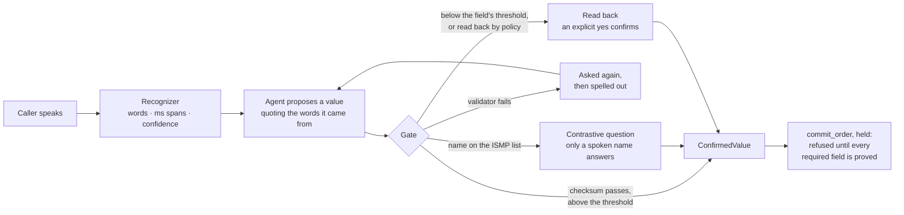
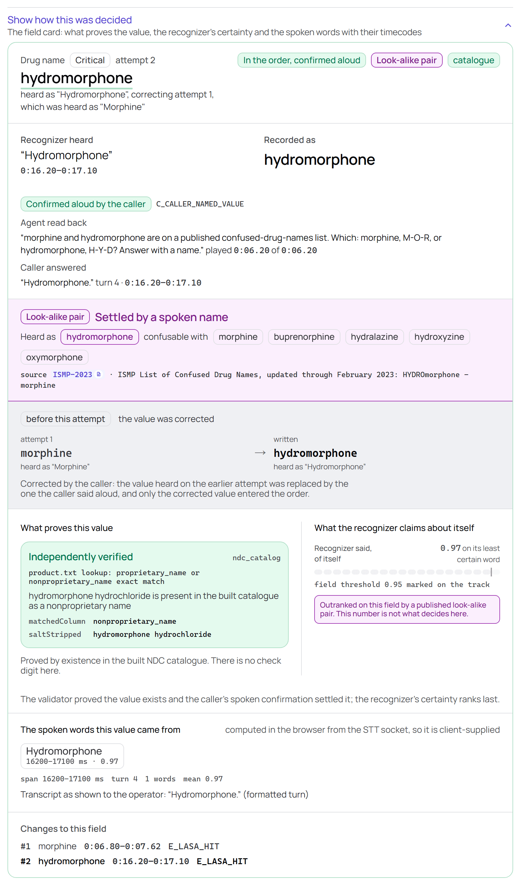
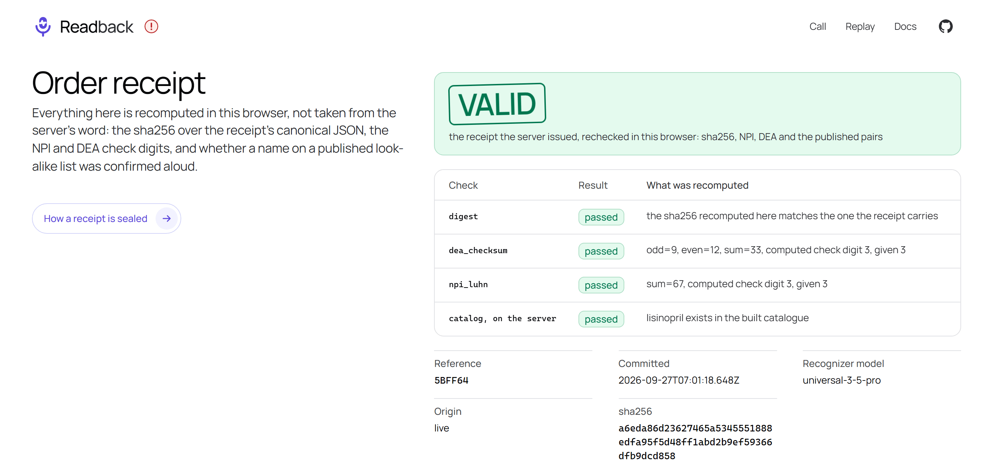

<p align="center">
  <a href="https://readback-rx.vercel.app/">
    <picture>
      <source media="(prefers-color-scheme: dark)" srcset="docs/brand/wordmark-dark.svg"/>
      
    </picture>
  </a>
</p>

<p align="center">
  <b>A voice agent that takes prescription orders and proves it did not mishear.</b><br/>
  The recognizer proposes. A validator or a regulator's list decides. A refusal is a result.
</p>

<p align="center">
  <a href="https://readback-rx.vercel.app/"></a>
  <a href="docs/README.md"></a>
</p>

<p align="center">
  <a href="#the-idea"></a>
  <a href="#three-decisions"></a>
  <a href="#how-it-works"></a>
  <a href="#see-it-in-two-minutes"></a>
  <a href="#what-is-measured"></a>
  <a href="#run-it"></a>
  <a href="#built-on-assemblyai"></a>
  <a href="#limits-stated-first"></a>
</p>

<p align="center">
  
  
  
  
</p>

<p align="center">
  <a href="https://readback-rx.vercel.app/"></a>
</p>

---

## The idea

A recognition error in prescription intake does not look like an error. AssemblyAI's own
example: *"A patient states an allergy to Lisinopril. The transcript reads Bisoprolol."*
Both drugs exist, both are plausible, nothing signals a fault. The vendor's
[own published figures](docs/sources.md#what-does-the-vendor-publish-about-recognition-errors)
set the scale: Universal-3.5 Pro Realtime has an entity error rate of **15.31%**, and at
84.69% per turn a five-turn conversation "comes through clean **43.6%** of the time". Reading
every entity back lifts that to 79.1% in a separate vendor projection, which assumes the caller
catches errors 70% of the time. A caller who hears "morphine, correct?" and says "yes" out of
habit is how that assumption fails.

> **High recognizer confidence does not protect against homophony.** The model can be
> certain it heard *morphine* while the caller said *hydromorphone*. Confidence proves
> nothing there; a regulator-published look-alike, sound-alike list does.

So a drug name on the ISMP List of Confused Drug Names is asked again **even at confidence
1.00**, and the question is contrastive: the agent names the drug it heard and every drug
the list pairs with it, and only a spoken name answers. A reflex "yes" writes nothing.

The name is the procedure. Read-back is required of flight crews by ICAO Annex 11 §3.7.3.1
and has been a Joint Commission requirement for verbal orders since 2003, so Readback
automates a step regulation already demands and busy practice skips. Why pharmacy, why this
procedure and who pays for it is the [product case](docs/product.md).

## Three decisions

<table>
<tr>
<td valign="top">

**Confidence is not evidence**

The pair check runs **before** the confidence threshold. A drug on the published list is
asked about at any certainty, including 1.00, and only the caller saying a name confirms it.
Naming the partner corrects the value.

</td>
<td valign="top">

**One constructor writes a field**

`ConfirmedValue` can be built only inside `gate.confirm()`. The order accepts nothing else,
so "the model decided it was fine" is not a code path that exists. A machine check fails
the build if a second way appears.

</td>
<td valign="top">

**Arithmetic where it exists, voice where it does not**

An NPI (Luhn over `80840`) or a DEA number (mod-10) that passes its checksum above the
field's threshold is written at once, without a read-back. A drug name has no check digit, so
it is proved by the catalogue and read back, and we say so.

</td>
</tr>
</table>

## How it works

The browser holds both AssemblyAI sockets on short-lived tokens. The recognizer gives every
word a millisecond span and a confidence; the agent calls our server-side tools; the gate
decides what may be written.


```mermaid
flowchart LR
    S["Caller speaks"] --> R["Recognizer<br/>words · ms spans · confidence"]
    R --> P["Agent proposes a value<br/>quoting the words it came from"]
    P --> G{"Gate"}
    G -- "name on the ISMP list" --> C["Contrastive question<br/>only a spoken name answers"]
    G -- "validator fails" --> V["Asked again,<br/>then spelled out"]
    G -- "below the field's threshold,<br/>or read back by policy" --> B["Read back<br/>an explicit yes confirms"]
    G -- "checksum passes,<br/>above the threshold" --> W["ConfirmedValue"]
    C --> W
    B --> W
    V --> P
    W --> O["commit_order, held:<br/>refused until every<br/>required field is proved"]
```

Every written field keeps its provenance: the words that produced it, their timings, the
lowest confidence among them and the validator's verdict. The order in which the gate
reads these, and the contract of every tool the agent calls, are laid out
[branch by branch in the specification](docs/specification.md); how the sockets, routes,
storage and per-session agents fit together is the [architecture](docs/architecture.md). After the call
the server fetches the vendor's own transcript and marks each field `witnessed` or not in
the receipt, a second channel the browser cannot forge, described in the
[security model](docs/security.md).

<p align="center">
  
</p>

<p align="center"><sub>One field card from the replay. The drug name sits in a published pair, so the caller's
spoken name settled it; the recognizer's certainty sits beside the verdict and is marked as not
what decides.</sub></p>

## See it in two minutes

No clone, no key and no microphone for the first four steps.

| Step | Open | What you should see |
|---|---|---|
| 1 | [The replay](https://readback-rx.vercel.app/demo?autoplay=1) | Hydromorphone said, morphine heard at certainty 1.00. With the pair rule on, the agent asks which of the two and the caller's "Hydromorphone." is written; with only the pair rule off, morphine is read back, a "yes" confirms it and morphine is ordered |
| 2 | [Compare](https://readback-rx.vercel.app/compare) | Six moments side by side: said, heard, certainty, the gate's verdict, and what the same gate writes with only its threshold and validators left on |
| 3 | [How it works](https://readback-rx.vercel.app/how-it-works#attack) | An attack console: seven attempts to push a value past the gate, each refused with the error the code raised, one of them before the value reaches the gate. Nothing is written |
| 4 | [Metrics](https://readback-rx.vercel.app/metrics) | Every figure with its command and set size, the pair rule's cost beside its catches, and a dash where nothing was measured |
| 5 | [Call it live](https://readback-rx.vercel.app/) | Say "Hydromorphone, two milligrams". The agent names the drug and every drug the list pairs with it, and waits for a name |

What each step proves, why each attack fails and where every judging criterion is answered
are set out in the [guide for judges](docs/for-judges.md).

<p align="center">
  <a href="https://readback-rx.vercel.app/demo?autoplay=1"></a>
</p>

<p align="center"><sub>Step 1, the replay. The same synthesised session through the shipped gate twice, differing
by one flag.</sub></p>

<p align="center">
  
</p>

<p align="center"><sub>The receipt of a production call placed by the synthesised-caller smoke harness, rechecked in
the browser: the sha256, the DEA and NPI check digits and the catalogue.</sub></p>

## What is measured

Every figure below is printed by a command in this repository, offline and free. The
[measurement report](eval/REPORT.md) carries each one with its command and set size, and
[the evidence page](docs/evidence.md) grades every claim the project makes, from measured
to assumed.

| Figure | What it shows | Command |
|---|---|---|
| Without the pair rule a reflex yes writes 20 of 20 pair mishearings; with it, 0 | The pair rule is the only difference between the two arms | `npx tsx scripts/measure/ab-gate.ts` |
| 59 of 59 correct drug names are asked about: 25 by the standing read-back, 13 by the threshold, 21 by a contrastive question | The cost side: which question a correct value gets | `npx tsx scripts/measure/coverage-matrix.ts` |
| The 2023 ISMP list carries 514 pairs over 754 names; 502 of 3730 catalogue drugs carry a listed name | How much of the catalogue the pair rule reaches | `npx tsx scripts/measure/ismp-coverage.ts` |
| NPI catches 100% of substitutions, DEA catches 95.2%, over 32 080 mutations | The two checksums are not equally strong, and the policy says so | `make audit-checksums` |
| 12 of 12 mutations killed | Every gate branch fails its own named test when broken | `make gate-mutation` |

The 20 curated pairs, each checked by hand against its row of the list, drive the demo and
the evaluation; the product rule reads the whole list.

## Run it

```bash
npm ci
make data
make dev
make verify
```

`make dev` creates `.env.local` from `.env.example` when it is missing and serves
`http://localhost:3000`. The tests, the replay and `make honest` (every offline figure with its
command) need no key. A live call needs `ASSEMBLYAI_API_KEY`, `AGENT_TOOL_SECRET` and a public
HTTPS origin in `.env.local`, because AssemblyAI calls the agent's tools only on a public host:
a laptop needs a tunnel, and otherwise the tools are exercised on a deployment. Every variable
is listed in [how to run it locally](docs/architecture.md#how-to-run-it-locally). `make verify`
runs every check; what each one refuses, and which few commands spend credit, is in
[how it is verified](docs/verification.md).

## Built on AssemblyAI

| Capability | Why the product depends on it |
|---|---|
| Word-level timings and per-word confidence (`universal-3-5-pro`) | The gate takes the **lowest** confidence over the words behind a value; a turn-level score would hide the one failed word that is the drug name |
| Voice Agent API with server-side HTTP tools | AssemblyAI itself calls `propose_field`, `read_back` and `commit_order` on our server, so each tool call is a short HTTPS request to a serverless route and none runs in the browser |
| `commit_order` in `hold` execution mode | The agent waits for the server's verdict instead of talking over a write |
| `keyterms_prompt` | Biases the recognizer toward clinic, prescriber and unit words, and is forbidden, by a check, from ever containing a drug name the pair rule tests |
| Entity-aware turn detection | The vendor documents that the agent waits for a whole entity before ending a turn; we never send the two settings that switch it off, because an NPI dictated in digit groups is the case it protects |

## Limits, stated first

- **The gate proves provenance, not truth.** Provenance is computed in the browser, so a
  hostile client can report words nobody said. The vendor's own transcript, fetched by the
  server after the call, witnesses each field, but it cannot block a commit during the
  call. The [threat model](docs/security.md) states what is and is not protected.
- **The pair rule is exactly as good as the 2023 ISMP list.** AssemblyAI's own example,
  lisinopril heard as bisoprolol, is on no published list, so only the plain read-back, which
  a reflex "yes" passes, stands between it and the order.
- **The evaluation audio is synthesised.** Recognition is real AssemblyAI traffic over
  desktop text-to-speech voices; no human-voice set has been measured. The recognizer has
  not been caught turning a listed name into its published partner in our corpus (0 of
  186 degraded utterances), so the rule rests on the published list, not on our data.
- **Live calls on production have run with a synthesised caller, not yet a human voice.**

These are the short versions. Each one, with what is measured, what enforces it and what
remains open, is set out in full in [the limitations](docs/limitations.md).

> **A technology demonstration, not a medical device.** Synthetic data only: no real
> patients, no real prescriptions. In an emergency call 911, or 988 for a mental health crisis.

<p align="center"><sub>Built for the <a href="https://lablab.ai/ai-hackathons/assemblyai-voice-agent-hackathon">AssemblyAI Voice Agent Hackathon</a>.</sub></p>
