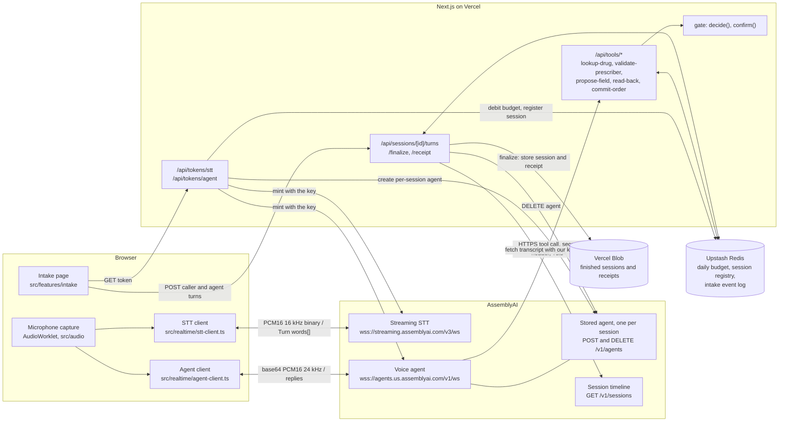
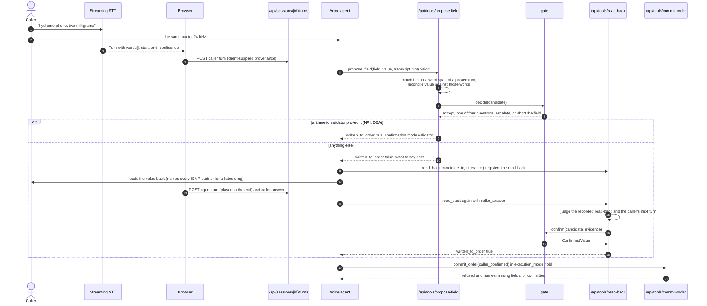
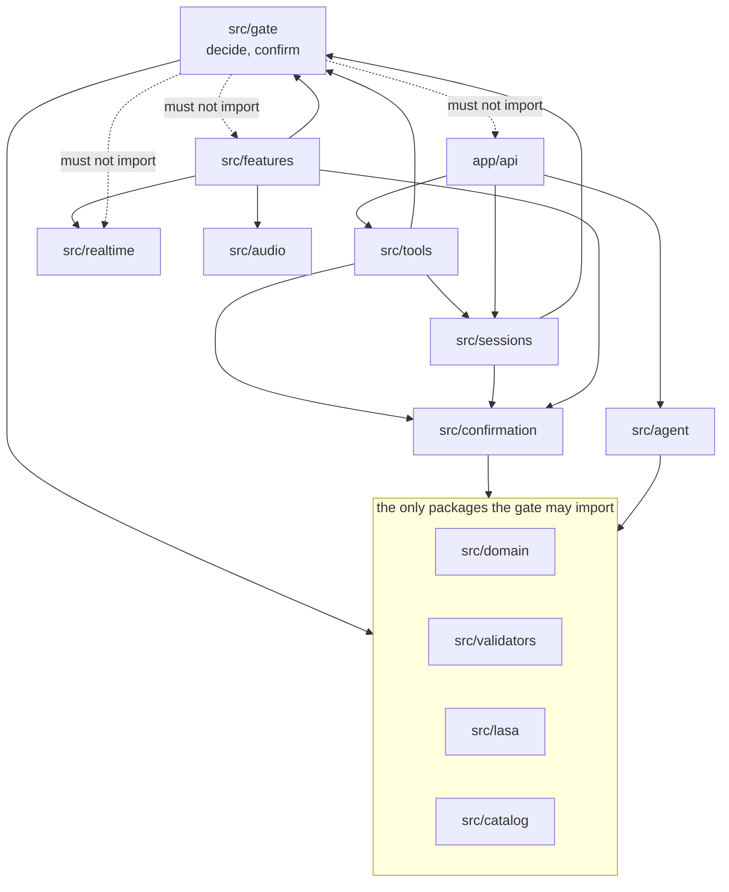

# How Readback is built

> One Next.js application on Vercel. The browser holds both AssemblyAI sockets directly on
> short-lived tokens; our server mints those tokens, answers the HTTP tools AssemblyAI calls
> on the agent's behalf, keeps the live session registry and the daily budget in Upstash
> Redis, and stores finished sessions in Vercel Blob. Every value that enters an order passes
> through one function, the gate, which is a leaf of the import graph and the only
> constructor of `ConfirmedValue`.

**Read this if** you are changing code, deploying the app, or want to know why there is no
audio proxy · **Related:** [security](security.md) · [verification](verification.md) ·
[spec](specification.md) · [limitations](limitations.md)

---

## What talks to what



| Piece | Where | Runs for |
|---|---|---|
| Two token routes | `app/api/tokens/stt`, `app/api/tokens/agent` | One short request each; `maxDuration` 20 s |
| Five tool webhooks | `app/api/tools/*`, logic in `src/tools/` | One short request per tool call; `maxDuration` 15 s |
| Turns, finalize, receipt | `app/api/sessions/[id]/*` | One short request each; `maxDuration` 30 s |
| Budget, health, metrics, demo | `app/api/budget`, `app/api/health`, `app/api/metrics`, `app/api/demo/run` | One short request each |
| Live session state | Upstash Redis, keys under `readback:intake:` and `readback:budget:` | Intake logs expire after 24 h, budget counters after two days |
| Finished sessions | Vercel Blob, under `sessions/live`, `sessions/rehearsal`, `sessions/measurement` | Kept |

No function stays open for the length of a call. A session runs 2 to 10 minutes; a Vercel
function on Hobby is capped at 300 s
([function duration](https://vercel.com/docs/functions/configuring-functions/duration)).
Because the audio never passes through our server, that cap never applies to a call.

## Why the browser holds the sockets and there is no proxy

AssemblyAI documents the browser pattern directly: mint a temporary token on the server,
hand it to the browser, and open the socket from the browser with the token in the query
string ([streaming temporary tokens](https://www.assemblyai.com/docs/streaming/authenticate-with-a-temporary-token),
[voice agent browser integration](https://www.assemblyai.com/docs/voice-agents/voice-agent-api/browser-integration)).
The two alternatives compare as follows:

| | Browser to AssemblyAI directly (built) | Always-on backend proxy | WebSocket inside a Vercel function |
|---|---|---|---|
| Always-on service | none | yes | none |
| Session length limit | set on the token, up to 10 800 s | none | 300 s on Hobby, 800 s on Pro, 1800 s on Pro in beta |
| Extra network hop | none | one | one |
| Word-level provenance | computed in the browser, so client-supplied | server-side | server-side |
| Deployments | one | two | one, on a public-beta feature |

WebSockets inside Vercel Functions are a public beta
([WebSockets in Vercel Functions](https://vercel.com/docs/functions/websockets)).

The price of the chosen column is the provenance row: the recognizer's `words[]` never
pass through our server, so provenance is data the browser posts. That trade and the
second channel that partly compensates for it are in [security](security.md).

## Why it's built on AssemblyAI

The gate's claim only holds if its input is the recognizer's own evidence, not a paraphrase
of it. Three properties of the API make that possible:

- **Word-level timings and per-word confidence.** The gate takes the **minimum**
  confidence across the words that produced a value, not the mean, because a mean hides the
  single failed word that turns out to be the drug name. That policy needs `words[]` with
  millisecond `start`/`end` and a confidence per word; a turn-level score could not support
  it. `E_LOW_CONFIDENCE` names this choice.
- **Server-side HTTP tools.** `propose_field`, `read_back`, `commit_order` and the two lookup
  tools are declared on the stored agent with `http.url`, and AssemblyAI calls them itself.
  There is no `tool.call`/`tool.result` exchange in the browser to order against
  `reply.done`, and no client-side queue to flush on interruption. Each call is an ordinary
  short HTTPS request, which is why a stateless serverless route is enough. The vendor's
  constraints (public HTTPS host only, responses truncated at 8 KiB, write-only headers)
  and what the code does about each are in
  [spec: how the tools are wired](specification.md#how-the-tools-are-wired).
- **`keyterms_prompt` is a first-class, testable field.** It biases the recognizer toward
  exactly the strings it is given. Domain terms (clinic name, prescriber name, dosage forms,
  units, route words) go in; drug names inside a published LASA pair never do, because
  biasing the recognizer toward them would make the observation depend on the verification.
  `make keyterms-purity` enforces it.

Two more properties matter for the build: single-use, short-lived tokens mean
`ASSEMBLYAI_API_KEY` never reaches the browser, and entity-aware turn detection on the agent
socket lets a prescriber dictate an identifier in digit groups without the turn ending
mid-number (see [turn detection](#turn-detection-is-set-per-socket-and-per-field)).

The recognizer model is `universal-3-5-pro` (`STT_MODEL` in
`src/domain/live/socket-params.ts`), with `domain=medical-v1`. `universal-3-pro` was retired
on 2 September 2026 and is never pinned. The agent definition sends no language-model field;
the vendor's managed model is used.

## One field, from speech to a written value



Four things the diagram compresses:

- **The value comes from the agent, the evidence from the recognizer.** `propose_field`
  receives the value from the model. The server finds the quoted hint in a turn the browser
  posted, then reconciles the value against that turn's words
  (`src/confirmation/reconcile-value.ts`). A value the words do not support becomes a
  validator failure named `spoken_support`, not a fourth reason to re-ask.
- **Only arithmetic writes at proposal.** A value whose checksum validator passed and whose
  policy does not require a read-back (NPI, DEA) is written by `propose_field` at once.
  Everything else is written only by the second `read_back` call.
- **The caller's answer is judged from speech, not from the model.** `caller_answer` is a
  hint kept for the record. The confirmation needs the agent's read-back turn, played to the
  end and naming the value, followed by a wholly affirmative caller turn; for a drug on the
  ISMP list only a spoken name answers, never a yes.
- **`commit_order` runs in `execution_mode: "hold"`.** The agent pauses instead of talking
  over the write, and the call is refused while any critical field is not a
  `ConfirmedValue`.

The branch table, reason codes and tool schemas are in [spec](specification.md).

## The gate is a leaf of the import graph



| Rule | How it is enforced |
|---|---|
| The gate imports only `domain`, `validators`, `lasa`, `catalog` | `make import-cycles` (`GATE_ALLOWED` in `scripts/checks/import-cycles.sh`) |
| No import cycle anywhere, tests and scripts included; `@/`, `@app/` and relative imports are resolved | `make import-cycles` over `src`, `app`, `tests`, `scripts` |
| The gate derives LASA risk from the value, not from a field the caller filled in | mutation `lasa_trusts_caller_field` in `scripts/checks/gate-mutations.txt` |
| `ConfirmedValue` is built only in `src/gate/confirm.ts` | `make gate-invariant` |
| A client tree imports no values from `@/catalog`, `@/sessions`, `@/tools`, `@/agent` | `make server-only`; type-only imports pass |
| Shared code is cut by subject; no `utils`, `common`, `helpers`, `lib` | `make package-subject` |

The gate decides; callers persist. `src/tools` applies a decision to the live intake state,
`app/api` speaks HTTP, `src/sessions` stores. The browser imports the gate too: the replay,
the comparison page and the attack console run the shipped `decide()` and `confirm()`
rather than a copy of them.

## Where each piece lives

| Path | What it holds |
|---|---|
| `app/(pages)/` | The pages: the live intake at `/`, the judge hub at `/demo`, `/docs`, `/compare`, `/how-it-works`, `/metrics`, `/deck`, the receipt check at `/order` and `/order/[id]` |
| `app/api/tokens/` | The STT and agent token routes; the agent route also creates the per-session stored agent and registers the session |
| `app/api/tools/` | The five HTTP tool webhooks the agent calls |
| `app/api/sessions/` | Posting turns, finalizing a session, reading back its receipt |
| `app/api/budget`, `health`, `metrics`, `demo` | Budget status, a health probe, the metrics feed, the scripted demo run |
| `src/domain/` | Types and errors: `WordSpan`, `Provenance`, `FieldCandidate`, `ValidatorVerdict`, `LasaRisk`, `ConfirmedValue`, `Order`, `GateDecision`, reason codes, field policies, token lifetime, budget rules, the agent region |
| `src/gate/` | `decide()` and `confirm()`, the only constructor of `ConfirmedValue` |
| `src/confirmation/` | Pure proof logic shared by server and browser: reply classification, echo overlap, spoken-value reconciliation, self-correction markers, provenance matching, the receipt recheck |
| `src/validators/` | Pure functions: DEA, NPI, combination, range, sig, schedule, consonant skeleton |
| `src/lasa/` | The full ISMP pair list, the curated tier, lookup, and the keyterms list |
| `src/catalog/` | Read-only access to the built NDC catalogue |
| `src/tools/` | What each tool does to the live intake state, tool authentication, input bounds, the Redis and memory event stores |
| `src/agent/` | The stored-agent definition (`buildAgentDefinition()`), its prompt and tools, per-session create and delete, the tool base URL |
| `src/sessions/` | Session storage (Blob or memory), the daily budget, the vendor-timeline witness, receipts |
| `src/stats/` | Wilson intervals and the benchmark arithmetic |
| `src/audio/` | Capture worklet host, the two resample paths, chunking, playback, the echo guard |
| `src/realtime/` | The two socket clients, per-field patience, close codes, the exit path |
| `src/features/` | Screens and their state: intake, field card, transcript view, read-back, gate banner, metrics, judge demo, receipt, attack console and others |
| `src/shared/ui/` | Primitives, data display, motion, navigation, states; the one allowed `shared` |
| `src/styles/tokens/` | Palette, semantic, typography and motion tokens in OKLCH |
| `data/` | Built artefacts: `catalog.json` (NDC) and `lasa-pairs.json` (ISMP) |
| `eval/` | Corpora, fixtures, the sealed held-out set, live run records, the spend ledger, `REPORT.md` |
| `scripts/` | Ratchet checks, corpus and data builds, measurements, reports, A/B arms, the live-smoke registry |
| `tests/` | Mirrors `src/`, plus `e2e/` (Playwright, fake microphone) and `live/` (the paid smoke harness) |
| `docs/` | This documentation |

## The two sockets take audio in two formats

The capture context runs at 48 kHz. One AudioWorklet feeds two resample paths, each chunked
at 100 ms (`src/audio/microphone.ts`):

| Socket | Format | Framing |
|---|---|---|
| Streaming STT | PCM16 little-endian, 16 kHz, mono | Binary frames; the vendor's 50 to 1000 ms rule applies to this socket, violations close with 3007 |
| Voice agent | PCM16, 24 kHz, base64 | JSON `input.audio` messages; no chunk-duration rule is stated for this socket |

The STT socket opens with `speech_model=universal-3-5-pro`, `encoding=pcm_s16le`,
`sample_rate=16000`, `format_turns=true`, `domain=medical-v1`, `voice_focus=near-field`,
`mode=balanced` (`src/realtime/tokens.ts`). The model the socket reports in `Begin` is
checked against the expected one (`src/realtime/stt-model.ts`).

## The agent must be heard, and must not hear itself

Agent audio is played through `src/features/intake/agent-audio.ts` to the speakers. An
interruption (`input.speech.started`) flushes already-scheduled audio, so a barge-in cuts
the agent off.

An echo is worse than a stutter here: a phantom STT turn puts words the caller never said
into a field's provenance, and a re-ask that names a drug can be recognised as an answer to
itself. Four layers, all required:

1. `getUserMedia` with `echoCancellation`, `noiseSuppression` and `autoGainControl`
   (`MIC_CONSTRAINTS`).
2. The capture worklet has no audible path to the output: it is created with
   `numberOfOutputs: 0`.
3. **Half-duplex.** Nothing is sent to the STT socket from the **first reply audio** until
   `reply.done`; the socket stays open. The mute starts at audio, not at `reply.started`,
   because a reply opens with tool calls that can run for seconds of silence while the
   caller is still speaking, and muting then would cut a dictated number out of the
   recognizer's turns (`src/features/intake/session-events.ts`).
4. A turn arriving during playback is discarded when it matches the agent's own last
   `transcript.agent` line (`src/audio/echo-guard.ts`).

## Turn detection is set per socket and per field

The two sockets take different parameters and react to them in opposite ways.

| | Streaming STT | Voice agent |
|---|---|---|
| Silence bounds | `min_turn_silence`, `max_turn_silence`, patched per field; they widen the window for a dictated entity | `min_silence`, `max_silence`: **never sent** |
| Sensitivity | `vad_threshold`, patched per field | `vad_threshold`, patched per field |
| Guard | an undocumented parameter is refused before it is sent | `buildAgentDefinition` throws on either silence field; the live socket refuses them in a patch |

On the agent socket, setting `min_silence` or `max_silence` turns off adaptive pacing and
entity-aware waiting for the rest of the session, per the vendor's
[turn-detection documentation](https://www.assemblyai.com/docs/voice-agents/voice-agent-api/turn-detection-and-interruptions),
and entity-aware waiting is what holds a turn through an NPI dictated in digit groups. A
test asserts the two fields are absent from every preset's agent patch.

Sending the agent's parameter names to the recognizer is a malformed configuration parameter
(close 3006 as another team observed it), so each socket gets its own patch from the same
switch (`src/realtime/patience.ts`), and `src/realtime/param-guard.ts` checks every connect
query and patch against the documented names for its socket (`src/domain/live/socket-params.ts`)
before anything is sent. Four presets, each carrying its reason:

| Preset | min / max silence (ms) | vad | Used for |
|---|---|---|---|
| dictated | 1400 / 4200 | 0.45 | NPI, DEA: digit groups with a breath between them |
| measured | 900 / 3000 | 0.50 | sig, drug name, strength: read off a label |
| spoken | 600 / 2200 | 0.60 | patient name, and the default |
| terse | 320 / 1200 | 0.65 | form, route, quantity, refills, days supply, and every outstanding confirmation |

An outstanding confirmation outranks the field: the answer to an NPI read-back is "yes",
not nine digits. `vad_threshold` works inversely: lower is more sensitive.

## How tokens, session length and the agent region are set

- **Single-use.** Each token opens one socket. A reconnect or `session.resume` needs a newly
  minted one; the agent token route accepts `?sessionId=` to mint a fresh token bound to the
  same registered session.
- **Two lifetimes, both on the token.** `expires_in_seconds` (clamped to 1 to 600, default
  60) is how long the token may be redeemed; `max_session_duration_seconds` (clamped to 60 to
  10 800, default 900) is how long the session may run (`src/domain/token-lifetime.ts`). No
  function timeout is involved.
- **Header shapes.** The STT host is called with `Authorization: <key>`, the agent host with
  `Authorization: Bearer <key>`, as each vendor page documents. Both hosts accept either
  shape (**Observed**), so a missing `Bearer` is not a cause to suspect when minting fails.
- **Region.** Stored agents live in one vendor region: an agent created through the US host
  answers 404 through the EU host. The unqualified host routes each client to its nearest
  region, which would split a US server and a European browser across two stores. Server and
  browser therefore both name `agents.us.assemblyai.com` (`src/domain/live/agent-region.ts`).
  The streaming recognizer uses its global host.
- **Every exit path ends the session.** Stop, tab close and errors send `session.end`, wait
  for `session.ended`, and close both sockets. Billing runs on socket lifetime, not audio:
  an unclosed agent socket lingers 30 s and an STT socket up to three hours.

## One stored agent per live session

The agent is defined in one place, `src/agent/`. `buildAgentDefinition()` produces the whole
`POST /v1/agents` body (prompt, tools, `input`/`output` configuration, keyterms) from source
under version control. For every live session the agent token route creates a stored agent
whose tool URLs carry that session's `?sid=`, reads it back (up to three attempts) to confirm
the vendor serves it (deleting it and refusing the token if it never answers), and registers
the session in Redis. Finalize deletes the agent. `make prune-agents` lists per-session
agents older than 24 hours, left behind by sessions that never finalized, in both regions;
it deletes nothing unless the script is run with `--apply`.

`make agent` keeps one reference agent for `make doctor`, which checks that its content
matches the source (`scripts/report/agent-drift.ts`) and that every tool URL answers.

## How to run it locally

```bash
npm ci
make data
make dev
```

| Step | What it does |
|---|---|
| `npm ci` (or `make install`) | Installs dependencies; Node 22 or newer |
| `make data` | Builds `data/catalog.json` from the FDA NDC file and `data/lasa-pairs.json` from the ISMP PDF (details below) |
| `make dev` | Creates `.env.local` from `.env.example` if it is missing, then runs `next dev` on `http://localhost:3000` |
| `make agent` | Creates the reference agent, or updates it in place when `ASSEMBLYAI_AGENT_ID` is set, and prints the id |
| `make verify` | Every check that must pass; `VERIFY_STEPS` in the `Makefile` is the list |

`make data` downloads the NDC file from the FDA. It rebuilds the ISMP table only when the
list's PDF has been downloaded to `artefacts/sources/ismp-confused-drug-names-2023.pdf`
(git ignores that directory; a different path can be passed to `scripts/build/lasa.ts`),
and otherwise keeps the committed snapshot; a parse below the floor `MIN_PARSED_PAIRS`
refuses to overwrite it. It ends by printing how many curated LASA names the catalogue matches.
[Reference data](reference-data.md) describes both sources.

The tests and the synthesised replay need no variables at all. A live call needs, in
`.env.local`:

| Variable | Purpose |
|---|---|
| `ASSEMBLYAI_API_KEY` | Minting tokens, creating and deleting agents, the witness fetch; read only under `app/api/` |
| `AGENT_TOOL_SECRET` | The shared secret the stored agent sends to our tools; at least 16 characters |
| `NEXT_PUBLIC_APP_URL` | The public HTTPS origin the tool URLs are built from; on Vercel the platform's deployment URL is used when it is unset |
| `TOKEN_EXPIRES_IN_SECONDS`, `MAX_SESSION_DURATION_SECONDS` | Token lifetimes, clamped as above |
| `READBACK_DAILY_BUDGET_SECONDS` | The shared daily socket budget; 7200 when unset, at most 86 400 |
| `UPSTASH_REDIS_REST_URL`, `UPSTASH_REDIS_REST_TOKEN` | Budget and session registry; `KV_REST_API_URL`/`KV_REST_API_TOKEN` are accepted too |
| `BLOB_READ_WRITE_TOKEN` | Finished sessions |
| `READBACK_ALLOW_MEMORY_STORE` | `1` permits in-memory stores in a production build; the CI build and test jobs set it, a deployment must not |

`ASSEMBLYAI_AGENT_ID` is used only by `make agent` and `make doctor`. Scripts run through
`make` do not load `.env.local`: export `ASSEMBLYAI_API_KEY`, `AGENT_TOOL_SECRET` and
`NEXT_PUBLIC_APP_URL` in the shell before `make agent`.

In development, without Redis or Blob variables, the stores fall back to process memory.
AssemblyAI calls tools only on a public HTTPS host, so a live call against a laptop needs a
tunnel, and tools are otherwise exercised on a preview deployment.

---

<sub>[Documentation index](README.md) · [Project README](../README.md)</sub>
