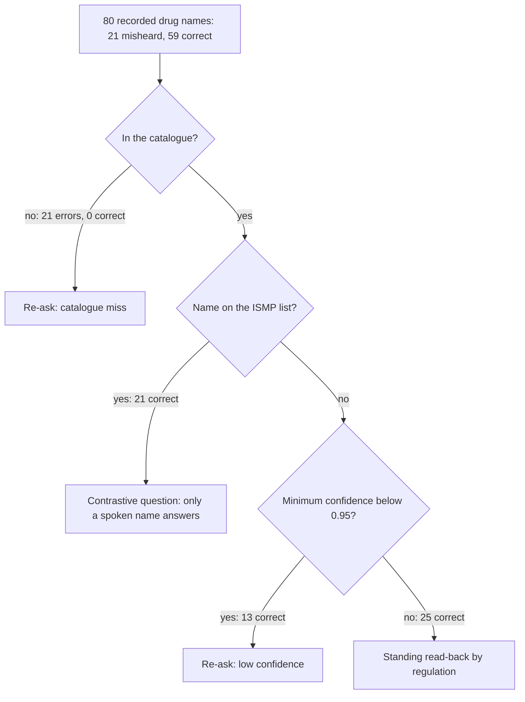

# Evidence

> Every claim this project makes, graded by how it is known: measured by a command, enforced
> by a check, verified by hand, observed live, cited from a third party, or only assumed. Each
> measured claim carries its command, the size of its set, and what that set is too small to
> show. The strongest single result is exhaustive rather than sampled; the weakest is that no
> human voice has yet been through a live call.

**Read this if** you want to know how much weight a number here can carry · **Related:**
[limitations](limitations.md) · [design decisions](design-decisions.md) ·
[sources](sources.md) · [eval/REPORT.md](../eval/REPORT.md)

---

## How is each claim graded?

Every claim carries one of seven statuses, so the strongest evidence here can be told from the
weakest. When two grades are defensible, the lower one is used.

| Status | Meaning |
|---|---|
| **Measured** | A command in this repository produces the number; the command and the set size are published beside it |
| **Enforced** | A machine check fails when the property stops holding; the check is named and runs in `make verify` |
| **Verified by hand** | Checked by execution on specific, named inputs, without a general measurement |
| **Observed** | Seen in live traffic, possibly once; not documented by the vendor and not generalised |
| **Cited** | A third party's number or rule, linked in [sources](sources.md), not re-measured here |
| **Assumption, not result** | Reasoned but unmeasured, and labelled so nobody believes it unknowingly |
| **False, and stated as false** | A property a reader might expect, which the system does not have |

## Which claims hold, and how is each one known?

| Claim | Status | Where |
|---|---|---|
| `ConfirmedValue` is unconstructible outside the gate | **Enforced** | `make gate-invariant` fails on a second type assertion in any of its three syntaxes, or on an `as unknown as` |
| Each gate branch has a test that fails by name when the branch breaks | **Enforced** | `make gate-mutation`, 12 of 12 mutations killed; the expected count is read from `scripts/checks/gate-mutations.txt`, never from the run itself |
| A LASA hit re-asks at confidence 1.0 | **Enforced** | The pair rule is read before the threshold in `decide()`; the mutations `lasa_hit_ignored` and `lasa_gated_by_confidence` each fail a named test |
| The key never reaches the browser | **Enforced** | `make secrets` fails if `ASSEMBLYAI_API_KEY` appears outside `app/api/`, or is absent from it |
| A proposed value is supported by what was spoken | **Enforced** | The server reconciles the value against the words of its turn (`src/tools/apply-proposal.ts`); a mismatch is a validator failure, `spoken_support`, not a fourth reason |
| A value confirmed for one field cannot be written under another | **Enforced** | The read-back route refuses it as `field_mismatch` (`src/tools/apply-read-back.ts`) |
| A word the recognizer never scored cannot pass as a scored one | **Enforced** | `makeProvenance` refuses a non-finite or out-of-range confidence, so `NaN < threshold` can never skip the low-confidence branch |
| A spoken "yes" confirms only when bound to the words that were read back | **Enforced** in tests; **Observed** on production with a synthesised caller | [When does a spoken yes confirm?](#when-does-a-spoken-yes-confirm) |
| Checksum behaviour on specific identifiers | **Enforced** | `AB1234563` passes, `BX1234567` fails (`tests/validators/dea.test.ts`); `1234567893` passes, `1234567890` fails (`tests/validators/npi.test.ts`) |
| Entity Error Rate on our corpora | **Measured** | [eval/REPORT.md](../eval/REPORT.md), each figure with its command, set size and Wilson interval |
| Which of the three mechanisms pays for which re-ask | **Measured** | Coverage matrix over 80 utterances: [below](#which-mechanism-pays-for-which-re-ask) |
| What the shipped gate asks about correct values | **Measured** | 59 of 59 correct drug names are asked about: 25 by the standing read-back, 13 by the threshold, 21 by a contrastive question ([below](#what-does-the-shipped-gate-ask-about-correct-values)) |
| What the pair rule adds over a plain read-back | **Measured** | Without the pair rule a reflex yes writes 20 of 20 pair mishearings; with it, 0 ([below](#what-does-the-pair-rule-add-over-a-plain-read-back)) |
| The pair rule covers the published ISMP list | **Measured** | The 2023 list carries 514 pairs over 754 names; 502 of 3730 catalogue drugs carry a listed name ([below](#how-much-of-the-published-list-does-the-rule-cover)) |
| DEA and NPI are equally provable by arithmetic | **Measured, and 4.8% false of DEA** | 32 080 mutations, exhaustive: NPI catches 100% of substitutions, DEA catches 95.2% ([below](#how-strong-is-the-arithmetic-on-dea-and-npi)) |
| The recognizer confidently turns a listed name into its published partner | **Measured**, and not observed | 0 of 186 degraded utterances, synthesised voices only ([below](#can-the-recognizer-be-confident-and-wrong)) |
| Recognizer confidence is a probability of being right | **Measured**, and false at the top | Of 83 utterances at 0.95 or above, 4 were misheard ([below](#can-confidence-be-read-as-a-probability)) |
| Rare drug names are harder than common ones | **Assumption, not result** | Pre-registered, tested once on the sealed set, **not demonstrated**: the intervals overlap ([below](#is-a-rare-drug-name-harder-to-recognise)) |
| Provenance proves what was said | **False, and stated as false** | Computed in the browser; the gate proves a value traces to words the session reported, not that they were spoken ([limitations](limitations.md#the-evidentiary-chain-does-not-survive-a-hostile-client)) |
| A whole call reaches a committed order | **Observed**, with a synthesised caller | [What has a live call shown?](#what-has-a-live-call-shown) |
| Socket close codes mean what we log | **Observed** | The vendor documents no close codes; every entry in `src/realtime/close-codes.ts` names whose observation it is |
| Every curated pair is a row of the 2023 ISMP list | **Verified by hand**, then pinned | `tests/lasa/pairs-sourced.test.ts` finds each pair in the committed parse of the list, with its page and row, and keeps lisinopril and bisoprolol out |
| Read-back is required by ICAO and the Joint Commission | **Cited** | Both quoted verbatim with the clause number in [sources](sources.md) |
| A confirmation loop nearly doubles task completion | **Cited**, and a projection | AssemblyAI's own model, quoted in [sources](sources.md); it assumes callers catch 70% of read-back errors, which nobody here has measured |
| The market size in money | **Assumption, not result** | Not estimated; no figure is published ([product](product.md)) |

Three entries grade the project's own hypothesis or expectation as failed: the rarity
prediction, confidence as a probability, and DEA's equivalence to NPI.

## When does a spoken yes confirm?

The model's `caller_answer` is a hint, not evidence. A confirmation needs the agent's read-back
turn, played to the end and naming the value, then a caller turn that is wholly affirmative.
"Yeah, no", "yes but", a different value, "mhm" or "thank you" never confirm.

For a drug on the ISMP list a "yes" never confirms at all:

| Situation | Result |
|---|---|
| The read-back does not name every listed partner | Refused: `E_READBACK_NOT_CONTRASTIVE` |
| The caller answers yes | Refused: `E_LASA_NAMED_ANSWER_REQUIRED` |
| The caller names a partner | The value is corrected to the name said: `E_CALLER_NAMED_LASA_PARTNER` |

Enforced by `tests/sessions/confirmation-evidence.test.ts`,
`tests/sessions/contrastive-read-back.test.ts`, `tests/api/confirmation-flow.test.ts` and
`tests/api/contrastive-read-back.test.ts`. On production, the `yeah-no` scenario completed with
a synthesised caller: the read-back was refused, not confirmed. No human voice has run it.

## What has a live call shown?

The production live runs are recorded in `eval/live/runs.json`. Every caller line is
synthesised speech injected into the page; no human voice has been through a live call.

| Scenario | Outcome on production |
|---|---|
| `clean-order` | The order committed |
| `lasa-named` | The order committed with hydromorphone, after the caller said the name |
| `yeah-no` | Completed: the read-back was refused, not confirmed |
| `barge-in` | Completed: a reply ended by the interruption |
| `npi-groups` | Completed: the ten-digit NPI dictated in groups reached the order |
| `commit-hold` | The early commit was refused in hold, then the order committed |

## Which mechanism pays for which re-ask?

**The assumption:** the three reasons to re-ask are not interchangeable, and each catches what
the others do not.

**Measured with:** `npx tsx scripts/measure/coverage-matrix.ts`: the real validators and the
real `decide()` over the 80 utterances of `eval/control` and `eval/native16`, each assigned to
the **first** branch `decide()` takes, in the gate's own order.

**At what n:** 21 errors and 59 correct values.

**What that n is not enough for.** Within the set the result is unambiguous: absence from the
catalogue caught **21 of 21** errors and asked about **none** of the 59 correct values, so no
error reaches a plain read-back. Every drug name is read back by policy, so the other
mechanisms decide which question a correct value gets, not whether it gets one. Without the
pair rule the threshold takes **16 of 59** and the standing read-back **43 of 59**. The corpus
is synthesised, and the error distribution of real speech may differ. "The threshold is
useless" **does not follow**; what follows is "on this corpus it caught nothing the catalogue
did not".

## What does the shipped gate ask about correct values?

**The assumption:** the cost of the idea is the questions asked about values that were already
right, and it has to be published next to the catches, or the metric is one-sided.

**Measured with:** `npx tsx scripts/measure/coverage-matrix.ts`: the shipped `drug_name`
policy, pair rule on and every drug name read back by regulation.

**At what n:** n=59 correct values, all asked about, because the Joint Commission read-back is
policy: the question is never whether to ask, only which question. The threshold asks
**22.0% [13.4%, 34.1%]** of them instead of the standing read-back, and the pair rule puts
**35.6% [24.6%, 48.3%]** to a contrastive question, Wilson intervals. A plain drug-name
read-back is about 2.5 s; a contrastive one naming every published partner is about 11.8 s,
9.4 s more. Both are estimates at the desktop synthesiser's 2.43 words/s with each spelled
letter counted as a word, not a timing of the agent's voice.

**What that n is not enough for.** The contrastive share belongs to this corpus, whose names
were chosen before the measurement. On the held-out set, never used for tuning, the same rule
asks **6 of 44** correct values, 13.6% [6.4%, 26.7%], and across the catalogue 13.5% of drugs
carry a listed name (`npx tsx scripts/measure/ismp-coverage.ts`). None of these is weighted by
how often a drug is dispensed, and no dispensing-weighted rate is claimed.

## What does the pair rule add over a plain read-back?

**The assumption:** a plain read-back already exposes a mishearing to the caller, so the pair
rule has to add something a read-back does not: protection against a caller who hears the
wrong name read back and says yes by reflex.

**Measured with:** `npx tsx scripts/measure/ab-gate.ts`: 40 candidates, seed 20260916, through
three arms of the real policy. A reflex yes writes whatever the threshold or the standing
read-back asked about, and never what the pair rule asked about, because only a spoken name
answers a contrastive question.

**At what n:** 20 correct values and 20 recognizer mishearings inside a curated pair. With the
pair rule a reflex yes writes **0 of 20** mishearings; without it, **20 of 20**, at a cost of
4 contrastive questions on the 20 correct values. The two arms differ by one flag,
`lasaChecked`, and both read every drug name back. A third arm, threshold only with no
standing read-back, writes 12 wrong values without asking at all.

**What that n is not enough for.** The mishearings are constructed, each substituting a curated
partner for the spoken name, and the reflex yes is modelled as the worst caller rather than
measured. The comparison shows what the rule does to a mishearing that happens; how often a
recognizer produces one confidently is a separate measurement, in the next section.

## Can the recognizer be confident and wrong?

**The assumption:** high recognizer confidence does not protect against a mishearing: the
model can be certain it heard one name when another was spoken.

**Measured with:** the confidence AssemblyAI returns over the recorded corpora, and
`npx tsx scripts/measure/analyse-stress.ts` over the degraded set.

**At what n:** 80 recordings in the coverage matrix; a held-out set of **60 recordings**,
opened once; 188 degraded recordings (telephone band, noise at 10 and 5 dB, speed-up), of
which 186 are scored and two sessions that closed on a transport error are excluded rather
than scored.

**What that n is not enough for.** It shows the recognizer can be confident and wrong: two
control-set words (`vinorelbine` as `venorelbine`, `glycopyrronium` as `glycopyrrhonium`,
each in two arms) sit **at or above 0.95**, and on the held-out set two genuine errors
(`oteseconazole` heard as `otesiconazole` at 0.971, `chlorthalidone` as `chlorothalidone` at
0.980) do too, as reported in [eval/REPORT.md](../eval/REPORT.md). A confidence check alone
would have written them into the order. Each confident error is a non-word the catalogue
refuses. **A confident substitution of one real listed drug for its partner has not been
observed**: 0 of 186 scored degraded utterances, and no error at all at or above 0.95 in that
set. The voices are synthesised, and the pair rule rests on the published list, not on this
data. Nor is the n enough to state a frequency: with 21 errors in the coverage matrix the
Wilson interval is too wide to claim that some percentage of errors are homophonic, and no
such claim is made.

## How much of the published list does the rule cover?

**The assumption:** a pair rule is only as good as the list behind it, so the whole published
list is the rule, not a hand-picked subset.

**Measured with:** `npx tsx scripts/measure/ismp-coverage.ts` over `data/lasa-pairs.json`,
parsed from the ISMP List of Confused Drug Names, updated through February 2023, with the page
and row of each pair kept.

**At what n:** 1056 rows parsed and 0 row groups left unresolved; **514 distinct pairs** over
**754 names**. The curated tier keeps its 20 hand-curated pairs for the demo and the
evaluation, each a row of the full list. Both names are in the catalogue for 204 of the listed
pairs and one name for 153; 124 listed names reach the catalogue only as a brand. The
consonant-skeleton distance between the two names of a pair has median 2 and is measured, not
used as a filter: it is 0 for 14 of them and 10 or more for 10. The counts on this page are
checked against the script's output and `LASA_PAIRS.length` by
`tests/scripts/public-figures-agreement.test.ts`.

**What that n is not enough for.** The count is exact for the 2023 edition and says nothing
about confusions the list does not publish: lisinopril and bisoprolol, AssemblyAI's own
example, are on neither tier. A brand name is matched only through the catalogue's
`proprietaryNames`, so a brand the catalogue does not carry is not checked.

## Is a rare drug name harder to recognise?

**The assumption:** rare drug names are recognised markedly worse than common ones. The
prediction, the decision rule and the falsification condition are recorded in
[eval/heldout-preregistration.md](../eval/heldout-preregistration.md), written before the
held-out audio existed.

**Measured with:** the held-out set in three strata by the number of combinations in the
catalogue, Wilson intervals:
`npx tsx scripts/measure/analyse-rarity.ts --set eval/heldout --strata 3`. The rule required
**non-overlapping** intervals between `rare` and `common`.

**At what n:** 60 recordings, 20 per stratum: `rare` 30.0% [14.5%, 51.9%], `mid` 30.0%
[14.5%, 51.9%], `common` 20.0% [8.1%, 41.6%].

**What that n is not enough for.** The hypothesis **is not supported**: the intervals overlap
heavily, and `rare` and `mid` coincide exactly. The control corpus shows 43.8% against 16.7%
on a two-way split of 40 (`npx tsx scripts/measure/analyse-rarity.ts --set eval/control`);
that gap does not reproduce on the held-out set, and on the evidence it is sampling noise. At
20 recordings per stratum the design cannot detect a difference smaller than roughly twenty
percentage points, so the conclusion is **"not shown"**, not "no effect". The set is sealed
and has been opened once, so no n can be added: this is the final result for this set.

What does generalise is the overall entity error rate: **26.7% [17.1%, 39.0%]** on the
held-out set (16 of 60) against 27.5% on the control corpus (11 of 40).

## How strong is the arithmetic on DEA and NPI?

**The assumption:** both identifiers are checkable by arithmetic, so both may go unread aloud.

**Measured with:** `make audit-checksums`: an **exhaustive** enumeration of every single-digit
substitution and every adjacent transposition for 200 valid identifiers of each kind,
32 080 mutations.

**At what n:** not a sample but the complete enumeration of the stated space, which is why this
is the strongest entry on the page.

**What that n is not enough for.** Within its space the result is exact: NPI catches 100% of
substitutions, DEA catches 95.2%. The DEA scheme weights alternating digits by 1 and 2 and sums
modulo 10, so a substitution changing a weight-2 digit by five is invisible to it. On
transpositions the order reverses: DEA catches all of them, NPI 97.9%, missing the adjacent
swap of 0 and 9. The enumeration does not cover errors of two or more digits, insertions or
deletions. The policy stands, because 95.2% of arithmetic is stronger proof than reading seven
digits aloud, but the two checks are not equivalent and are never described as such;
`tests/validators/checksum-coverage.test.ts` pins both figures.

## Does the similar-name detector find collisions in our own catalogue?

**The assumption:** the detector should be pointed not only at incoming speech but at the
catalogue that ships.

**Measured with:** `npx tsx scripts/measure/audit-catalog.ts`: the consonant skeleton over the
whole catalogue of 3730 prescription products.

**At what n:** the entire shipped catalogue. **131 shared skeletons**: 71 are one name
punctuated two ways, 28 are a spelling error in the FDA registry itself, **32 are genuinely
different drugs**.

**What that n is not enough for.** The 32 are real, named pairs, but what to do about them
is policy, not measurement. "The skeleton matched" is knowingly wider than "they will be
confused in speech". The numbers show the problem exists in our own data, not a frequency of
confusion.

## How much delay does the gate add?

**The assumption:** the gate's decision adds no noticeable delay to the conversation.

**Measured with:** `npx tsx scripts/measure/latency-budget.ts`, which reads the recorded runs
and times the gate's decision over the word spans of the synthesised fixtures, in Node, with no
socket.

**At what n:** the gate decision over 17 spans: 0 over the 5 ms budget, worst case well under
a millisecond (a wall-clock timing, so the exact figure varies from run to run). Recognizer
finalisation over 80 recorded utterances: 0 over the vendor's published 500 ms, worst case
357 ms. [eval/REPORT.md](../eval/REPORT.md) reports finalisation P95 of 268 ms over 40 live
sessions from `make eval-control`, a paid run not reproduced here. The two are different
metrics on different sets and are not interchangeable.

**What that n is not enough for.** The gate figure is the pure function alone: it **does not
include** audio capture, the sockets or the tool round trip. A word-to-decision figure would
have to be taken in the browser, because word timings never reach the server and the vendor's
session timeline carries turn-level times only; it has not been taken. Turn-to-turn latency
needs a live agent socket and stays not measured. So this is "the delay the gate adds", not
"the delay a human hears".

## Can confidence be read as a probability?

**The assumption:** the recognizer's confidence can be read as a probability of being right.

**Measured with:** calibration over 120 recorded utterances (`eval/control`, `eval/dev`,
`eval/native16`): `npx tsx scripts/measure/analyse-calibration.ts`. Every confidence value
comes from AssemblyAI.

**At what n:** 120 recordings; of the **83 at confidence 0.95 and above, 4 were misheard** (two
words, each in two arms). The 0.95 to 0.99 bin reads 89.7% [76.4%, 95.9%] correct.

**What that n is not enough for.** Enough to refute "0.95 means reliable"; the per-bin Wilson
intervals are wide, so the curve bounds the calibration rather than pinning it. That is why the
interface shows confidence as the recognizer's own certainty beside the validator's verdict,
never as a quality score.

## What is not measured at all?

The full list, with the reason for each, is in [limitations](limitations.md). In short:
accuracy on human speech (no open corpus found), a live call with a human voice, the existence
of an NPI in the live registry (our NPIs are synthetic), the optimality of the thresholds
(chosen values, not measured optima), browser word-to-gate latency, turn-to-turn latency, and
the size of the market in money.

---

<a href="README.md">Documentation index</a> · <a href="../README.md">Project README</a>
