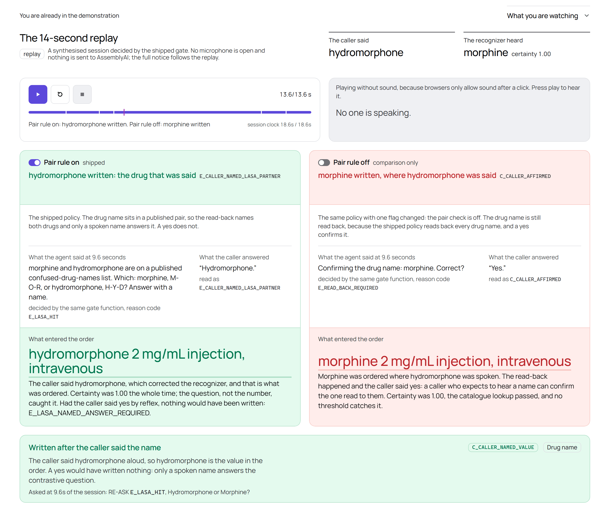
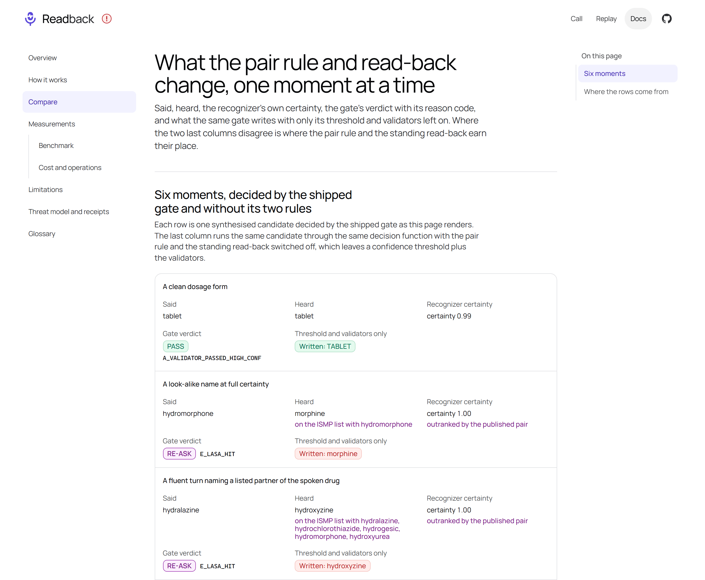
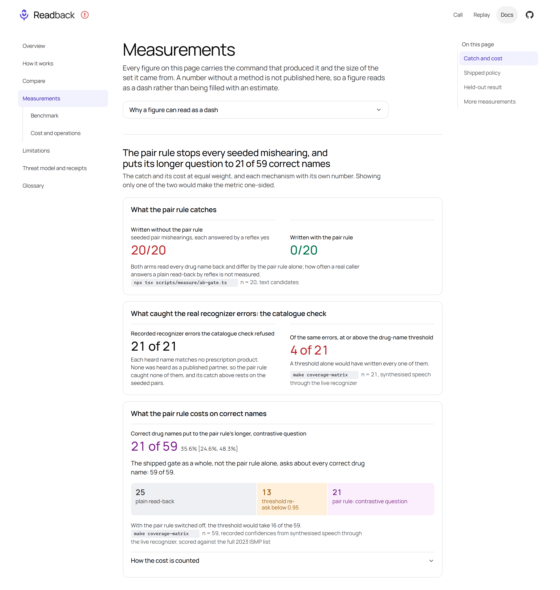
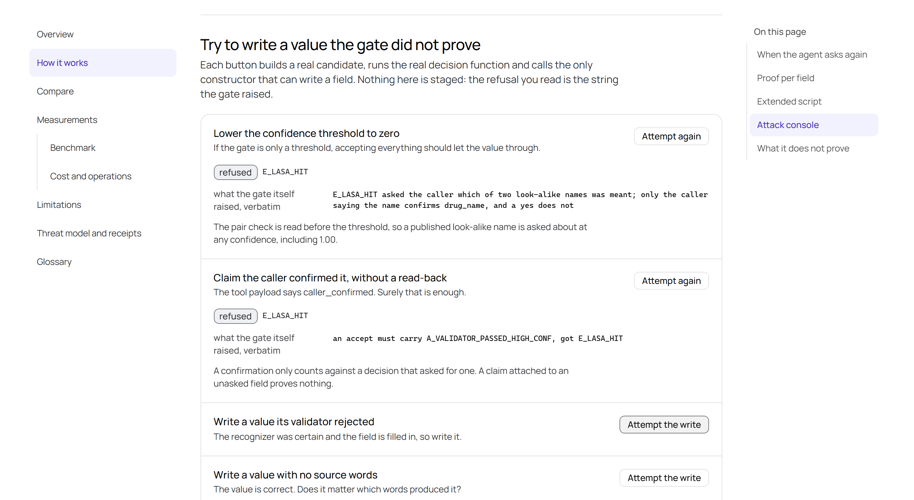
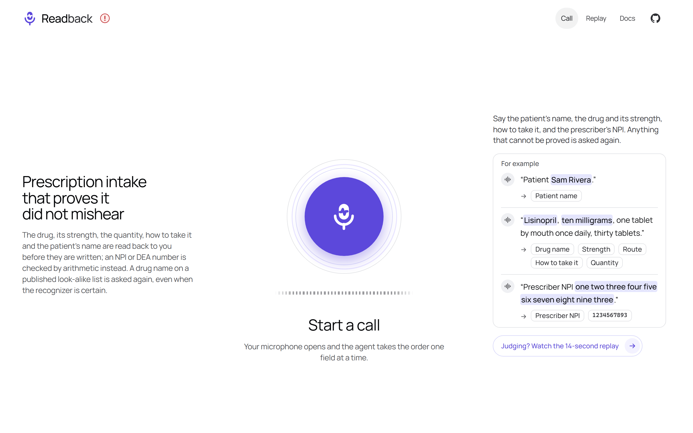

# Judging Readback

> The shortest route through the live product: what to open, what you should see, and what
> each step proves. The first five steps need no clone, no key and no microphone; the sixth
> is a live call. The last section maps the hackathon's four judging criteria to the part of
> the project that answers each.

**Read this if** you are evaluating the submission · **Related:** [product](product.md) ·
[evidence](evidence.md) · [limitations](limitations.md)

---

## Where does everything live?

The deployment is **<https://readback-rx.vercel.app/>**.

| Route | What it is |
|---|---|
| `/` | The live call: a microphone, a one-paragraph promise, three example lines to say, and the proof map of what each field must pass before it is written. Spends AssemblyAI credit |
| `/demo` | The judge hub: the replay with the pair rule on and off in two panels, a 90-second tour, one-button scenarios and the keyterms A/B |
| `/compare` | Six moments side by side: said, heard, recognizer certainty, the gate's verdict, and what the same gate writes with only its threshold and validators left on |
| `/how-it-works` | The three reasons to re-ask, what counts as proof per field, an extended script and the attack console |
| `/metrics` | The pair rule's catches beside its cost, the shipped policy's rows and the held-out result, each with its command and set size |
| `/metrics/benchmark` | Every recognizer and gate figure with its input, command, set size and date; a dash where nothing was measured |
| `/metrics/operations` | What an open call costs at the vendor's rates, what the gate would cost an order, and the socket close codes as observations |
| `/order/[id]` | A committed order's receipt, rechecked in your browser (sha256, NPI and DEA check digits, the pair list): `VALID` or `TAMPERED`, with the vendor witness per field |
| `/order` | The same recheck for a receipt file you downloaded |
| `/docs` | The documentation overview, glossary, limitations and threat model |
| `/deck`, `/cover` | The submission slides (print to PDF, one slide per page) and the cover image |

Three entry points redirect: `/?judge=1` and `/start` go to the autoplaying replay
(`/demo?autoplay=1#replay`), and `/live` goes to the call at `/`. When the daily live-call
budget is spent, `/` shows "Live calls are paused for today" with a **Watch the replay**
button instead of the microphone.

## Two minutes, in order

| Step | Do this | You should see | It proves |
|---|---|---|---|
| 1 | Open [the replay](https://readback-rx.vercel.app/demo?autoplay=1) | It starts by itself. At the decision the banner reads **RE-ASK** `E_LASA_HIT`, certainty 1.00, candidates Hydromorphone / Morphine | A published sound-alike pair outranks a perfect confidence |
| 2 | Read the two panels, **Pair rule on** and **Pair rule off** | On: the agent asks which of the two, and hydromorphone is written when the caller says the name. Off: morphine is read back, a "yes" confirms it, morphine is ordered | The arms differ by one policy flag, `lasaChecked`, not by the model or by a missing read-back |
| 3 | Open [/compare](https://readback-rx.vercel.app/compare) | Six moments; the last column shows what a threshold plus the validators alone would write | What the pair rule and the standing read-back change, case by case |
| 4 | Open [/how-it-works](https://readback-rx.vercel.app/how-it-works#attack) and run the attacks | Seven attempts, each refused with the error the code raised; nothing is written | The guarantee is in the code path, not in a prompt |
| 5 | Open [/metrics](https://readback-rx.vercel.app/metrics) | Every number carries its command and set size, and the cost of the rule sits beside its catches | Nothing is published without a method |
| 6 | Start a call on [/](https://readback-rx.vercel.app/) and say "Hydromorphone, two milligrams" | The agent names hydromorphone and every drug the list pairs with it, spelling the start of each, and asks for a name; a "yes" writes nothing | The same rule, live, on the production deployment |

  

Steps 1 and 2: the replay once it has finished, both panels decided by the same gate function.

In step 2 the pair-rule panel also states what a reflex "yes" would have produced: a refusal
code and nothing written. In step 6 the question is long because hydromorphone has five
partners on the ISMP list (morphine, buprenorphine, hydralazine, hydroxyzine, oxymorphone),
and every one is named.

  

Step 3: <code>/compare</code>. At certainty 1.00 the gate asks again, while the threshold and
validators alone write the wrong drug.

  

Step 5: <code>/metrics</code>. The catch and its cost at equal weight, each with its command and
set size.

**What the replay is.** Its socket messages are synthesised in the vendor's documented
shapes, so it demonstrates the gate's decisions, not the recognizer's behaviour. The gate,
the validators and the pair table it runs through are the shipped ones. The mishearing it
stages, hydromorphone heard as morphine at 1.00, has not been observed on the live recognizer
([limitations](limitations.md#the-confident-mishearing-the-product-is-built-around-has-not-been-observed)).
The recognizer figures in [eval/REPORT.md](../eval/REPORT.md) come from real AssemblyAI
sockets over synthesised speech.

## What does the attack console try?

Seven attempts to get a value past the gate. Each button builds a real candidate, runs the
real decision function and calls the only constructor that can write a field:

  

The first two attempts, run. The refusal under each is the string the gate raised.

| Attempt | Why it fails |
|---|---|
| Lower the confidence threshold to zero | The pair check is read **before** the threshold, so a listed name is asked about at any confidence. This is the quickest way to falsify the central claim, so it is first |
| Claim the caller confirmed it, without a read-back | A confirmation counts only against a decision that asked for one; an accept forged onto a value the gate asked about is refused |
| Write a value its validator rejected | A failed validator is a reason to re-ask, never to write |
| Write a value with no source words | Provenance with no words cannot be built, so there is nothing to confirm |
| Reuse an accepted decision from another field | A decision is bound to its candidate and its field |
| Order a Schedule II medicine with five refills | The refills check applies 21 CFR 1306.12(a), cites it in the refusal, and the agent offers to record none |
| Order a medicine whose name is one vowel away from a real one | The name is absent from the catalogue, and the refusal names the real medicine sharing its consonants so the caller can correct it in one turn |

## What can you try with a microphone?

  

The call page. Each example line shows which fields it fills; the microphone opens a live
call on the production deployment.

- **Interrupt the agent mid-sentence.** Playback stops at once. Nothing reaches the
  recognizer from the first audio of a reply until the reply ends, and a turn that matches
  the agent's own last line is discarded, so the agent's voice never becomes a caller's
  words in a field's provenance.
- **Correct yourself in one breath:** "Lisinopril, no wait, Losartan". The server refuses
  the value you took back (`E_VALIDATOR_COMBO`, `support_code: E_RETRACTED_VALUE`) and
  losartan goes on to its own checks. Six correction markers are recognized; any other
  phrasing falls back to the read-back
  ([limitations](limitations.md#a-caller-who-corrects-themselves-inside-one-utterance-is-detected-only-through-six-markers)).
- **Dictate an NPI in groups:** "one two three four, five six seven, eight nine three". The
  checksum proves it, so it is written at once: the agent tells you what it recorded and
  does not wait for a yes.

Live calls on production have so far used a synthesised caller, not a human voice
([evidence](evidence.md#what-has-a-live-call-shown)).

## Where is each judging criterion answered?

The [hackathon page](https://lablab.ai/ai-hackathons/assemblyai-voice-agent-hackathon)
publishes four criteria without weights, quoted here verbatim.

### Application of Technology

> "How effectively the chosen model(s) are integrated into the solution."

Both AssemblyAI sockets are held by the browser on short-lived tokens, with no proxy
([architecture](architecture.md)). Word-level timings and per-word confidence are the input
to the gate, which takes the lowest confidence over a value's words. The agent's tools run on
our server, `commit_order` in `hold` mode. `keyterms_prompt` carries clinic, prescriber,
dosage-form, unit and route words, and a check forbids it from containing any drug the pair
rule tests. Turn detection is set per field. Recognizer model: `universal-3-5-pro`.

### Presentation

> "The clarity and effectiveness of the project presentation."

The replay: one session where the caller says hydromorphone and the recognizer returns
morphine at confidence 1.00, run with and without the pair rule side by side. A judge without
a microphone gets the whole pipeline from it ([the route above](#two-minutes-in-order)).

### Business Value

> "The impact and practical value, considering how well it fits into business areas."

Read-back of verbal orders has been a Joint Commission requirement since 2003
(NPSG.02.01.01; where it sits in 2026 is not verified), so the product automates a step that
is already required rather than adding one. AssemblyAI's own figures set the scale: "Entity
error rate 15.31%", "Names 16.92%", a five-turn conversation that "comes through clean 43.6%
of the time", and 79.1% across five turns if the agent reads back every entity and the caller
catches errors 70% of the time, a vendor projection rather than a measurement
([sources](sources.md#what-does-the-vendor-publish-about-recognition-errors)). No market-size
figure is published, because none was measured ([product](product.md#who-pays-for-this)).

### Originality

> "The uniqueness and creativity of the solution, highlighting approaches and ability to
> demonstrate behaviors."

**Confidence is not evidence against homophony.** A regulator-published sound-alike list
overrides confidence 1.00 for a value that is valid in the catalogue, and only a spoken name
answers the question. The guarantee is structural: `ConfirmedValue` has no constructor
outside the gate.

---

<a href="README.md">Documentation index</a> · <a href="../README.md">Project README</a>
