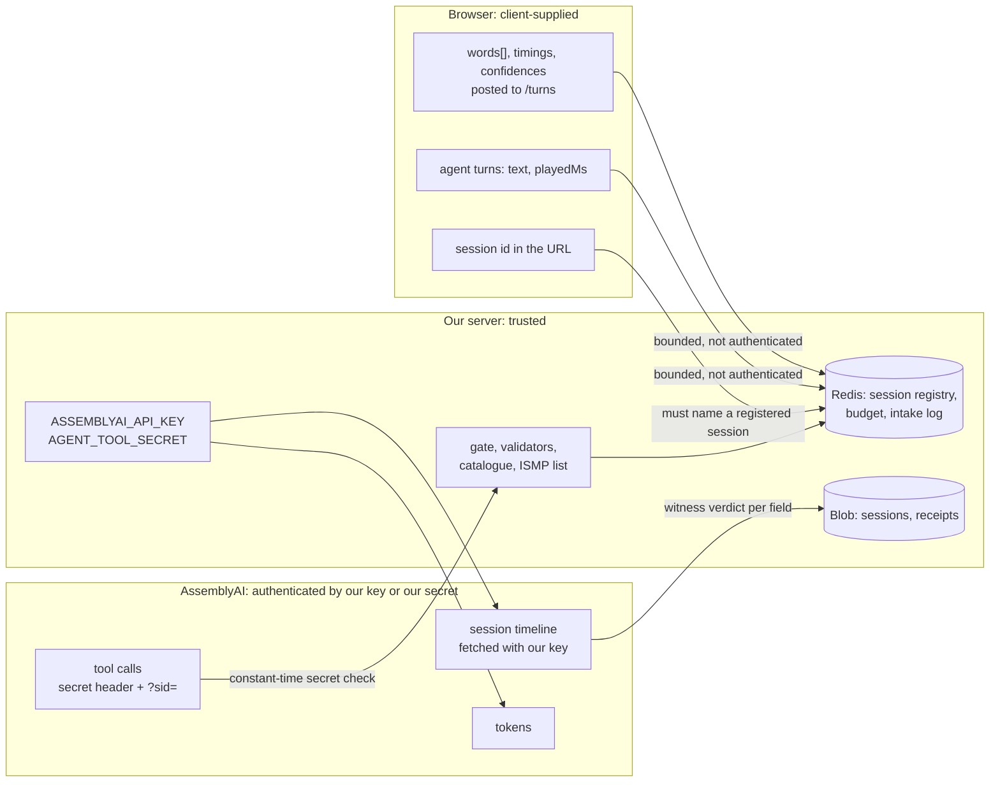

# Security and threat model

> What the server trusts, what the browser supplies, and what defends each boundary. The API
> key never leaves the server, spend has a shared daily ceiling, the tools answer only
> AssemblyAI and only for a registered session, and storage fails closed. Provenance is the
> one boundary left open: the browser posts the recognizer's words, so the gate proves
> provenance, not truth, and only the vendor's own transcript, fetched at finalize, witnesses
> them independently.

**Read this if** you are reviewing the app for deployment, attacking it, or deciding what a
receipt proves · **Related:** [architecture](architecture.md) ·
[verification](verification.md) · [limitations](limitations.md) ·
[cost and budget](cost-and-budget.md)

---

## Trust boundaries

| Input | Who supplies it | Trusted for |
|---|---|---|
| Tool arguments (`field`, `value`, `transcript_hint`, `caller_answer`) | The agent, via AssemblyAI, authenticated by the tool secret | Nothing on their own: the value is reconciled against posted words, the answer is judged from recorded turns |
| `words[]`, timings, confidences | The browser | Nothing beyond their bounds: this is the stated gap |
| Agent turn text and `playedMs` | The browser | Nothing beyond their bounds |
| Session id | The server issues it (a random UUID); the browser echoes it | Addressing only; it must name a registered session |
| Vendor session timeline | AssemblyAI, fetched with our key | The witness verdict in the receipt |
| Catalogue, ISMP list, checksums | Built from public sources into `data/`, and code | The validators and the pair rule |

## The key never leaves the server

- The browser receives two short-lived, single-use tokens and nothing else. The token
  routes clamp `expires_in_seconds` to 1 to 600 and `max_session_duration_seconds` to 60 to
  10 800 ([`src/domain/token-lifetime.ts`](../src/domain/token-lifetime.ts),
  `tests/api/tokens/token-routes.test.ts`), and return an allowlisted set of fields with
  `cache-control: no-store`.
- `make secrets` fails if `ASSEMBLYAI_API_KEY` appears under `src` or `app` outside
  `app/api/`, and also fails if it appears nowhere, so a renamed variable cannot pass as
  absent. It also refuses a hardcoded `Authorization` header, the tool secret outside
  `src/tools/auth.ts` and `app/api/`, a client component reading a server secret, a secret
  under a `NEXT_PUBLIC_` name, a tracked `.env` file, and a real value in `.env.example`.
  When a build is present it greps `.next/static` for the secret names; CI builds first and
  fails if the bundle is missing, so there the scan always runs.
- `make check-bundle`, run by hand after a build, scans the built client JavaScript for
  secret names, for the values of any secret present in the environment, and for server-only
  markers (the Redis key prefixes, the tool-secret header name, a server-side error string).
- `tests/setup.ts` deletes every paid credential from the environment before any test module
  loads and replaces `fetch` and `WebSocket` with stubs that throw.

## Spend has a shared ceiling, and it is not a rate limit

Every token is paid from one AssemblyAI account. Before minting, each token route debits the
token's whole session ceiling (`max_session_duration_seconds`) from a daily budget in Redis,
and refunds it when the vendor refuses to mint. Once the budget is spent, minting stops for
the rest of the UTC day with `E_DAILY_BUDGET_EXHAUSTED`; the recorded replay needs no token
and keeps working. The budget values and what they cost are in
[cost and budget](cost-and-budget.md#what-caps-the-spend).

| Layer | Limit | Redis key |
|---|---|---|
| Per client | Half of the daily budget (`CLIENT_SHARE_DIVISOR = 2`) | `readback:budget:<UTC day>:client:<client key>` |
| Daily | `READBACK_DAILY_BUDGET_SECONDS`: 7200 when unset (`DEFAULT_DAILY_BUDGET_SECONDS`), clamped to 0 to 86 400; the production deployment sets 86 400 | `readback:budget:<UTC day>` |

The client key is the platform-reported address (`x-real-ip`, else the first
`x-forwarded-for`), hashed with SHA-256 and cut to 16 hex characters; the address is never
stored in clear. The layers are debited in order, client first, and a refusal at any layer
refunds the layers already debited
([`src/sessions/budget/client-share.ts`](../src/sessions/budget/client-share.ts)). The
counter is Redis `INCRBY`, so concurrent instances share it. Tests:
`tests/api/tokens/budget-health.test.ts`, `tests/sessions/budget-client-share.test.ts`.

What this does not stop: two addresses can together spend the whole budget, and a client
with no reported address falls into one shared `unattributed` bucket. It is a ceiling on
spend, not a rate limit.

Separately, each token route has a per-instance rate brake (20 tokens per 60 s,
[`src/domain/instance-rate-brake.ts`](../src/domain/instance-rate-brake.ts)). It counts
requests seen by one warm serverless instance, so a new instance resets it. It damps a client
stuck in a retry loop, and its 429 body carries `RATE_BRAKE_HONESTY_NOTE`, which says it
does not enforce a global cap.

## The tools trust only AssemblyAI, and only for one session

- **Shared secret.** Every tool URL is declared on the stored agent with the header
  `x-readback-tool-secret`. AssemblyAI stores headers write-only. The server compares the
  header with `AGENT_TOOL_SECRET` in constant time (SHA-256 of both, then
  `timingSafeEqual`), and refuses every call when the secret is unset or shorter than 16
  characters ([`src/tools/auth.ts`](../src/tools/auth.ts), `tests/tools/auth.test.ts`).
- **Session binding.** Each per-session agent's tool URLs carry `?sid=<session id>`. A tool
  call whose `sid` is not a usable id, or names no registered session, is refused with
  `UNKNOWN_SESSION_CODE` and creates nothing ([`src/tools/handler.ts`](../src/tools/handler.ts),
  `tests/api/unknown-session-guards.test.ts`). The session is bound through the URL, never
  through an argument the model supplies.
- **Tool host.** Tool URLs are built from `NEXT_PUBLIC_APP_URL`, else the platform's
  deployment URL. In production they are never taken from the request's own origin, which a
  client can influence, because those URLs carry the secret
  ([`src/agent/tool-base-url.ts`](../src/agent/tool-base-url.ts),
  `tests/agent/tool-base-url.test.ts`).
- **Arguments.** Every argument is length-bounded and stripped of control characters
  ([`src/tools/input-bounds.ts`](../src/tools/input-bounds.ts)), the field name is a closed
  list, and a response over the 8 KiB the vendor truncates at is replaced by an error rather
  than cut.

## Provenance is client-supplied, so the gate proves provenance, not truth

With the browser holding the STT socket directly, `words[]` never pass through our server,
so provenance is client-supplied data: the client posts it to
`POST /api/sessions/{id}/turns`, which is deliberately unauthenticated because a browser
cannot hold the shared tool secret without publishing it.

Stated at full strength: anyone with DevTools can post
arbitrary words with arbitrary timings and arbitrary confidences, and the gate will accept a
value carrying that provenance, because the gate verifies that a value traces to words the
session reported, not that those words were ever spoken. The gate is built to stop a
recognizer from quietly mishearing a drug name, not a caller deceiving themselves. In the
malicious-client threat model the evidentiary chain inside the call is worth nothing, and the
receipt's witness verdict is the only independent check on it. The trade against an audio
relay is argued in
[limitations](limitations.md#the-evidentiary-chain-does-not-survive-a-hostile-client).

What the route does enforce is resource isolation, since bounds are the only defence
available without a secret:

| Bound | Value | Source |
|---|---|---|
| Session id | `[A-Za-z0-9._-]`, never `..`, at most 128 characters, so an id can neither address another tenant's blob nor escape the `sessions/` prefix | `MAX_SESSION_ID_CHARS`, `src/domain/session.ts` |
| Registration | The id must name a session the agent token route registered | `tests/api/unknown-session-guards.test.ts` |
| Words | at most 200 words per turn, each with a finite timing bounded by the three-hour socket cap and a confidence in 0 to 1 | `MAX_WORDS_PER_TURN`, `app/api/sessions/[id]/turns/route.ts` |
| Turns | the session keeps the last 400 turns per session | `MAX_TURNS_PER_SESSION`, `src/tools/intake.ts` |
| Event log | 2400 events per session log, then further events are refused; the Redis log expires after 24 h | `MAX_EVENTS_PER_LOG`, `src/tools/intake-events.ts`, `src/tools/redis-event-store.ts` |
| Memory fallback | the in-memory store, used only where no Redis is configured, holds 64 concurrent sessions, evicting the least recently used | `MAX_LIVE_SESSIONS`, `src/tools/intake-events.ts` |

Tests: `tests/api/resource-bounds.test.ts`, `tests/api/turn-input-bounds.test.ts`,
`tests/api/session-id-bounds.test.ts`, and `tests/api/disclosure.test.ts`, which holds this
section's wording to the constants in code.

Making provenance itself trustworthy would mean routing audio through our own host, which is
the always-on process the architecture deliberately removed
([architecture](architecture.md#why-the-browser-holds-the-sockets-and-there-is-no-proxy)).

## A second channel witnesses the words, after the call

The agent socket recognizes the caller on AssemblyAI's side. At finalize the server lists
the vendor sessions of this call's own agent with its own key, fetches each session's
timeline, and reconciles every field written to the order against the caller transcripts
there, with the same tolerances the spoken-support check uses. Each field is sealed into the
receipt as `witnessed`, `not_witnessed` or `unavailable`, and `/order/[id]` shows it
([`src/sessions/witness.ts`](../src/sessions/witness.ts), `WITNESS_BOUNDARY_NOTE` in
[`src/domain/live/witness-contract.ts`](../src/domain/live/witness-contract.ts),
`tests/sessions/finalize-witness.test.ts`).

A browser that forges its turns cannot also write the vendor's record. The boundaries:

- The timeline appears only seconds after the session ends, so the witness cannot block a
  commit during the call.
- It proves the vendor heard the words, not that a person said them: a client sending
  synthesised speech to both sockets passes.
- The timeline carries turn-level text and confidence, not word-level timings.

## Headers and content security policy

Set in [`next.config.ts`](../next.config.ts).

| Header | Value | When |
|---|---|---|
| `Content-Security-Policy` | see below | Production |
| `X-Frame-Options` | `DENY` | Production |
| `Strict-Transport-Security` | `max-age=63072000; includeSubDomains` | Production |
| `Cross-Origin-Opener-Policy` | `same-origin` | Production |
| `Permissions-Policy` | `microphone=(self)`; camera, geolocation, payment and USB disabled | Always |
| `X-Content-Type-Options`, `Referrer-Policy` | `nosniff`, `strict-origin-when-cross-origin` | Always |

The policy is `default-src 'self'`, with `connect-src` limited to our origin,
`streaming.assemblyai.com` and `agents.us.assemblyai.com` (https and wss), plus
`object-src 'none'`, `base-uri 'self'`, `form-action 'self'`, `frame-ancestors 'none'` and
`upgrade-insecure-requests`. It allows `'unsafe-inline'` for scripts and styles, which is
weaker than a nonce-based policy.

## Storage fails closed

`chooseSessionStore()` refuses to start in production without `BLOB_READ_WRITE_TOKEN`, and
the budget and the intake event store refuse without an Upstash Redis URL and token
(`UPSTASH_REDIS_REST_*` or `KV_REST_API_*`). Each error names the missing variable. A
whitespace-only token counts as absent. Without this, a finished order written to the memory
of one function would be lost when the function is torn down while the commit reported
success, and a budget counted in one instance would cap nothing
(`tests/sessions/store-fail-closed.test.ts`, `tests/tools/shared-store.test.ts`).

Development without these variables gets memory stores, because needing a Blob token to
run `npm run dev` would be its own defect. `READBACK_ALLOW_MEMORY_STORE=1` permits memory
stores in a production build; the CI jobs set it, a deployment must not.

Sessions are stored under three prefixes keyed off a required `origin`: `sessions/live`,
`sessions/rehearsal`, `sessions/measurement`. An unknown origin defaults to `live`, never
`measurement`, so a missing label cannot inflate a published set
([`src/sessions/origin.ts`](../src/sessions/origin.ts)).

Blob objects are written with public access, and `GET /api/sessions/{id}/receipt` returns
a receipt to anyone holding the session id. The data is synthetic by design; a deployment
holding real orders would need authenticated reads. This and the other open weaknesses of
low severity are listed in
[limitations](limitations.md#known-security-weaknesses-left-open).

## Where the audio goes

Voice audio goes to AssemblyAI: the recognizer through its global streaming host, the voice
agent through its US region, pinned because stored agents are regional, not as a
data-residency choice. Retention and consent are covered in
[limitations](limitations.md#voice-audio-leaves-this-application-and-goes-to-a-third-party-vendor).
All data in this project is synthetic: no real patients, no real prescriptions, no clinical
use.

---

<a href="README.md">Documentation index</a> · <a href="../README.md">Project README</a>
