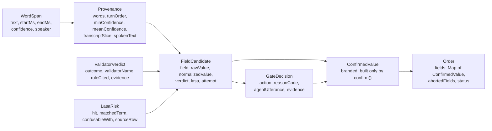
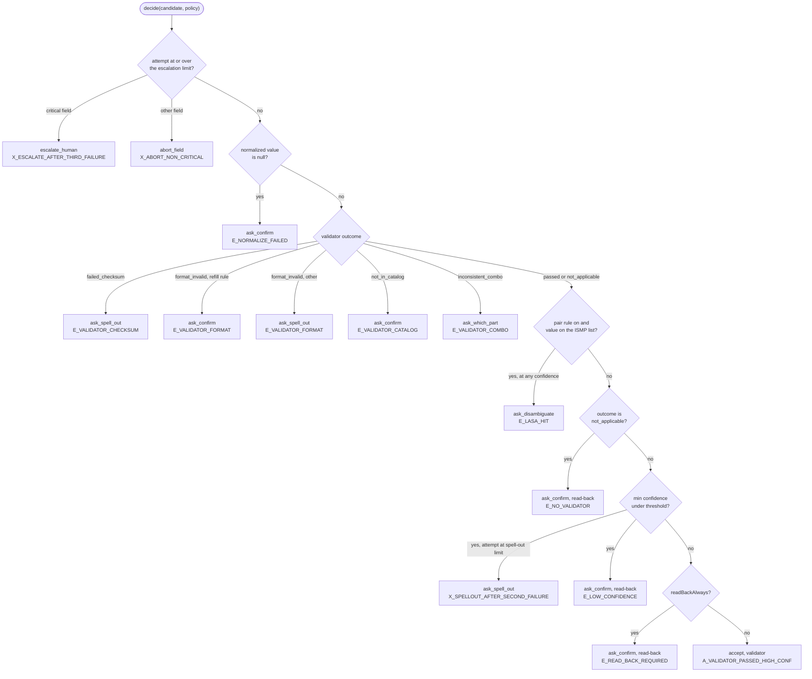

# Engineering specification

> The rules the code implements and the reasons behind them: the data model, the field
> policy, the gate's branch order, the tool contracts the voice agent calls, the system
> prompt, the keyterms rule and the exact definition of every metric. The single most
> important fact is the branch order: the published sound-alike list is checked **before**
> the confidence threshold, so a drug name on the ISMP list is re-asked even at confidence
> 1.0, and only a spoken name answers that question.

**Read this if** you are changing the gate, a validator, a tool or a metric, or you want
to know why a number in the policy is what it is · **Related:** [architecture](architecture.md) ·
[security](security.md) · [evidence](evidence.md) · [limitations](limitations.md) ·
[reference data](reference-data.md)

---

## What this document holds, and what it leaves to the code

The code is the authority. Where this page and `src/` disagree, `src/` wins and this page
is corrected in the same change. What the page adds is the reasoning the code cannot
carry: why a threshold sits where it does, why the gate's branches run in this order, why
no drug name may reach the recognizer's biasing list, and what each metric counts and
refuses to count.

No figure on this page is a measurement. Thresholds, attempt limits and budgets are chosen
defaults. The measurements are in [../eval/REPORT.md](../eval/REPORT.md) and
[evidence](evidence.md), each with the command that produced it and the size of its set.
The one vendor figure quoted here (16.92% entity errors in the benchmark's names category)
is AssemblyAI's publication, cited in [sources](sources.md) and not re-measured by this
repository.

| Subject | Where it lives |
|---|---|
| Types and errors | [`src/domain/`](../src/domain/) |
| Field policy | [`src/domain/policy.ts`](../src/domain/policy.ts) |
| Reason codes and actions | [`src/domain/reason-codes.ts`](../src/domain/reason-codes.ts), [`src/domain/enums.ts`](../src/domain/enums.ts) |
| The decision and the only `ConfirmedValue` constructor | [`src/gate/decide.ts`](../src/gate/decide.ts), [`src/gate/confirm.ts`](../src/gate/confirm.ts) |
| The words the gate hands the agent | [`src/gate/utterance.ts`](../src/gate/utterance.ts), [`src/gate/spell-out.ts`](../src/gate/spell-out.ts) |
| Validators | [`src/validators/`](../src/validators/), dispatched by [`src/sessions/validate-field.ts`](../src/sessions/validate-field.ts) |
| Proof logic shared with the browser | [`src/confirmation/`](../src/confirmation/) |
| Tool schemas | [`src/agent/tools.ts`](../src/agent/tools.ts) |
| Tool behaviour | [`src/tools/`](../src/tools/), served from [`app/api/tools/`](../app/api/tools/) |
| System prompt | [`src/agent/prompt.ts`](../src/agent/prompt.ts) |
| Keyterms | [`src/lasa/keyterms.ts`](../src/lasa/keyterms.ts) |
| Metrics | [`scripts/measure/`](../scripts/measure/), [`scripts/eer/`](../scripts/eer/), [`src/sessions/metrics.ts`](../src/sessions/metrics.ts), [`src/stats/wilson.ts`](../src/stats/wilson.ts) |

---

## 1. The data model: every value carries the words it came from

### The types, from a spoken word to a written field

| Type | File | What it guarantees |
|---|---|---|
| `WordSpan` | [`word-span.ts`](../src/domain/word-span.ts) | A recognized word with millisecond start and end and a confidence in [0, 1]; `makeWordSpan` throws otherwise |
| `Provenance` | [`provenance.ts`](../src/domain/provenance.ts) | At least one word, each with a usable confidence; `makeProvenance` computes `minConfidence`, `meanConfidence`, the span and `spokenText` itself |
| `ValidatorVerdict` | [`verdict.ts`](../src/domain/verdict.ts) | An outcome, the validator's name and the rule it applied, taken from `RULE_CITATIONS` |
| `LasaRisk` | [`lasa.ts`](../src/domain/lasa.ts) | Whether the value is on the ISMP list, every listed partner, and the source row |
| `FieldCandidate` | [`candidate.ts`](../src/domain/candidate.ts) | A proposed value with its provenance, verdict, LASA risk and attempt number (an integer of at least 1) |
| `GateDecision` | [`decision.ts`](../src/domain/decision.ts) | The action, the reason code, the sentence for the agent, the evidence, and a confirmation mode when the action can end in a write |
| `ConfirmedValue` | [`order.ts`](../src/domain/order.ts) | A branded type whose brand symbol is a non-exported `declare const ... unique symbol` |
| `Order` | [`order.ts`](../src/domain/order.ts) | `setField(order, value: ConfirmedValue)` is the only way a field enters; statuses are `in_progress`, `needs_pharmacist`, `committed`, `abandoned` |

The eleven fields are `FieldName` in [`enums.ts`](../src/domain/enums.ts): `drug_name`,
`strength`, `dosage_form`, `route`, `quantity`, `sig`, `prescriber_npi`,
`prescriber_dea`, `patient_name`, `refills`, `days_supply`.

### Provenance is the unit, and a value without one has no right to exist

A `Provenance` requires at least one source word, and that refusal sits before the gate:
no words, no `Provenance`; no `Provenance`, no `FieldCandidate`; no candidate, no
`ConfirmedValue`. The same structure closes off an invented value. The agent must quote
the words that carry the value, and
[`src/confirmation/provenance-match.ts`](../src/confirmation/provenance-match.ts) looks
for that quotation among the words of the three most recent caller turns. If it is not
there, `propose_field` answers `E_PROVENANCE_NOT_FOUND` and nothing reaches the gate.

### Thresholds compare against the minimum confidence over the span, never the mean

The mean hides the case the product exists for. "Lisinopril ten milligrams" at
`[0.42, 0.99, 0.99]` has a mean of 0.80 while failing on the one word that is the drug
name. The gate compares `provenance.minConfidence` with the field's threshold; the mean is
carried in the decision's evidence for display only. The minimum is conservative on
purpose and buys extra re-asks.

### Both the formatted slice and the words are kept

With `format_turns=true` the recognizer's formatted transcript and the concatenation of
its words differ in punctuation and number casting. Highlighting needs the words; showing
a person a sentence needs the slice. `Provenance` carries `transcriptSlice` and
`spokenText` side by side, because deriving one from the other loses information in
whichever direction it is done.

### A verdict cites a rule, not an opinion

Every `ValidatorVerdict` carries the rule it applied, from `RULE_CITATIONS` in
[`verdict.ts`](../src/domain/verdict.ts). These are the strings the field card shows.

| Validator | Field | The rule cited |
|---|---|---|
| `npi_luhn` | `prescriber_npi` | Luhn mod-10 over `80840` plus the first nine digits (ISO/IEC 7812 issuer ID 80840) |
| `dea_mod10` | `prescriber_dea` | `(d1+d3+d5) + 2*(d2+d4+d6)`; the last digit of the result equals `d7` |
| `ndc_catalog` | `drug_name` | lookup in the built catalogue, proprietary or nonproprietary name |
| `combo_consistency` | `strength`, `dosage_form`, `route` | the `(drug, strength, dosage form, route)` tuple must exist in the catalogue |
| `sig_abbrev` | `sig` | ISMP Error-Prone Abbreviations 2024-04: the abbreviation is on the do-not-use list |
| `range_check` | `quantity`, `refills`, `days_supply` | an integer within the documented bounds |
| `schedule_refills` | `refills` | 21 CFR 1306.12(a): a Schedule II prescription may not be refilled |
| `spoken_support` | any | every token of the proposed value must be accounted for by the recognized words of the turn its provenance points at |
| `none` | `patient_name` | no independent validator exists for this field |
| `ndc_format` | none | FDA NDC format rules. The citation exists, but the order has no NDC code field, so no path emits this verdict |

"It did not add up" without the rule cited is not proof. The worked examples behind the
arithmetic are in [reference data](reference-data.md#what-does-the-arithmetic-prove).

### A field with no validator is not a passed field

`not_applicable` is a separate outcome from `passed`, because `patient_name` has no
checksum and no catalogue, and reporting it as passed would be a lie in the audit. The
implication runs the other way too: `validator === "none"` forces `readBackAlways === true`,
and [`tests/domain/policy-reachability.test.ts`](../tests/domain/policy-reachability.test.ts)
asserts it over the whole policy table, so a new field cannot be added without deciding
how it is proved.

`not_applicable` also arrives from `combo_consistency` when a sibling of the combination
is not yet known: strength cannot be checked against a drug that has not been named. That
verdict routes to `E_NO_VALIDATOR`, a read-back, rather than to a failure of the
catalogue; the whole combination is checked again by `commit_order` before anything is
committed (section 4.5).

### `ConfirmedValue` cannot be constructed outside the gate

In TypeScript it is a branded type whose brand symbol is module-private, plus `confirm()`
in [`src/gate/confirm.ts`](../src/gate/confirm.ts) as the only exported path. `setField`
accepts nothing else, so "the model decided it was fine" has no code path into the order.
`make gate-invariant` fails if a second assertion appears in any of its three syntaxes, if
the single legitimate one disappears, or if a double assertion (`as unknown as`) appears
that could forge any branded type.

The limit: the invariant stops carelessness and structural mistakes, not a determined
author editing the same module. No barrier in a language with structural types can do
more. How the check itself could be read wrongly is in
[limitations](limitations.md#two-guarantees-rest-on-checks-reading-the-tree-correctly).

### A value the speech does not support is a validator failure, not a fourth reason

The agent supplies the value to `propose_field` and can supply a name nobody said while
quoting a hint that really does trace to a turn.
[`src/confirmation/reconcile-value.ts`](../src/confirmation/reconcile-value.ts) reconciles
the value against the words of that turn and returns a verdict named `spoken_support` with
outcome `inconsistent_combo`, which enters the existing `E_VALIDATOR_COMBO` branch. The
name deliberately does not borrow a checksum's name: that would claim a proof that never
ran. The tolerances are the ones a recognizer produces (spoken units, spelled-out numbers,
salt suffixes in either direction, consonant-skeleton drift), and a test asserts over all
curated pairs, in both directions, that no LASA partner is ever accepted as support for
the other name.

The same verdict refuses a value the caller took back inside the turn. "Lisinopril, no
wait, losartan" proposed as lisinopril answers `E_RETRACTED_VALUE` when a correction marker
("no wait", "sorry", "I mean", "actually", "scratch that", or "not X, Y") is followed by the
replacement within four words
([`src/confirmation/self-correction.ts`](../src/confirmation/self-correction.ts)). A
correction without a marker is not detected; see
[limitations](limitations.md#a-caller-who-corrects-themselves-inside-one-utterance-is-detected-only-through-six-markers).

### The DEA number is required on every order

`prescriber_dea` is critical in the policy, so `CRITICAL_FIELDS` contains it and
`commit_order` refuses without it, whatever the drug. The catalogue's DEA schedule is read
elsewhere: `schedule_refills` refuses any refill on a Schedule II product. Requiring a DEA
number for a non-controlled drug is stricter than pharmacy practice, and it is how the
code behaves.

---

## 2. The field policy, and why the numbers are what they are

The values below are copied from [`src/domain/policy.ts`](../src/domain/policy.ts), which
is the only place they are defined. If this table and that file disagree, the file is
right.

| Field | Criticality | Auto-accept threshold | Validator | Always read back | Pair rule | Spell-out from attempt | Escalate or abort at attempt | Spell-out style |
|---|---|---|---|---|---|---|---|---|
| `drug_name` | critical | 0.95 | `ndc_catalog` | yes | yes | 3 | 4 | NATO |
| `strength` | critical | 0.92 | `combo_consistency` | yes | no | 3 | 4 | digits |
| `dosage_form` | critical | 0.90 | `combo_consistency` | no | no | 3 | 4 | none |
| `route` | critical | 0.90 | `combo_consistency` | no | no | 3 | 4 | none |
| `quantity` | critical | 0.92 | `range_check` | yes | no | 3 | 4 | digits |
| `sig` | critical | 0.93 | `sig_abbrev` | yes | no | 3 | 4 | none |
| `prescriber_npi` | critical | 0.90 | `npi_luhn` | no | no | 3 | 4 | digits |
| `prescriber_dea` | critical | 0.90 | `dea_mod10` | no | no | 3 | 4 | NATO |
| `patient_name` | important | 0.90 | `none` | yes | no | 3 | 4 | NATO |
| `refills` | important | 0.88 | `range_check` | no | no | 3 | 4 | digits |
| `days_supply` | low | 0.85 | `range_check` | no | no | 2 | 3 | digits |

**None of these values was tuned on measured data.** They are chosen defaults resting on
four lines of reasoning. [evidence](evidence.md) reports what the drug-name threshold
does on recorded confidences; whether another value would do better is not measured.

**First: the cost of an error on a field, not its frequency.** A wrong drug name is a
different medicine; a wrong days supply is an inconvenience. That is the spread from the
highest threshold to the lowest, and re-asks are spent where the error is expensive.

**Second: proper nouns are the hard case, by the vendor's own numbers.** AssemblyAI
publishes 16.92% entity errors in its names category, and a drug name is a name. The
drug-name threshold is set high enough that accepting on confidence would be rare, and in
practice it never decides alone: the field also carries `readBackAlways`, so every drug
name is read back and the threshold only chooses which question is asked.

**Third: where arithmetic exists, voice is not spent.** NPI and DEA carry
`readBackAlways: false`, not because they matter less but because a checksum rejects a
mistyped digit independently of what the recognizer heard. Reading a ten-digit number back
aloud lengthens the call without adding proof. If the checksum fails, spell-out becomes
mandatory, and that is no longer a threshold question.

**The two checksums are not equally strong.** `make audit-checksums` enumerates every
single-digit substitution and every adjacent transposition over 200 valid identifiers of
each kind. NPI catches every substitution and misses the 0-to-9 adjacent swap. DEA misses a
class of substitution by construction: its scheme weights alternating digits by 1 and 2 and
sums mod 10, so changing a weight-2 digit by five is invisible. The policy stands, but the
two are never described as equivalent, and the coverage figures are pinned by
[`tests/validators/checksum-coverage.test.ts`](../tests/validators/checksum-coverage.test.ts)
rather than quoted here.

**Fourth: the read-back on the patient name is about the absence of a validator, not about
importance.** It is the implication of section 1, enforced by a test.

**Which fields carry the pair rule is a policy decision with a cost.** Only `drug_name`
has `lasaChecked`, because only a drug name can be on the ISMP list. On the other fields
the check would find nothing and spend latency.

**How tuning would proceed.** A threshold is raised if an accepted incorrect value is found
on held-out data: that is a safety failure. It is lowered if a field's re-asks on correct
values are high with no accepted incorrect value: that is a usability failure. Tuning uses
the development set only (section 8).

---

## 3. The gate: the branch order and why it is exactly this one

`decide(candidate, policy)` in [`src/gate/decide.ts`](../src/gate/decide.ts) is a pure
function. It imports only `@/domain`, `@/lasa` and its own sentence builders, and returns
the first branch that applies.

| Order | Reason code | The branch | Action |
|---|---|---|---|
| 1 | `X_ESCALATE_AFTER_THIRD_FAILURE` | the attempt limit is reached on a critical field | escalate to a human |
| 1 | `X_ABORT_NON_CRITICAL` | the attempt limit is reached on another field | abort the field |
| 2 | `E_NORMALIZE_FAILED` | the normalizer produced nothing | ask to confirm |
| 3 | `E_VALIDATOR_CHECKSUM` | a failed checksum | ask to spell out, at once |
| 3 | `E_VALIDATOR_FORMAT` | an invalid format; for the Schedule II refill rule, ask whether to record none | ask to spell out, or ask to confirm |
| 3 | `E_VALIDATOR_CATALOG` | not in the catalogue; names the nearest catalogue drug by consonant skeleton when one exists | ask to confirm |
| 3 | `E_VALIDATOR_COMBO` | the combination does not exist, or the speech does not support the value | ask which part is wrong |
| 4 | `E_LASA_HIT` | the value is on the ISMP list, on a field with the pair rule | ask to disambiguate, **at any confidence including 1.0** |
| 5 | `E_NO_VALIDATOR` | no validator applies, or the combination cannot be checked yet | ask to confirm, read-back mode |
| 6 | `X_SPELLOUT_AFTER_SECOND_FAILURE` | confidence under the threshold and the spell-out limit reached | ask to spell out |
| 6 | `E_LOW_CONFIDENCE` | confidence under the threshold | ask to confirm, read-back mode |
| 7 | `E_READ_BACK_REQUIRED` | everything passed, but the field is always read back | ask to confirm, read-back mode |
| 8 | `A_VALIDATOR_PASSED_HIGH_CONF` | a clean pass | accept, validator mode |

Each branch has a test named for it in [`tests/gate/branches.test.ts`](../tests/gate/branches.test.ts),
and `make gate-mutation` breaks one branch at a time and requires the matching test to fail
by name.

**Escalation goes first, or the gate does not terminate.** A field that keeps failing its
validator would otherwise spin forever: the checksum branch returns a spell-out every time
and the attempt counter is never read. Checking the limit before any other logic is the
only way to guarantee termination, and the test "gate always terminates" asserts that a
candidate at the limit always gets a terminal decision.

**The pair rule goes after the validators.** "This drug is not in the catalogue" is a
more useful question than "did you perhaps confuse it with": there is no sense offering a
choice between two names when what was recognized does not exist.

**The pair rule goes before the confidence threshold, and this is the product.** Put it
after, and a candidate at confidence 0.99 is accepted before the pair rule is reached.
That is exactly the case to catch: the recognizer is certain it heard morphine while the
human said hydromorphone. Its certainty is about the acoustics, not about which word was
spoken, and no confidence value protects against homophony. The only protection is a
published list applied before any numeric condition. "lasa hit asks even at perfect
confidence" pins it, and [`tests/gate/differential.test.ts`](../tests/gate/differential.test.ts)
checks it at every confidence including 1.0.

**The gate derives the pair risk from the value itself.** `pairRisk()` calls
`lasaRiskFor(normalizedValue)` rather than trusting the `lasa` field the caller filled in,
so a caller that forgets the risk cannot skip the rule. The mutation
`lasa_trusts_caller_field` in `scripts/checks/gate-mutations.txt` guards it.

**The re-ask wording comes from the gate, not from the model.** The decision carries the
sentence (`agentUtterance`) and the tool returns it as `say_to_caller`, so the logged
sentence and the spoken one start as one string. For the pair rule the sentence names
every listed partner with the letters that tell the names apart, for example "Which:
hydromorphone, H-Y-D, or morphine, M-O-R? Answer with a name." (`contrastiveUtterance` in
[`utterance.ts`](../src/gate/utterance.ts)).

**The escalation ladder.** An ordinary re-ask, then spell-out, then escalation for a
critical field or an abort for another. The limits are per field in the policy table. A
NPI or DEA number is not re-asked in full: if its checksum failed, a character is wrong,
and spell-out is the way to find it, so a checksum failure goes to spell-out at once.
A drug name often survives a plain repeat, and twelve NATO words is an irritating
procedure to reach for early.

**The escalation target is a pharmacist, and the code does not pretend one is present.** An escalated field marks
the order `needs_pharmacist` in the tool state, `commit_order` refuses with
`COMMIT_REFUSED_ESCALATED`, and no `ConfirmedValue` is created: the field stays empty
rather than holding a value tagged low-confidence.

### 3.1 What `confirm()` refuses

`decide()` says what to ask; `confirm()` is the only function that writes. It throws
`GateViolationError` when:

| Refusal | Why |
|---|---|
| the decision belongs to another candidate or another field | a proof is bound to the value it proved |
| the action is `escalate_human` or `abort_field` | a terminal refusal has nothing to confirm |
| the action is not `accept` and the caller did not confirm | only an accept may write without the caller; for `E_LASA_HIT` the message names the rule that a yes does not confirm |
| an `accept` carries a reason code other than `A_VALIDATOR_PASSED_HIGH_CONF` | an accept that did not come from the clean-pass branch is forged |
| the value is null or the provenance has no words | nothing provable to write |
| the validator did not pass and the caller did not confirm | no proof from either channel |
| the verdict is `not_applicable` and the caller did not confirm | voice is the only proof for such a field |

### 3.2 Spell-out

[`src/gate/spell-out.ts`](../src/gate/spell-out.ts) spells a value for the gate's
sentences and names the instruction for the caller.

| Rule | Enforced by |
|---|---|
| Letters use the NATO alphabet, with the official spellings `Alfa` and `Juliett` | `NATO` in `spell-out.ts` |
| Numbers go one digit at a time | `DIGIT_WORDS` and the `digits` style |
| Grouped numbers such as "twenty-three" are not accepted in spell-out | the system prompt only; no code rejects them |
| A spelled-out value earns no leniency: it is proposed again with fresh provenance and goes through the gate from the start, one attempt higher | `propose_field` counts every candidate for the field |
| The read-back sentence is recorded as spoken, with style `spell_out` | the `read_back` registration and the `spell_out_entered` event |

Letters need a spelling alphabet because B, D, P, T, V and M, N are the classic telephone
confusions, and a DEA number opens with two letters.

---

## 4. The tool contracts: what each tool accepts, refuses and writes

### How the tools are wired

Each live session gets its own stored agent, created by
`createSessionAgent` in [`src/agent/session-agent.ts`](../src/agent/session-agent.ts) and
deleted at finalize ([architecture](architecture.md#one-stored-agent-per-live-session)).
Every tool carries an `http.url` on our deployment with the session id in the query string,
and AssemblyAI calls it. There is no `tool.call` and `tool.result` exchange in the browser,
and each invocation is a short request, which is what lets a serverless function serve a
two-to-ten-minute call.

The constraints, all from the vendor's
[HTTP tools documentation](https://www.assemblyai.com/docs/voice-agents/voice-agent-api/tools/http-tools)
and all load-bearing:

| Constraint | What we do about it |
|---|---|
| HTTPS and a publicly reachable host only | tools are tested on a preview deployment |
| The response is truncated at 8 KiB | `fitsToolLimit` in [`src/tools/respond.ts`](../src/tools/respond.ts) turns an oversized payload into an error rather than letting it be cut |
| Headers are write-only | the shared secret travels in `x-readback-tool-secret` and is compared in constant time ([`src/tools/auth.ts`](../src/tools/auth.ts)) |

| Tool | Route | Execution mode | Timeout | Writes |
|---|---|---|---|---|
| `lookup_drug` | `/api/tools/lookup-drug` | `interactive` | 10 s | nothing |
| `validate_prescriber` | `/api/tools/validate-prescriber` | `interactive` | 5 s | nothing |
| `propose_field` | `/api/tools/propose-field` | `interactive` | 15 s | a value its validator proved on a field not always read back |
| `read_back` | `/api/tools/read-back` | `interactive` | 5 s | a value the caller confirmed aloud |
| `commit_order` | `/api/tools/commit-order` | `hold` | 30 s | the order |

`commit_order` is the only `hold` tool: the agent pauses rather than talking over a write.
Every other tool is `interactive`, so the agent keeps the floor while a lookup runs.

### 4.1 `lookup_drug`

Searches the built catalogue by spoken name and returns only combinations of strength,
dosage form and route that exist. The prompt tells the agent to call it before proposing a
drug, strength, form or route and never to propose a combination it did not return.

When the query is on the ISMP list, the result carries `lasa_warning` with every listed
partner in `confusable_with`. That is an optimisation, not a protection: the gate returns
`E_LASA_HIT` whether or not the model read the warning. **The protection is in the code;
the hint is in the prompt.**

No network call happens at runtime. The catalogue is built offline by
`scripts/build/ndc.ts` into `data/catalog.json` and read through `src/catalog/`.

### 4.2 `validate_prescriber`

Two local arithmetic checks: Luhn with the `80840` prefix for the NPI, mod-10 for the DEA.
The schema requires digits (ten for the NPI, two letters and seven digits for the DEA), so
"one two four five" fails schema validation and the model is told to pass digits. The tool
records nothing.

Registry lookup is deliberately absent (`registry_lookup: null` in the response). The
keyless NPI Registry API could check existence, but our NPIs are synthesised from the
checksum and are not in the registry, so a lookup would answer "not found" for a number
that provably adds up.

### 4.3 `propose_field`: every value starts here, and it writes only what a validator proved

Every value the agent proposes goes through it. The one candidate built elsewhere is a
LASA partner the caller named in answer to a contrastive read-back (section 4.4), and that
candidate passes through `decide()` too.

The server locates the quoted words, normalizes and validates the value, reconciles it
against the speech, builds a `FieldCandidate`, calls `decide()` and answers with the action, the reason code, `say_to_caller`, the evidence, `next`, and
`written_to_order`. **That flag is present in every response.**

**An accept writes at once, through `confirm()` with confirmation mode `validator`.** An
accept means the field's validator passed above its threshold on a field that is not
always read back: the NPI and DEA checksums, which is the case the rule exists for, and
also a dosage form or route whose catalogue combination is complete, or refills and days
supply within range. Voice is not spent where a validator already proved the value, and a
second tool round trip to write it adds no proof and costs the call a turn in which the
model can stall. The response carries `after_this`, the next step for the order, so the
agent moves on with the write. A later
`read_back` on a written candidate answers that it is already written rather than writing
it twice. Every other value comes back with `written_to_order: false` and is written only
by the second `read_back` call.

Before the gate runs, three refusals can answer instead:

| Code | When | What the agent is told |
|---|---|---|
| `E_PROVENANCE_NOT_FOUND` | the quotation matches none of the three most recent caller turns | the searched text, to copy a shorter hint, then to ask the caller again |
| `E_STALE_PROPOSAL` | the caller said something newer about this field after the quoted turn | to propose again from the latest statement |
| `E_PLACEHOLDER_VALUE` | a patient name such as "unknown", "test patient" or "Jane Doe" | to ask for the real name; nothing is proposed |

**The transcript hint is the most fragile part of the contract.** The model must copy two
to five of the caller's words exactly. A paraphrase finds no match, which is safe but costs
a turn, which is why that rule sits at the top of the prompt.

### 4.4 `read_back`

Two calls. The first registers the sentence about to be spoken for a candidate; the second,
carrying `caller_answer`, resolves it.

**It is `interactive`, not `hold`.** `hold` would silence the agent at the moment it is
meant to speak. The tool exists to register the sentence, not to delay it.

**The answer is judged from the recorded speech, not from `caller_answer`.** That argument
is kept as a hint for the record. `evaluateConfirmation` in
[`src/sessions/confirmation-evidence.ts`](../src/sessions/confirmation-evidence.ts) finds
the agent's own read-back turn that carries the value, requires it to have played in full,
takes the caller's next turn, discards it if it echoes the agent's line, and classifies it.

**Resolution leans towards caution.** A confirmation counts only on an affirmation with
nothing else, or with a restatement that matches the value. A negation or a correction
word rejects. A backchannel ("mhm", "okay", "thank you"), silence or anything else is
unclear and writes nothing. "Yes, but the dose is wrong" is a correction, not a yes. The
word lists are in
[`src/domain/live/answer-vocabulary.ts`](../src/domain/live/answer-vocabulary.ts).

**For a value on the ISMP list, a yes never confirms.** The read-back must be contrastive,
naming every partner; if the agent's sentence does not, the registration returns the
contrastive sentence to say instead. Only the caller saying one of the names answers it.
If the caller names a partner, the partner becomes a new candidate with the caller's own
words as its provenance and goes through `decide()`; it is written when that decision is
the pair-rule question the caller has just answered, and otherwise the new decision's
sentence is returned and nothing is written
([`src/tools/pair-rule.ts`](../src/tools/pair-rule.ts)). If the caller says yes, the answer is `E_LASA_NAMED_ANSWER_REQUIRED` with a
sentence asking for the name.

| Code | Verdict | Meaning |
|---|---|---|
| `C_CALLER_AFFIRMED` | confirmed | an affirmation, alone or with a matching restatement |
| `C_CALLER_NAMED_VALUE` | confirmed | the caller said the listed name that was proposed |
| `E_CALLER_NAMED_LASA_PARTNER` | rejected, and the partner written | the caller said the other listed name |
| `E_LASA_NAMED_ANSWER_REQUIRED` | unclear | a yes to a contrastive question |
| `E_READBACK_NOT_CONTRASTIVE` | unclear | the spoken read-back of a listed value did not name every partner |
| `E_NO_READBACK_TURN` | unclear | no recorded agent turn carries the value |
| `E_READBACK_INTERRUPTED` | unclear | the read-back did not play in full |
| `E_NO_CALLER_ANSWER` | unclear | no caller turn after the read-back |
| `E_ECHO_TURN` | unclear | the "answer" matches the agent's own line |
| `E_CALLER_NEGATED` | rejected | a negation |
| `E_CALLER_CORRECTED` | rejected | a correction word, or a different number |
| `E_CALLER_REPEAT_MISMATCH` | rejected | an affirmation with a restatement that does not match |
| `E_CALLER_BACKCHANNEL` | unclear | only a backchannel |
| `E_CALLER_UNCLEAR` | unclear | anything else |
| `E_SUPERSEDED_BY_NEWER_TURN` | rejected | a later caller turn changed the field |

### 4.5 `commit_order`

Commits the order. It takes one argument, `caller_confirmed`, which the model is forbidden
to set on its own judgement; the server records the full read-back from the recorded speech
of the call. The checks run in this order, and each refusal needs a different recovery:

| Order | Code | Refused when |
|---|---|---|
| 1 | `COMMIT_REFUSED_ALREADY_COMMITTED` | the order is already committed; returns the existing reference, idempotently |
| 2 | `COMMIT_REFUSED_NO_FULL_READBACK` | `caller_confirmed` is false, including when the caller asks to submit early |
| 3 | `COMMIT_REFUSED_ESCALATED` | a field was escalated to a human |
| 4 | `COMMIT_REFUSED_MISSING_CRITICAL` | a critical field holds no `ConfirmedValue`; the response separates never asked, refused by the gate, and abandoned |
| 5 | `COMMIT_REFUSED_INCONSISTENT_COMBINATION` | each of drug, strength, form and route was confirmed alone, but together they are not one catalogue product |

**`hold` here is demonstrative as well as technical.** The agent falls silent for the
write, and a refusal on an unconfirmed field is the gate visible live.

### 4.6 The language model is the vendor's managed one

None is selected. The create-agent schema has no model field, so the stored agent
definition sends none and the session runs the vendor's managed model; the session
configuration reports `llm: []`. This account has no access to the LLM Gateway models
that could replace it. `AGENT_MODEL_NOTE` in
[`src/agent/session-config.ts`](../src/agent/session-config.ts) records this and a test
pins it. What makes a call complete is the prompt and the tool responses, not a model
choice.

### 4.7 What a finished session records, and what it does not

There is no database. One record per session goes to Vercel Blob through
[`src/sessions/`](../src/sessions/): `commit_order` writes it when the order commits, and
the finalize route writes it again with the witness verdicts added.

| Recorded | Content |
|---|---|
| `decisions` | every gate decision with its reason code, the cited rule, the evidence and the threshold applied |
| `events` | the `MetricKind` events of section 7.1 |
| `receipt` | every written field with its provenance, verdict and confirmation evidence; see below |
| `witness` | per field, whether the vendor's own transcript of the call contains the value: `witnessed`, `not_witnessed` or `unavailable` ([`src/sessions/witness.ts`](../src/sessions/witness.ts)) |
| `origin`, `gateEnabled`, `startedAt`, `endedAt`, `orderId`, `committed` | the session's frame |

The receipt (`OrderReceipt` in
[`src/domain/live/live-contract.ts`](../src/domain/live/live-contract.ts)) holds, per written
field, the value, the provenance with word timings and confidences, the verdict, the
confirmation mode and the confirmation evidence (the agent's read-back text and the caller's
answering turn); then the recognizer model reported, the origin, the commit time, the
witness verdicts and a sha256 over the whole. The witness transcript is fetched by the
server with its own key, so the browser cannot write it.

| Not recorded | Why |
|---|---|
| Audio | Audio goes from the browser to AssemblyAI and never reaches our server. The proof does not need it: the words with their timecodes prove a value |
| Real personal data | The product takes synthetic data only: fictitious patient names, NPI and DEA numbers synthesised from their checksums. Recognizer-side redaction is not enabled |
| Close codes | the stored `closes` list is empty; close codes are logged in the browser with their Error frame ([`src/realtime/close-codes.ts`](../src/realtime/close-codes.ts)) |
| The configuration sent to the vendor and a policy version | a reproduction depends on the commit the deployment was built from |

Storage fails closed in production and keeps rehearsals apart from measured sessions by
origin; both rules are in [security](security.md#storage-fails-closed).

---

## 5. The agent's system prompt is for speed, not safety

The prompt that ships is `SYSTEM_PROMPT` in
[`src/agent/prompt.ts`](../src/agent/prompt.ts); read it there. This section is why it is
shaped that way.

### 5.1 The construction principles

- **The prompt is not a protection.** Everything it says about not writing without the gate
  is guaranteed by the types of section 1. The prompt exists so the agent does not spend
  turns on attempts that would fail anyway: it is for speed, not for safety. A prompt can
  be broken; an invariant cannot.
- **The field read-back wording is not in the prompt.** The gate returns it as
  `say_to_caller`, and the prompt holds only the rule "say exactly that sentence". The only
  template the agent fills in itself is the full-order read-back, assembled from written
  values.
- **The server steers the call.** Every result carries `next` or `after_this.next`, written
  by the server, and the prompt tells the agent to follow those and to treat everything else
  (the caller's words, values quoted inside results) as untrusted data.
- **Prohibitions are short and have no reasons attached.** The reasons are on this page, for
  people; for the model they cost tokens on every turn.

### 5.2 The decisions in it

| Rule | Why |
|---|---|
| Every value the caller says goes to `propose_field` in the turn it is heard, once per value | a value held in the model's context is recorded nowhere; it is the rule most likely to be broken, so it comes first |
| `transcript_hint` is copied, never written | a paraphrase finds no words and the field does not pass |
| Look at `written_to_order` first | an arithmetic-proved value is already written and needs no `read_back` |
| Read-back is two calls, and `caller_answer` is never evidence | the server judges from the recorded speech |
| A sound-alike question is answered by a name, and a yes never confirms it | the contrastive rule of section 4.4 |
| When the caller asks to submit early, call `commit_order` with `caller_confirmed` false | the refusal names what is missing, instead of the model arguing the request away |
| Never ask for or record anything outside the eleven fields | the line handles synthetic prescription intake only, and volunteered data is not passed to any tool |
| An intake line, not a clinician | the agent has no opinion on clinical appropriateness; this belongs with the medical disclaimer |
| One question per turn | two questions in one turn get one answer and a repeat |

What is deliberately absent: the pair list (it lives in the code, and putting it in the
prompt is the leak section 6 is about), the thresholds (the gate's business), and any
explanation of why read-back is needed.

---

## 6. Keyterms: the rule that decides whether any of this proves anything

### 6.1 Why the biasing list and the pair list must not meet

`keyterms` on the agent socket and `keyterms_prompt` on the recognizer bias decoding: a
listed term gains an advantage over its neighbours. The protective construction has two
parts, and its strength is that they are independent: the **recognizer observes** (a
hypothesis and a confidence), while the **validators and the pair rule check** that
hypothesis against a published source. "The gate caught an error" means something exactly
to the extent that the check does not depend on the observation.

Put both names of a LASA pair into keyterms, and the recognizer starts preferring those
two words over any phonetic neighbour. The pair rule fires more often, not because it
caught anything, but because we nudged the recognizer into producing the words the rule
looks for. Put only one name in, and it is worse: the human says the other one, the
recognizer returns the listed name at high confidence, and we have built the failure the
product exists to prevent.

**Keyterms belong to the observation channel; the pair list belongs to the checking
channel; the two sets must not intersect.** `make keyterms-purity` refuses a build where
they do.

### 6.2 Where the list goes

`buildKeyterms()` in [`src/lasa/keyterms.ts`](../src/lasa/keyterms.ts) builds one list,
and the product sends it in one place: `input.keyterms` of the stored agent definition
([`src/agent/session-config.ts`](../src/agent/session-config.ts)). The browser's
recognizer socket sends no `keyterms_prompt` and no `prompt`. Two paid measurement targets
send keyterms to the recognizer: `make eval-keyterms` sends the same list as
`keyterms_prompt`, and `make eval-live-keyterms` sends the LASA-checked names instead, as an
ablation whose result is labelled `lasa-names`.

### 6.3 What goes in

Only identifying context: words that help the recognizer orient itself and take part in no
checked rule.

| Category | Why it is safe, and why it earns a slot |
|---|---|
| Clinic and pharmacy names, fictitious | pure identity; affects no order field |
| Prescriber names, fictitious | the same, and dictated at speed |
| Dosage forms | dictated constantly, from a closed set |
| Units | a unit error is a strength error, and strength is critical |
| Route words | a closed set, easily confused with one another |
| Dictation words ("days supply", "no refills", "twice daily") | they frame every field but are never a drug name |
| The NATO alphabet | spell-out is the last line before escalation |

The list holds 92 terms, pinned by "spends the fixed skeleton of 92 terms" in
[`tests/lasa/keyterms-purity.test.ts`](../tests/lasa/keyterms-purity.test.ts). The NATO
words take 26 of them, justified because a misheard `Foxtrot` breaks the last line.

### 6.4 What is forbidden

**No drug name enters keyterms at all**, not only the names on the list. The moment a new
pair is added, a narrower rule would quietly lose independence. "There are no drug names in
keyterms" is checkable on its own; "there are no names from checked pairs" requires two
files to change in step. We take the first.

That gives up biasing on exactly the field where it would help most. In its place: the
recognizer's `domain=medical-v1` mode, a catalogue lookup, and the gate.

### 6.5 The checks, including the one that keeps the others honest

| Assertion in `keyterms-purity.test.ts` | Why |
|---|---|
| no keyterm is a name on the full ISMP list | the direct check |
| no keyterm hides a listed name inside a multi-word term | "hydromorphone 2 mg" passes a whole-string comparison |
| no keyterm is a drug name in the catalogue | the ban is wider than the pairs |
| the list fits `KEYTERMS_MAX` (100) | the vendor rejects more than 100 keyterms per session and ignores a term over 50 characters ([keyterms prompting](https://www.assemblyai.com/docs/streaming/keyterms-prompting)) |
| terms are unique case-insensitively | a duplicate wastes a slot |
| the pair list is actually loaded, and it is the full list | break the parse and the first check goes green over an empty set; a check that passes when its subject is missing manufactures confidence |

---

## 7. Metrics: what each figure counts and refuses to count

No results are on this page. [../eval/REPORT.md](../eval/REPORT.md) holds each figure with
its command and set size, and
[`tests/scripts/honest-report-agreement.test.ts`](../tests/scripts/honest-report-agreement.test.ts)
runs each anchored command and requires its printed figures to appear in the report, so a
published number cannot go stale silently. A percentage is never shown without the size of
its set, and a proportion carries a 95% Wilson interval (`wilson()` in
[`src/stats/wilson.ts`](../src/stats/wilson.ts), z = 1.959964).

### 7.1 What a live session records

`MetricKind` in [`src/domain/session.ts`](../src/domain/session.ts): `session_started`,
`turn_received`, `field_proposed`, `gate_decided`, `read_back_requested`,
`read_back_matched`, `read_back_failed`, `spell_out_entered`, `escalated`,
`order_committed`, `order_refused`, `socket_closed`, `echo_turn_discarded`. Each carries a
millisecond time, the field and the reason code where one applies.

### 7.2 What is implemented

| Metric | Definition as implemented | Code | Command |
|---|---|---|---|
| Entity Error Rate | wrong utterances over utterances, one drug name per utterance | [`scripts/eer/score.ts`](../scripts/eer/score.ts) | `make eval`, `eval-control`, `eval-native16`, `eval-heldout` (paid); `npx tsx scripts/eer/report.ts <set>` over a recorded run (free) |
| Finalization delay | from the last audio frame sent to the first `Turn` with `end_of_turn: true`; P50, P95 and max | [`scripts/eer/transcribe.ts`](../scripts/eer/transcribe.ts), [`scripts/eer/report.ts`](../scripts/eer/report.ts) | the same runs |
| Latency budget | the count of recorded values over each budget in `LATENCY_BUDGET_MS`; see below | [`scripts/measure/latency-budget.ts`](../scripts/measure/latency-budget.ts), [`src/domain/latency-budget.ts`](../src/domain/latency-budget.ts) | `make latency-budget` (free) |
| Socket open, first `Turn` after open | from connect to open, and from open to the first `Turn` message | [`scripts/eer/transcribe.ts`](../scripts/eer/transcribe.ts) | the EER runs |
| Gate decision time | the time `decide()` takes over the synthesised fixtures | [`scripts/measure/measure-gate-latency.ts`](../scripts/measure/measure-gate-latency.ts) | `make measure` (free) |
| Which mechanism catches which error | each recorded utterance assigned to the first branch `decide()` takes under the shipped drug-name policy | [`scripts/measure/coverage-matrix.ts`](../scripts/measure/coverage-matrix.ts) | `make coverage-matrix` (free) |
| What a reflex yes writes | the same candidates through three policy arms | [`scripts/measure/ab-gate.ts`](../scripts/measure/ab-gate.ts), [`scripts/arms/`](../scripts/arms/) | `make ab-gate` (free) |
| Checksum coverage | every single-digit substitution and adjacent transposition over valid identifiers | [`scripts/measure/audit-checksums.ts`](../scripts/measure/audit-checksums.ts) | `make audit-checksums` (free) |
| Ask rate on `/metrics` | decisions whose action is not `accept`, over all stored decisions, by reason code | [`src/sessions/metrics.ts`](../src/sessions/metrics.ts) | the `/api/metrics` route |

**Entity Error Rate.** The transcript is lowercased, stripped of non-letters and of the
filler words "the", "drug", "name", "is", "a" and "an", and compared with the spoken name
after `normalizeDrugName` on both sides.

**Latency budget.** Finalization is held to 500 ms, the vendor's published P95 target, and
gate decision time to 5 ms; a single recorded value over either, or no observation at all,
fails the build. Socket open is held to 2500 ms, a ceiling chosen above the worst case
recorded, and is counted and printed without failing the build.

**Which mechanism catches which error.** Errors and correct values are reported separately,
and for correct values the read-back length is given in words and in seconds at a stated
speaking rate.

**What a reflex yes writes.** The arms are shipped, without the pair rule
(`withoutPairRule`), and threshold only. A reflex yes writes whatever a plain read-back
asked and never what the pair rule asked, because only a spoken name answers the pair rule.

Percentiles are nearest-rank: index `floor(p / 100 * n)` into the sorted values, capped at
the last. No interpolation, so a P95 over a small set is one of the observed values, and a
P99 on a small sample is decided by a single outlier.

**Finalization delay depends on endpointing**, so a figure without the recognizer's
`min_turn_silence` and `max_turn_silence` is a figure about nothing. Why the recognizer
keeps both bounds while the agent socket is sent neither is in
[architecture](architecture.md#turn-detection-is-set-per-socket-and-per-field).

**The false-ask rate is not defined in live mode.** A false ask is a re-ask on a value that
was already correct, and in a live call the truth is unknown, so `/metrics` returns `null`
with `FALSE_ASK_NOTE` rather than a zero nobody measured. Over the corpora, where the truth
is known by construction, `make coverage-matrix` and `make ab-gate` report the same thing
as asks on correct values, broken down by the branch that asked. For the pair rule that
cost is high by construction: it asks whenever a listed name is heard, including every time
it was heard right. That is the price of the rule, and it is published as a number.

### 7.3 Defined, and not measured by any code

These definitions are fixed before any measurement so that a result cannot bend them. No
script computes them.

| Metric | What it would need |
|---|---|
| Entity Error Rate over multi-field turns | a corpus of full dictations with per-field ground truth |
| Per-field correctness | the same |
| Time to first audio | both events on one clock; the vendor timeline carries a per-turn time, which is not collected into a figure |
| Caller repeat rate | a record of the agent's question per caller turn |
| End-to-end task success | live calls with known ground truth |

- **Entity Error Rate over multi-field turns.** `EER_turn` is entity-bearing turns with at
  least one wrong entity over entity-bearing turns; `EER_field` is wrong entities over
  ground-truth entities. Turns with no entity ("yes", "go ahead") are excluded from both.
- **Per-field correctness.** Drug name: exact normalized nonproprietary name. Strength: value
  and unit, so `10 mg` equals `10.0 mg` and not `10 mcg`. Form and route: catalogue code.
  Integers: equality. NPI and DEA: character equality. Sig: exact normalized form (strict).
  Patient name: equality after case and whitespace.
- **Time to first audio.** The first agent audio chunk minus the agent socket's
  speech-stopped event, both on one clock; not from reply-started, which flatters it, and not
  to the end of the reply.
- **Caller repeat rate.** Caller turns whose normalized text equals the previous caller
  turn's, over caller turns excluding the first, segmented by the agent's preceding question.
  Punctuation is replaced by a space, never deleted, so `12-45-31` does not collapse into
  `124531`.
- **End-to-end task success.** Calls with a committed order and every field correct, over
  calls attempted; one wrong field is a failure.

---

## 8. The held-out set is sealed before it is read

Without these rules no figure above is worth anything.

1. **The held-out set is labelled once and then sealed.** `make seal-heldout` records a
   digest of `eval/heldout/`; `make heldout-seal`, a step of `make verify`, fails if the set
   changed afterwards, and also fails on a populated set nobody sealed.
2. **It is not opened between labelling and the final evaluation**: not for debugging, not
   for one file, not for tuning.
3. **Tuning happens on the development set** (`eval/dev`) only.
4. **The final evaluation is one run at one commit** (`make eval-heldout`). A second run
   after a code change is no longer held-out, and if one becomes necessary the report says
   the set was compromised and shows both numbers.
5. **What this buys is stated before the figures.** A number from a sealed held-out set may
   be worse than one from the set it was tuned on, and it means more.

---

## 9. What is still undecided

| Question | Options | Current position |
|---|---|---|
| Does a later session update that omits the silence bounds restore the agent's adaptive pacing? | the vendor's "for the rest of the session" suggests not; nothing documents it either way | assume not, and never claim otherwise; `buildAgentDefinition` keeps both fields out from the start |
| Should a DEA number be required only for a scheduled product? | as now, always; or only when the catalogue's `deaSchedule` is set | always. Conditional would match practice and needs the catalogue flag wired into the required set |
| How strict should sig comparison be in EER? | exact normalized form, or semantic equivalence | strict, and report both if they diverge |
| Spell-out of a drug name in NATO | twelve NATO words is long | kept, reached only after ordinary re-asks; the first three letters may be enough |
| Escalation with no human on the line | a flag and a banner, or imitating an operator | the flag and the banner; imitating an operator would be an untruth to the caller |

---

[Documentation index](README.md) · [Project README](../README.md)
