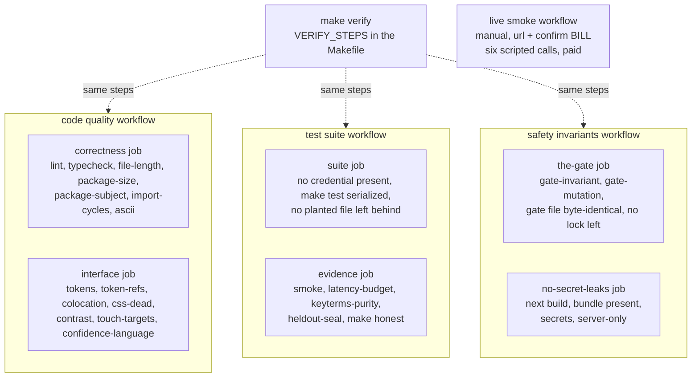

# How correctness is checked

> Every rule this project states is enforced by a check that fails the build. Each ratchet
> either has a positive control that plants a violation and requires the check to fail, or is
> exempt by name for a stated reason, and every gate branch is broken in turn until its own
> test fails by name. `make verify` runs the whole set locally; three CI workflows run the same
> steps on every push to `main` and every pull request. Paid AssemblyAI calls are confined to
> a few named targets that refuse to run without a key and without an explicit confirmation.

**Read this if** you are changing code and need to know what must pass, or you want to check
a published number yourself · **Related:** [architecture](architecture.md) ·
[security](security.md) · [evidence](evidence.md) ·
[design decisions](design-decisions.md) · [cost and budget](cost-and-budget.md) ·
[eval/REPORT.md](../eval/REPORT.md)

---

## What runs, and where



`VERIFY_STEPS` in the `Makefile` is the list of steps and the only one; no count is quoted
here, because a number copied into prose drifts from the list that runs. Read it there, or
run `make help`. `make verify` must pass before a task counts as done.

`make verify` is not safe to run twice at once in one working tree: `make gate-mutation`
edits `src/gate/decide.ts` while it runs, so a concurrent `typecheck` or `lint` can fail
inside the gate file. If `git diff --stat src/gate/decide.ts` is not empty, a mutation run is
in progress; wait and re-run. The script restores the file byte for byte itself.

## Which rules fail the build?

| Rule | Check |
|---|---|
| No file over 250 lines | `make file-length` (ratchet over a baseline) |
| No directory over 20 sources / 30 tests | `make package-size` |
| No import cycles, test imports included | `make import-cycles` |
| The gate imports nothing but domain, validators, lasa, catalog | `make import-cycles` |
| No directory named `utils`, `common`, `helpers`, `misc`, `lib`, `core` or `shared` (except `src/shared`) | `make package-subject` |
| No non-Latin script in any tracked text file, docs included (`data/` excepted) | `make ascii` (ratchet over a baseline) |
| No raw hex outside the token files | `make tokens` |
| Every referenced design token is defined | `make token-refs` |
| Every stylesheet sits beside the component it styles | `make colocation` |
| Every class declared in a CSS module is used | `make css-dead` |
| Body text reaches 4.5:1 against its surface | `make contrast` |
| Every interactive control reaches the 44 px touch floor | `make touch-targets` |
| Confidence is never worded as a quality score | `make confidence-language` |
| A client tree imports only types, never values, from `@/catalog`, `@/sessions`, `@/tools`, `@/agent` | `make server-only` |
| The API key never leaves `app/api/` | `make secrets` |
| No LASA-checked drug name in keyterms | `make keyterms-purity` |
| The held-out set is unchanged since sealing, **and a populated set nobody sealed also fails** | `make heldout-seal` |
| `ConfirmedValue` is built only inside the gate | `make gate-invariant` |
| Every gate branch dies to its own test | `make gate-mutation` |

The remaining steps of `VERIFY_STEPS` are `lint`, `typecheck`, `test`, `smoke` (the
synthesised fixtures replayed through the server pipeline) and `latency-budget`. File size,
package size and the language rule are ratchets: what is already exceeded is recorded in
`scripts/baselines/` and the counter only moves down. Tests are counted separately from
sources, so thorough coverage is not pushed toward fewer tests. The package limit exists
because the file limit alone would let a long file be sliced into many small ones inside the
same directory.

The ban on comments covers code, `Makefile`, configuration, scripts and CI. Explanations live
in [docs/](README.md).

## How the guarantee is enforced

### One constructor for a confirmed value

`ConfirmedValue` is a branded type. Its brand is a non-exported
`declare const confirmedBrand: unique symbol` in `src/domain/order.ts`, so the single type
assertion that builds one is inside `src/gate/confirm.ts`, and `Order.setField` accepts
nothing else. There is no `force` flag, no convenience constructor and no object-literal
path by which "the model decided it was fine" writes a value.

`make gate-invariant` ([`scripts/checks/gate-invariant.sh`](../scripts/checks/gate-invariant.sh))
fails on each of these:

| Refused | Why |
|---|---|
| `as ConfirmedValue` or `<ConfirmedValue>` in `src`, `app` or `tests`, except in `src/gate/confirm.ts` | Both TypeScript assertion syntaxes construct the type |
| Zero or more than one such assertion in `src/gate/confirm.ts`, or the file missing | A check that passes with its subject absent proves nothing |
| `as unknown as` in `src` or `app`, or `as unknown as ConfirmedValue` in `tests` | A double assertion forges any branded type |
| `@ts-expect-error`, `@ts-ignore`, `@ts-nocheck` in `src` or `app` | A suppression forges a branded type past `tsc` |
| `setField(` outside `src/domain/order.ts` and `src/tools/intake.ts` | A value reaches the order only through `confirm()` and the intake store |
| The brand no longer a `unique symbol`, or exported | Without a private brand every object literal satisfies the type |

[`tests/gate/invariant-check.test.ts`](../tests/gate/invariant-check.test.ts) plants each
forgery (an `as` cast, an angle-bracket cast, a suppression, a stray `setField`, a double
assertion) and requires the check to fail, and requires it to pass on the tree as it stands.

A `ConfirmedValue` is not a secret. A human-approval code returned to the model is a
password: learning the string grants the action. Here nothing about knowing the shape of a
`ConfirmedValue`, or holding a real one from another field, lets code construct a new one,
because the only expression capable of producing the assertion is inside `confirm()`. There
is no code path that accepts a string as proof.

### Every gate branch dies to its own test

`make gate-mutation` ([`scripts/checks/gate-mutation.sh`](../scripts/checks/gate-mutation.sh))
reads [`scripts/checks/gate-mutations.txt`](../scripts/checks/gate-mutations.txt), one line
per branch: a label, the original text, the broken text and the name of the test that must
fail. Before the first mutation it refuses to start if any original text is missing from
`src/gate/decide.ts`, since that means an interrupted run left the gate broken or the gate
changed without the list. Then, for each line, it:

1. writes the broken text, requiring the original to occur exactly once and reading and
   writing without newline translation;
2. reruns `tests/gate` only and requires the suite to fail;
3. reruns `tests/gate` filtered to the named test with the JSON reporter and colour disabled,
   and requires that test itself to report failure, so a different test breaking does not
   count;
4. restores the file byte for byte.

The expected count is derived from the file, not from the loop, so a skipped line cannot
read as a pass. A lock file recording its pid refuses a concurrent run and lets a stale one
be cleared. The check fails when the gate file is absent unless `ALLOW_NO_GATE=1` is set.
12 of 12 mutations killed; the twelve are a LASA hit ignored, a LASA hit gated by confidence,
the threshold disabled, a failed checksum accepted, a catalogue miss accepted, an
inconsistent combination accepted, a missing validator accepted, the standing read-back
skipped, a normalization failure accepted, both attempt ceilings removed, and the gate
trusting a caller-filled LASA field instead of deriving it from the value.

### Every ratchet is proved to bite

[`tests/scripts/ratchet-positive-control.test.ts`](../tests/scripts/ratchet-positive-control.test.ts)
plants a violation for each ratchet, runs its script, requires it to fail, removes the
planted file, and requires the script to pass again. A final test reads `VERIFY_STEPS` and
fails if any step has neither a control nor a stated exemption. The exemptions are named in
that test: `lint`, `typecheck` and `test` fail loudly by themselves; `gate-mutation` and
`gate-invariant` carry their own adversarial tests; `contrast`, `keyterms-purity`,
`heldout-seal`, `smoke` and `latency-budget` read recorded data and have dedicated test
files.

The controls plant files inside `src/features/`, because the checks scan `src` and `app` and
a control planted elsewhere would prove nothing about the real configuration. That is why
`make test` runs with `--no-file-parallelism`: while a planted file exists, another test
walking the same tree would see it. Separate worker pools do not help, since they share one
filesystem.

A check can be wrong in two directions, and both are tested: a control planted in the tree
must fail it, and the whole tree must leave it quiet. Why each of these rules exists is in
[design decisions](design-decisions.md#how-do-the-checks-avoid-passing-while-checking-nothing).

### The secrets check reads the built bundle

`make secrets` searches `src` and `app` for `ASSEMBLYAI_API_KEY` and allows it only under
`app/api/`, and fails if no file there names it at all. When `.next/static` exists it greps
the built client bundle for the secret names. The CI job builds first and fails if
`.next/static` is missing, so the bundle scan cannot be skipped. `make check-bundle`, run by
hand after a build and not part of `verify` or CI, also searches the bundle for secret values
and server-only markers. See [security](security.md#the-key-never-leaves-the-server) for the
rest of what both refuse.

## What CI runs on every push

Four workflows in [`.github/workflows/`](../.github/workflows/). The first three run on every
push to `main`, every pull request and on demand; together they run every step of
`VERIFY_STEPS`, plus a production build and `make honest`.

| Workflow | Job | What fails it | Timeout |
|---|---|---|---|
| **code quality** | correctness | lint, types, file length, package size, package subject, import cycles, the English-only rule | 10 min |
| | interface | design tokens, token references, colocation, dead CSS, contrast, touch targets, confidence wording | 10 min |
| **test suite** | suite | a credential present in the job, the suite itself, a positive control leaving a planted file behind | 20 min |
| | evidence | the fixture pipeline, the latency budget, keyterm purity, the held-out seal, every figure `make honest` reproduces | 15 min |
| **safety invariants** | the-gate | the gate invariant, all twelve mutations, the gate file not byte-identical afterwards, a mutation lock left behind | 25 min |
| | no-secret-leaks | the build, a missing client bundle, a secret in the sources or the bundle, a server-only value imported by the client | 15 min |
| **live smoke** | smoke | manual only; refuses unless the `confirm` input is `BILL`; six scripted calls against the given URL | 45 min |

After the first step of a job, most steps carry `if: ${{ !cancelled() }}` and the run
assertions carry `if: always()`, so one failure does not hide the state of the checks behind
it. Two steps are deliberately gated on the one before: in the suite job `make test` runs
only once no credential is found, and in no-secret-leaks the bundle-presence step and
`make secrets` run only after a successful build, because without a bundle they would prove
nothing. Jobs in one
workflow run in parallel. Each gate mutation reruns `tests/gate`, not the whole suite, which
keeps the safety job inside its time limit.

Two jobs assert something about the run rather than the code: the gate file must be
byte-identical after mutation testing with no lock left behind, and no positive control may
leave a planted file behind.

The live smoke workflow installs only Chromium, while `make live-smoke` runs both Playwright
projects, so the `firefox-fake-caller` project cannot run there as the workflow stands. The
recorded live runs used that project locally (see
[the live smoke harness](#what-does-the-live-smoke-harness-drive)).

## Checking our numbers without a key

```bash
make honest
```

Prints every figure in this repository that is derivable offline, each above the command
that produced it and the size of the set it came from: the entity error rate on the control
corpus, which mechanism catches which recorded error and which question each asks of a
correct value, the shipped gate run against itself with and without the pair rule,
exhaustive checksum coverage, our own skeleton detector pointed at our own catalogue, the
controlled-substance census, the confidence calibration curve, the rarity stratification,
latency against its budget, how much of the published ISMP list the pair rule covers and
what it costs, whether degraded audio turns a name into its published partner, the
synthesised fixture path replayed end to end, the human-voice set, a count of every paid run
including the discarded ones, and what the paid API has cost.

Fifteen blocks, no network call, no key. [`scripts/report/honest.ts`](../scripts/report/honest.ts)
prints the count at the end of its own output, and a step that prints nothing counts as a
failure.

It does not fill in anything that needs a live socket (turn-to-turn latency, the agent's own
timings, the sealed held-out set). Those rows read as not measured in `eval/REPORT.md`.

**A figure and its command are compared, not merely both present.**
[`tests/scripts/honest-report-agreement.test.ts`](../tests/scripts/honest-report-agreement.test.ts)
runs each anchored step's real command and requires its printed figures, the measured values
and not only the set size, to appear in `eval/REPORT.md`. The figures in the project README,
the slides and these docs are checked the same way by
[`tests/scripts/public-figures-agreement.test.ts`](../tests/scripts/public-figures-agreement.test.ts).

## Which path reaches the API and which reaches a fixture

| Command | Opens a paid socket | What it runs against |
|---|---|---|
| `make test` | **no** | Socket traffic in `eval/fixtures/`, **synthesised** by `make fixtures` against the documented message shapes, not captured from a live run |
| `make verify` | **no** | Every step is local; `VERIFY_STEPS` in the `Makefile` is the list |
| `make honest` | **no** | Recorded corpora and the real validator and gate |
| `make e2e` | **no** | Playwright with a fake microphone, against `E2E_BASE_URL` (a preview deployment) or, without it, a local `npm run dev` |
| `make doctor` | **no** | Ordinary HTTPS requests; see below |
| `make spend` | **no** | Reads the spend ledger and reconciles it against the run registry; see below |
| `make measure` | **no** | The gate's own decision latency over fixtures; its live path is **not implemented** |
| `make eval` | **yes** | The development set, 40 sessions at 24-second spacing |
| `make eval-heldout` | **yes** | The sealed held-out set, opened once against the rule in [`eval/heldout-preregistration.md`](../eval/heldout-preregistration.md) |
| `make eval-live` | **yes** | The human voice set from [`eval/live/voice-set.md`](../eval/live/voice-set.md) |
| `make live-smoke` | **yes** | Six scripted calls through both live sockets |

`make doctor` checks that the reference agent exists and matches the source and that every
tool URL is reachable; it opens no socket and exits non-zero on a mismatch. `make spend` with
no run recorded publishes no figure at all and says why, because a zero would be a number
nobody measured. `make measure` states which latency rows stay unmeasured rather than
printing a number for them.

Every paid target refuses rather than reporting a number it did not measure: the recognizer
runs refuse without `ASSEMBLYAI_API_KEY`, `make eval-live` also requires `--confirm-paid`
(which the target passes), and `make live-smoke` requires `LIVE_SMOKE_CONFIRM_PAID=1` and a
public https `LIVE_SMOKE_URL`. A target that silently skipped would produce an absent figure
indistinguishable from a measured zero. The other paid variants and what each spends are in
[cost and budget](cost-and-budget.md#which-commands-pay).

In the other direction, the test suite never reads a real key:
[`tests/setup.ts`](../tests/setup.ts) deletes `ASSEMBLYAI_API_KEY` and the other credentials
before any test module loads and replaces `fetch` and `WebSocket` with refusing stubs; a test
that needs a variable sets a placeholder with `vi.stubEnv`. No test can reach AssemblyAI
through either even if the environment holds a valid key, and the CI suite job fails if a key
is present at all.

## What does the live smoke harness drive?

[`tests/live/`](../tests/live/) drives the real product: a real browser on the deployed
page, both real AssemblyAI sockets, and a synthesised caller.

| Part | What it does |
|---|---|
| `live-guard.ts` | Refuses unless `LIVE_SMOKE_CONFIRM_PAID=1` and `LIVE_SMOKE_URL` is an https URL that is not this machine, because AssemblyAI must reach the tools |
| `caller-injector.ts`, `responder.ts`, `lines/` | Plays prepared lines of synthesised speech into the page through WebAudio after each agent reply, choosing the line from what the agent said |
| `scenarios.ts` | Six scenarios, each with the outcome it must observe on the page |
| `playwright.config.ts` | Two projects, `chromium-fake-caller` and `firefox-fake-caller`, one worker, no retries |

| Scenario | Must observe | Recorded on the production deployment |
|---|---|---|
| `clean-order` | The order commits after its read-backs | Committed |
| `lasa-named` | The contrastive question is answered by naming hydromorphone, and hydromorphone is in the committed order | Committed |
| `yeah-no` | "Yeah, no" is read as a refusal, not a confirmation | Completed |
| `barge-in` | A reply ends interrupted after the caller cuts in | Completed |
| `npi-groups` | An NPI dictated in digit groups arrives whole | No passing run recorded |
| `commit-hold` | An early `commit_order` is refused in hold, then accepted | No passing run recorded |

The caller is synthesised speech, not a human voice, and provenance is still computed in the
browser; every run record carries those boundaries. The harness stops the call once the order
commits.

```bash
LIVE_SMOKE_CONFIRM_PAID=1 LIVE_SMOKE_URL=https://<deployment> \
  npx playwright test --config tests/live/playwright.config.ts --project firefox-fake-caller
```

`make live-smoke` runs the same config with both projects.

**Every paid run is recorded, including the failed ones.** Each run is appended to
[`eval/live/runs.json`](../eval/live/runs.json) with its outcome, the reason, the socket
seconds, the cost at the recorded rate, the session ids and its boundaries. `make live-runs`
counts them from the artefacts, and `make spend` derives the total from
`eval/spend-ledger.json` at the rates on a named date and reconciles every registry run
against the ledger (`tests/eval/spend-registry-agreement.test.ts`). Rates come from one table
through `ratePerHourFor`; `tests/eval/spend-ledger.test.ts` refuses an hourly-rate literal in
the paid STT probe.

---

<sub>[Documentation index](README.md) · [Project README](../README.md)</sub>
